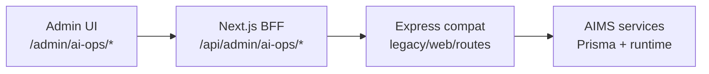

# AI Administration Panel

**Version:** 1.0.0  
**Last Updated:** 2026-05-30  
**Scope:** Admin UI, BFF proxies, registry APIs, permissions, validation

---

## Overview

The AI Administration Panel gives platform admins operational control over the AIMS (AI Management System) stack without redeploying application code. All sections live under **`/admin/ai-ops/*`** in the web app and **`/api/admin/ai-ops/*`** on the backend (legacy compat routes).



---

## Sections

| Section | Admin path | API base | Primary service |
|---------|------------|----------|-----------------|
| **Dashboard** | `/admin/ai-ops` | `/overview` | `AiAnalyticsService` |
| **Providers** | `/admin/ai-ops/providers` | `/providers` | `AiRegistryAdminService` |
| **Models** | `/admin/ai-ops/models` | `/models` | `AiRegistryAdminService` |
| **Routes** | `/admin/ai-ops/routes` | `/routes` | `AiRegistryAdminService` |
| **API Keys** | `/admin/ai-ops/api-keys` | `/secrets` | `AiSecretService` |
| **Prompt Management** | `/admin/ai-ops/prompts` | `/prompts` | `AiPromptManagementService` |
| **Usage Analytics** | `/admin/ai-ops/analytics` | `/analytics/usage/*` | `AiUsageAnalyticsService` |
| **Failover** | `/admin/ai-ops/failover` | `/failover` | `AiRegistryAdminService` + `AIProviderMonitor` |
| **Health Status** | `/admin/ai-ops/health` | `/health` | `AiPlatformAdminService` |

Additional operational pages: **Knowledge**, **Risk monitoring**, **Governance** (kill switch).

---

## API Reference

### Providers

| Method | Path | Description |
|--------|------|-------------|
| GET | `/api/admin/ai-ops/providers` | List registry providers |
| POST | `/api/admin/ai-ops/providers` | Create provider (validated) |
| GET | `/api/admin/ai-ops/providers/dashboard` | Runtime health + 7-day metrics |
| GET | `/api/admin/ai-ops/providers/:id` | Get provider |
| PUT | `/api/admin/ai-ops/providers/:id` | Update provider |
| POST | `/api/admin/ai-ops/providers/:id/toggle` | Enable/disable `{ "enabled": true }` |

### Models

| Method | Path | Description |
|--------|------|-------------|
| GET | `/api/admin/ai-ops/models?providerId=` | List models |
| POST | `/api/admin/ai-ops/models` | Create model |
| PUT | `/api/admin/ai-ops/models/:id` | Update model |
| POST | `/api/admin/ai-ops/models/:id/toggle` | Enable/disable |

### Routes

| Method | Path | Description |
|--------|------|-------------|
| GET | `/api/admin/ai-ops/routes` | List routing rules |
| POST | `/api/admin/ai-ops/routes` | Create route |
| PUT | `/api/admin/ai-ops/routes/:id` | Update route |
| POST | `/api/admin/ai-ops/routes/:id/toggle` | Enable/disable |

### API Keys (Vault)

| Method | Path | Role |
|--------|------|------|
| GET | `/api/admin/ai-ops/secrets` | ADMIN+ |
| POST | `/api/admin/ai-ops/secrets` | SUPER_ADMIN |
| PUT | `/api/admin/ai-ops/secrets/:id` | SUPER_ADMIN |
| POST | `/api/admin/ai-ops/secrets/:id/test` | ADMIN+ |
| POST | `/api/admin/ai-ops/secrets/:id/disable` | ADMIN+ |
| POST | `/api/admin/ai-ops/secrets/:id/rotate` | SUPER_ADMIN |

### Prompt Management

See prompt management service under `src/modules/ai/prompts/management/` — draft / publish / rollback lifecycle.

### Usage Analytics

| Method | Path |
|--------|------|
| GET | `/api/admin/ai-ops/analytics/usage/dashboard?sinceDays=30` |
| GET | `/api/admin/ai-ops/analytics/usage/daily-cost` |
| GET | `/api/admin/ai-ops/analytics/usage/monthly-cost` |
| GET | `/api/admin/ai-ops/analytics/usage/providers` |
| GET | `/api/admin/ai-ops/analytics/usage/features` |
| GET | `/api/admin/ai-ops/analytics/usage/trends` |
| GET | `/api/admin/ai-ops/analytics/usage/report?format=csv` |

### Failover

| Method | Path | Description |
|--------|------|-------------|
| GET | `/api/admin/ai-ops/failover/status` | Circuit breakers + rules |
| GET | `/api/admin/ai-ops/failover?routeId=` | List rules |
| POST | `/api/admin/ai-ops/failover` | Create rule |
| PUT | `/api/admin/ai-ops/failover/:id` | Update rule |
| POST | `/api/admin/ai-ops/failover/:id/toggle` | Enable/disable |

### Health

| Method | Path | Description |
|--------|------|-------------|
| GET | `/api/admin/ai-ops/health` | Live probes, validation, snapshots |

---

## Permissions

### Web capability keys (`permissions-core.ts`)

| Capability | SUPER_ADMIN | ADMIN | SUPPORT |
|------------|:-----------:|:-----:|:-------:|
| `ai.view` | ✓ | ✓ | ✓ |
| `ai.manage` | ✓ | ✓ | — |
| `ai.secrets.manage` | ✓ | — | — |
| `ai.analytics.export` | ✓ | ✓ | — |

Nav items gate on `ai.view`; governance requires `ai.manage`. API key **mutations** remain SUPER_ADMIN-only at the backend.

### Backend guards

- `requireAiAdminActor()` — ADMIN or SUPER_ADMIN (session cookie)
- `requireAiSuperAdmin()` — vault write operations

---

## Validation

Backend Zod schemas: `src/modules/ai/admin/ai-admin.schemas.ts`

Web form schemas (subset): `pranidoctor-web/src/lib/admin-ai/schemas.ts`

All mutating endpoints return `400` with `AI_ADMIN_ERROR` on validation failure.

---

## Key Files

### Backend

- `src/modules/ai/admin/` — registry admin service, guards, schemas
- `src/legacy/web/routes/admin/ai-ops/` — production HTTP handlers
- `src/modules/ai/vault/` — encrypted API keys
- `src/modules/ai/prompts/management/` — versioned prompts

### Web

- `src/app/admin/(dashboard)/ai-ops/` — pages
- `src/components/admin/ai-ops/` — panel components
- `src/app/api/admin/ai-ops/` — BFF proxies
- `src/components/admin-ui/admin-nav.tsx` — navigation

---

## Tests

```bash
# Backend
cd pranidoctor-backend
npx vitest run src/modules/ai/admin/

# Web validation
cd pranidoctor-web
npx vitest run src/lib/admin-ai/schemas.test.ts
```

---

## Operational Notes

1. **No-deploy edits** — Provider/model/route/failover/prompt changes apply at runtime via DB; routing engine reads `AiRoute` / `AiFailoverRule` on next request.
2. **Prompts** — Always edit **drafts** first; publish to swap live version.
3. **API keys** — Stored encrypted (`AiApiKey`); plaintext never returned in list APIs.
4. **Health probes** — `/health` runs network probes; may be slow in dev if keys are missing.
