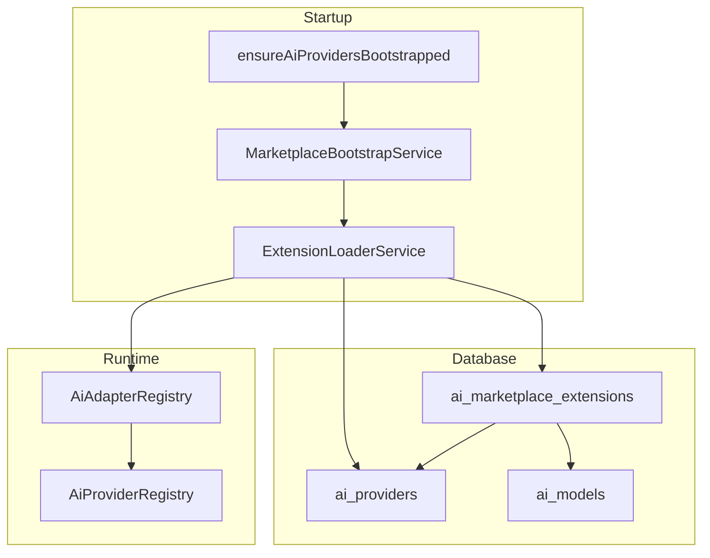

# AI Marketplace Architecture

**Version:** 1.0.0  
**Last Updated:** 2026-05-30  
**Scope:** Plugin-based providers, external models, veterinary models, OpenRouter, self-hosted LLM

---

## Overview

The AI Marketplace is an **extension framework** layered on top of the AIMS provider registry. It decouples **how** a provider speaks (adapter type) from **which** vendor or endpoint runs (provider key + DB config).



---

## Core Concepts

| Concept | Description |
|---------|-------------|
| **Extension** | Versioned plugin manifest stored in `ai_marketplace_extensions` |
| **Adapter type** | Wire protocol handler (`openai_compatible`, `openrouter_gateway`, `self_hosted_openai`, `veterinary_custom`) |
| **Provider key** | Runtime registry key (builtin or dynamic string) |
| **External model** | Upstream model ID mapped to internal `modelKey` in `ai_models` |
| **Model source** | `BUILTIN`, `MARKETPLACE`, `EXTERNAL`, `VETERINARY`, `SELF_HOSTED` |
| **Model category** | Veterinary task slot (`symptom_analysis`, `disease_classification`, etc.) |

---

## Adapter Types

| Adapter | Use case |
|---------|----------|
| `openai_compatible` | Generic OpenAI API shape |
| `openrouter_gateway` | OpenRouter with Referer/X-Title headers |
| `self_hosted_openai` | Ollama, vLLM, LM Studio |
| `veterinary_custom` | Fine-tuned vet models on compatible endpoints |
| `openai_native` | Built-in OpenAI (alias to compatible stack) |
| `anthropic_native` | Built-in Anthropic |
| `gemini_native` | Built-in Gemini |

Adapters are registered in `AiAdapterRegistry` (`src/modules/ai/marketplace/adapter-registry.ts`).

---

## Extension Manifest

```json
{
  "extensionKey": "my_vendor_plugin",
  "name": "My Vendor",
  "version": "1.0.0",
  "publisher": "Acme AI",
  "adapterType": "openai_compatible",
  "providerKey": "acme_ai",
  "capabilities": ["chat", "vision"],
  "config": {
    "baseUrl": "https://api.acme.ai/v1",
    "chatModel": "acme-chat-v1",
    "secretProviderKey": "acme_ai"
  },
  "models": [
    {
      "modelKey": "acme_chat_v1",
      "displayName": "Acme Chat v1",
      "externalModelId": "acme/chat-v1",
      "source": "MARKETPLACE",
      "modelCategory": "general_chat"
    }
  ]
}
```

Install via:

```http
POST /api/admin/ai-ops/marketplace/extensions
Content-Type: application/json
```

Validated by `extensionManifestSchema` (Zod).

---

## Built-in Integrations

### OpenRouter

- Provider plugin: `OpenRouterProvider` (builtin) + marketplace extension `openrouter_gateway`
- Catalog sync: `OpenRouterCatalogService.syncSelectedModels({ modelIds: [...] })`
- Admin API: `POST /api/admin/ai-ops/marketplace/openrouter/sync`

Env:

```env
OPENROUTER_API_KEY=
OPENROUTER_DEFAULT_MODEL=openai/gpt-4o-mini
OPENROUTER_BASE_URL=https://openrouter.ai/api/v1
```

### Self-hosted LLM

- Builtin key: `self_hosted`
- Adapter: `self_hosted_openai`
- Extension: `self_hosted_llm`

Env:

```env
SELF_HOSTED_LLM_BASE_URL=http://localhost:11434/v1
SELF_HOSTED_LLM_MODEL=llama3.2
SELF_HOSTED_EMBEDDING_MODEL=nomic-embed-text
```

### Custom Veterinary Models

- Extension: `prani_vet_models`
- Categories: `symptom_analysis`, `disease_classification`, `emergency_triage`, etc.
- Service: `VeterinaryModelService.registerVeterinaryModel()`
- Models stored with `source = VETERINARY`

---

## Module Layout

```
src/modules/ai/marketplace/
├── marketplace.types.ts       # Manifest + Zod schemas
├── adapter-registry.ts        # Plugin adapter factories
├── adapters/
│   ├── dynamic-openai.provider.ts
│   └── self-hosted.provider.ts
├── extension-loader.service.ts
├── external-model.service.ts
├── veterinary-model.service.ts
├── openrouter-catalog.service.ts
├── marketplace-bootstrap.service.ts
└── index.ts
```

---

## Admin APIs

| Method | Path | Purpose |
|--------|------|---------|
| GET | `/api/admin/ai-ops/marketplace/extensions` | List installed extensions |
| POST | `/api/admin/ai-ops/marketplace/extensions` | Install extension manifest |
| GET | `/api/admin/ai-ops/marketplace/adapters` | List adapter types |
| GET | `/api/admin/ai-ops/marketplace/models/external` | List external/marketplace models |
| POST | `/api/admin/ai-ops/marketplace/models/external` | Register external model |
| GET | `/api/admin/ai-ops/marketplace/veterinary/models` | List veterinary models |
| POST | `/api/admin/ai-ops/marketplace/openrouter/sync` | Sync OpenRouter catalog entries |

---

## Runtime Bootstrap

On platform startup (`bootstrapAiPlatform`):

1. Built-in providers registered via `ensureAiProvidersBootstrapped()`
2. `MarketplaceBootstrapService.bootstrap()` loads ACTIVE extensions
3. Each extension builds an `IAIProvider` via adapter registry and registers dynamically

---

## Database

Migration: `20260604120000_ai_marketplace_extensions`

New table: `ai_marketplace_extensions`  
Extended: `ai_models` (+ `source`, `externalModelId`, `modelCategory`, `extensionId`)

Seed: `prisma/seeds/ai_marketplace.seed.ts`

---

## Tests

```bash
npx vitest run src/modules/ai/marketplace/marketplace.test.ts
```

---

## Future Roadmap

1. Wire `AIRouterService` hops → `registry.get(hop.providerKey).chat({ model: hop.modelKey })`
2. Signed extension manifests + publisher verification
3. Tenant-scoped marketplace listings
4. Usage-based billing per external model
5. Admin UI marketplace browser

See [AI_MARKETPLACE_MIGRATION_GUIDE.md](./AI_MARKETPLACE_MIGRATION_GUIDE.md) for adoption steps.
