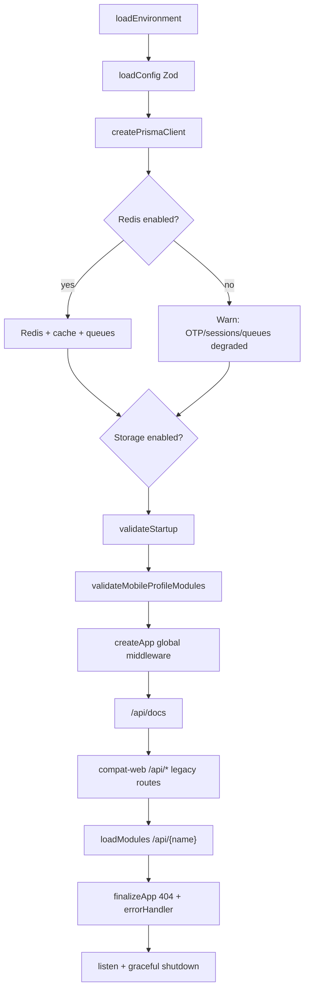

# Backend Stabilization Plan — Phase 1

**Repository:** `pranidoctor-backend` (Express modular monolith)  
**Reference:** [pranidoctor-web](https://github.com/balagpetcare/pranidoctor-web) (original Next.js API surface)  
**Document version:** 1.0  
**Date:** 2026-05-29  
**Status:** Phase 1 complete — [implementation report](./backend-stabilization-phase-1-implementation-report.md) · [final QA report](./backend-stabilization-final-report.md)

---

## Executive summary

The backend is a **hybrid architecture**: a new **Express module loader** (`/api/{module}`) coexists with a **compat layer** that auto-registers **242 legacy Next.js-style route handlers** under `/api/*`. Production traffic today is overwhelmingly served by **legacy routes**; several **foundation modules expose HTTP routes whose repositories are stubs** and would return 500 if called.

Phase 1 stabilization should **preserve all existing client contracts**, harden auth/ops boundaries, eliminate silent failure modes (stub modules, missing rate limits, dual session stores), and establish a **measurable migration order** from legacy → foundation without big-bang rewrites.

---

## 1. Current backend architecture overview

### 1.1 Runtime stack

| Layer | Technology | Notes |
|-------|------------|-------|
| HTTP | Express 5 | `src/app.ts`, `src/server.ts` |
| Language | TypeScript 5.8 (strict) | Production build excludes much of `src/legacy/**` |
| ORM | Prisma 7.8 + `@prisma/adapter-pg` | Client output: `src/generated/prisma` |
| DB | PostgreSQL 16 | External or Docker Compose |
| Cache / sessions (partial) | Redis 7 (ioredis) | Optional in dev (`REDIS_ENABLED=false`) |
| Queues | BullMQ | Connection initialized; **worker has no processors** |
| Object storage | MinIO / S3 / local | `STORAGE_DRIVER`, Sharp pipeline for images |
| Auth tokens | `jose` (JWT) + bcrypt | Channel-specific secrets (admin/mobile/doctor/technician/refresh) |
| Validation | Zod 3 | Mixed with legacy inline parsing |
| Logging | Pino + pino-http | Request context, redaction |
| API docs | Swagger UI | `/api/docs` |

### 1.2 Boot sequence (`src/server.ts`)

### 1.3 Request routing model

| Mount order | Prefix | Handler |
|-------------|--------|---------|
| 1 | `/` | Health (`createHealthRouter`) |
| 2 | `/api/docs` | OpenAPI / Swagger |
| 3 | `/api` | **Compat web router** — 242 filesystem routes from `src/legacy/web/routes/**/route.ts` |
| 4 | `/api/{module}` | **14 registered modules** via `loadModules` |
| Last | `*` | `notFoundHandler`, `errorHandler` |

**Important:** Compat routes are registered **before** modular routes. Express matches in registration order; deeper paths are registered first within compat (depth sort). Modular mounts use distinct prefixes (`/api/auth`, `/api/users`, …) and rarely collide except where noted (notifications).

### 1.4 Architectural pattern

- **Modular monolith** with `ModuleRegistry`, dependency ordering, `initialize()` / `shutdown()` lifecycle.
- **Strangler pattern:** legacy web API preserved via `compat-web` + Next request/response adapter (`next-adapter.ts`).
- **Domain logic split:** active business logic in `src/legacy/web/lib/**` and newer `src/modules/**` services (inventory, profile, assignment, treatment, etc.) imported by legacy routes.

### 1.5 Secondary processes

- **`src/worker.ts`:** Initializes DB + Redis + queues; logs *"No job processors registered yet (Phase 1 foundation)"*.
- **Verification scripts:** `p1:*-verify`, `p2:verify`, `p3:verify`, `e2e:freeze`, `foundation:verify` — use these as regression gates during stabilization.

---

## 2. Existing modules list

### 2.1 HTTP-mounted foundation modules (`createAllModules`)

| Module name | Mount path | Router file | Implementation maturity |
|-------------|------------|-------------|-------------------------|
| `auth` | `/api/auth` | `auth.routes.ts` | **Active** — OTP via IdentityAuthService; aliases `/login`, `/refresh` |
| `identity` | `/api/identity` | `identity.routes.ts` | **Active** — capabilities, devices, profile summary |
| `area-engine` | `/api/area-engine` | `area-engine.routes.ts` | **Active** — BD location hierarchy |
| `cases` | `/api/cases` | `treatment-workflow.routes.ts` | **Active** — doctor treatment workflow |
| `voice-assistant` | `/api/voice-assistant` | `voice-assistant.routes.ts` | **Active** — STT/chat/navigation |
| `sync` | `/api/sync` | `offline-architecture.routes.ts` | **Active** — offline sync |
| `offline` | `/api/offline` | `offline-architecture.routes.ts` | **Active** — offline queue |
| `users` | `/api/users` | `users.routes.ts` | **Active** — Prisma-backed |
| `doctors` | `/api/doctors` | `doctors.routes.ts` | **Partial** — read/update via Prisma; `create()` throws |
| `leads` | `/api/leads` | `leads.routes.ts` | **Active** — Prisma-backed CRM |
| `animals` | `/api/animals` | `animals.routes.ts` | **STUB** — repository throws on all methods |
| `clinics` | `/api/clinics` | `clinics.routes.ts` | **STUB** — repository throws |
| `notifications` | `/api/notifications` | `notifications.routes.ts` | **STUB** repo + SMS/push throw |
| `ai-veterinary-core` | `/api/ai-veterinary-core` | `ai-veterinary-core.routes.ts` | **Active** |
| `media` | `/api/media` | `media.routes.ts` | **Active** — uploads + rate limit |

### 2.2 Implemented but **not** HTTP-mounted

| Package | Path | Used by |
|---------|------|---------|
| `inventory` | `src/modules/inventory/` | Legacy `/api/mobile/inventory/*` |
| `profile` | `src/modules/profile/` | Legacy `/api/mobile/me`, media uploads |
| `assignment` | `src/modules/assignment/` | Admin assign-technician legacy route |
| `timeline` | `src/modules/timeline/` | Assignment side-effects |
| `doctor` / `doctor-queue` | `src/modules/doctor/`, `doctor-queue/` | Doctors repository, queue logic |
| `case` | `src/modules/case/` | Treatment / AI case linking |
| `technician` | `src/modules/technician/` | Technician domain |
| `lead` (singular) | `src/modules/lead/` | Possible duplicate of `leads` |
| `area` | `src/modules/area/` | Overlaps `area-engine` |
| **`ai`** | `src/modules/ai/` | **Has `AiModule` + routes but excluded from `createAllModules()`**; repository stub |

### 2.3 Compat / legacy surface

| Segment | Route files | Role |
|---------|-------------|------|
| `mobile` | 137 | Customer app — auth, animals, finance, fattening, inventory, health, etc. |
| `admin` | 74 | Admin panel operations |
| `doctor` | 15 | Doctor panel |
| `technician` | 5 | Technician panel |
| `locations` | 7 | Public/shared location tree (overlaps area-engine) |
| `notifications` | 3 | Legacy notification list/read |
| `health` | 1 | Legacy health check |

### 2.4 Archived / excluded from production build

- `src/modules/auth/_archived_foundation/**`
- `src/modules/media/_archived_foundation/**`
- `src/modules/auth/legacy-web/**`, `compat/**` (excluded from `tsconfig.build.json` but still imported at runtime via dynamic paths in some flows)

---

## 3. API route analysis

### 3.1 Scale

| Surface | Count |
|---------|-------|
| Legacy `route.ts` files | **242** |
| Unique legacy Express paths | **242** (no duplicate path files) |
| Legacy HTTP method registrations | **~1,452** (242 × 6 methods; lazy handlers return 405 if method absent) |
| Foundation module route files | **17** `.routes.ts` (+ compat ping) |
| Modular mount prefixes | **15** |

### 3.2 Legacy path distribution

| Prefix under `/api` | Routes |
|---------------------|--------|
| `/api/mobile/*` | 137 |
| `/api/admin/*` | 74 |
| `/api/doctor/*` | 15 |
| `/api/technician/*` | 5 |
| `/api/locations/*` | 7 |
| `/api/notifications/*` | 3 |
| `/api/health` | 1 |

### 3.3 Foundation modular endpoints (summary)

**Auth** (`/api/auth`): `POST /otp/request`, `/otp/verify`, `/token/refresh`, `/login`, `/refresh`, `/logout`

**Identity** (`/api/identity`): capabilities, session devices, revoke device, profile summary, user state

**Area engine** (`/api/area-engine`): divisions → villages hierarchy, search, seed version

**Cases / treatment** (`/api/cases/:id/...`): treatment CRUD, notes, close

**Voice** (`/api/voice-assistant`): stt, chat, navigation, session

**Offline** (`/api/sync`, `/api/offline`): status, sync, retry, queue

**Users, doctors, leads, animals, clinics, notifications, media, ai-veterinary-core**: REST-style resources per `*.routes.ts`

### 3.4 Contract duality (critical for clients)

| Style | Success shape | Error shape | Used by |
|-------|---------------|-------------|---------|
| Legacy | `{ ok: true, data }` | `{ ok: false, error: { code, message, details? } }` | Mobile/admin/doctor/technician routes |
| Foundation | `{ success: true, data, requestId? }` | `{ success: false, error: { code, message, details?, requestId? } }` | Modular controllers + global `errorHandler` |

**Stabilization rule:** Do not change legacy shapes without versioned aliases; new work should target one canonical format per channel with explicit migration notes.

### 3.5 Auth route duplication (logical, not Express collision)

| Concern | Legacy path | Foundation path |
|---------|-------------|-----------------|
| OTP request | `/api/mobile/auth/otp/request` | `/api/auth/otp/request` |
| OTP verify / login | `/api/mobile/auth/verify-otp`, `/login` | `/api/auth/otp/verify`, `/login` |
| Refresh | `/api/mobile/auth/refresh` | `/api/auth/token/refresh`, `/refresh` |
| Panel admin | `/api/admin/auth/login` | N/A (panel services in modules/auth) |

Both paths funnel into shared services (`IdentityAuthService`, `mobile-auth-credentials.service.ts`) but **response envelopes differ** unless compat adapters normalize them.

### 3.6 Location API triplication

| API | Paths |
|-----|-------|
| Area engine (modular) | `/api/area-engine/divisions`, …, `/search`, `/seed/version` |
| Legacy public | `/api/locations/divisions`, …, `/tree`, `/search` |
| Legacy mobile | `/api/mobile/locations/*` |

**Risk:** Divergent caching, seed versioning, and search ranking between three implementations.

---

## 4. Middleware analysis

### 4.1 Global stack (`src/app.ts`)

| Order | Middleware | Purpose |
|-------|------------|---------|
| 1 | `helmet` | Security headers; **CSP disabled** |
| 2 | `cors` | Configurable origins; credentials |
| 3 | `compression` | Response compression |
| 4 | `express.json` / `urlencoded` | 10 MB limit |
| 5 | `contextMiddleware` | AsyncLocalStorage request context |
| 6 | `createLoggerMiddleware` | Pino HTTP logging |
| 7 | Version header | `X-API-Version: v1` |
| — | Health router | `/health`, `/ready`, etc. |

**Not applied globally:** rate limiting, request size per-route tuning, API key gateway, WAF.

### 4.2 Foundation per-route middleware

| Middleware | Location | Usage |
|------------|----------|-------|
| `authenticate` / `authMobile` / `authAdmin` / … | `shared/security/middleware/auth.middleware.ts` | Modular routes; Redis session lookup |
| `authenticateMobileCustomer` | `modules/auth/mobile-express.middleware.ts` | Sync, offline, voice, AI — **dual path**: Redis session OR Prisma session via `verifyMobileJwt` |
| `createValidationMiddleware` | `modules/auth/validation.middleware.ts` | Auth module Zod |
| `asyncHandler` / `wrapController` | `shared/middleware/async-handler.ts` | Async error propagation |
| `rateLimitUpload` | media routes only | Upload abuse protection |

### 4.3 Legacy per-route guards (representative)

| Guard file | Channels |
|------------|----------|
| `mobile-auth/guard.ts` | Mobile customer |
| `admin-auth/api-guard.ts`, `dashboard-guard.ts` | Admin |
| `doctor-auth/api-guard.ts` | Doctor panel |
| `technician-auth/api-guard.ts` | Technician |
| `notifications/guard.ts` | Notifications |
| `mobile-ai-technician/mobile-module-guard.ts` | AI technician module |
| `mobile-profile/profile-dashboard-guard.ts` | Profile dashboard |

**Issue:** Multiple guard implementations with overlapping JWT verification logic; not all use the same session store.

### 4.4 Compat adapter middleware

`compat-web/next-adapter.ts` wraps Web `Request`/`Response` handlers — errors may not always pass through Express `errorHandler` identically to native Express controllers.

---

## 5. Duplicate route detection

### 5.1 Within legacy tree

- **No duplicate filesystem paths** among 242 `route.ts` files (audit script verified).

### 5.2 Legacy vs modular prefix overlap

| Legacy path | Modular mount | Severity |
|-------------|---------------|----------|
| `GET/POST /api/notifications` | `/api/notifications` router | **HIGH** — compat registered first; modular routes may be **unreachable** for colliding methods/paths |
| `POST /api/notifications/read-all` | same | HIGH |
| `POST /api/notifications/:id/read` | same | HIGH |

**Action:** Inventory exact method/path matrix; either namespace modular (`/api/v2/notifications`) or disable stub modular router until migration complete.

### 5.3 Functional duplicates (different paths, same domain)

| Domain | Duplicate endpoints |
|--------|---------------------|
| Locations | `/api/area-engine/*`, `/api/locations/*`, `/api/mobile/locations/*` |
| Auth | `/api/auth/*` vs `/api/mobile/auth/*` vs panel `/api/{admin,doctor,technician}/auth/*` |
| Animals | `/api/mobile/animals/*` (working) vs `/api/animals/*` (stub module) |
| Health | `/` health router vs `/api/health` legacy |
| Uploads | `/api/media/*` vs `/api/mobile/upload*` vs `/api/mobile/uploads*` |

---

## 6. Duplicate middleware detection

| Concern | Implementations | Recommendation |
|---------|-----------------|----------------|
| Mobile JWT verification | `auth.middleware authMobile`, `mobile-express.middleware`, `mobile-auth/guard.ts`, `verifyMobileJwt` | Consolidate on **Prisma session + single verifier** |
| Session storage | Redis `session.storage.ts` vs Prisma `UserSession` + `SessionService` | Document source of truth; sync or deprecate Redis path for mobile |
| Admin auth | `admin-auth/api-guard`, `panel-access`, modular `authAdmin` | Single panel guard factory |
| Validation | `createValidationMiddleware`, inline Zod in legacy routes, `*.validator.ts` per module | Shared `validate(schema)` helper with consistent 422 body |
| Error JSON | `jsonError` (legacy) vs `AppError` + `errorHandler` | Adapter layer for legacy to emit unified codes |

---

## 7. Auth / security weaknesses

| ID | Finding | Severity | Evidence |
|----|---------|----------|----------|
| SEC-01 | **Stub modules expose authenticated-looking routes** that 500 on use | High | `animals.repository.ts`, `clinics.repository.ts`, `notifications.repository.ts` |
| SEC-02 | **Rate limiting not enforced** on OTP/login/global API | High | `rate-limit.service.ts` exports unused except `media.routes.ts` |
| SEC-03 | **Dual session model** — Redis vs Prisma; `authenticate()` uses Redis, mobile tokens use Prisma | High | `auth.middleware.ts`, `session.service.ts`, `mobile-express.middleware.ts` |
| SEC-04 | Default JWT secrets `CHANGE_ME_*` allowed in non-production | Medium | `.env.example`, `config.schema.ts` production refine |
| SEC-05 | `helmet` CSP disabled | Medium | `app.ts` |
| SEC-06 | **OTP dev log endpoint** `/api/admin/dev-tools/otp-logs` | Medium | Gated by `isOtpDebugPanelAllowed()` — verify **never** enabled in prod |
| SEC-07 | `trust proxy` hardcoded to `1` | Low | Correct behind one proxy; document for K8s/ALB |
| SEC-08 | Legacy routes excluded from `tsc` build — auth bugs may slip to prod | Medium | `tsconfig.build.json` exclude `src/legacy/**` |
| SEC-09 | No global request ID requirement on legacy handlers | Low | Foundation has context middleware; legacy may omit `X-Request-Id` in responses |
| SEC-10 | CORS defaults to localhost only — staging misconfig risk | Medium | `CORS_ORIGINS` must be explicit per env |
| SEC-11 | Redis optional in dev — teams may deploy staging without Redis and break OTP | Medium | `infra.flags.ts`, server warns but continues |
| SEC-12 | Refresh token rotation implemented but not all clients may use foundation `/api/auth/token/refresh` | Low | Audit mobile app endpoints |

---

## 8. Prisma schema issues

### 8.1 Scale

- **~100 models**, **~100 `@@index` declarations**, large unified schema (`prisma/schema.prisma`).
- Client generated to `src/generated/prisma` (non-default output path).

### 8.2 Structural observations

| Issue | Detail |
|-------|--------|
| Legacy column mapping | Many `@map()` renames (e.g. `ServiceRequest.problemOrSymptom` → `symptoms`) — migrations must preserve DB names |
| Dual area models | `Area` legacy + division/district/upazila/union/village hierarchy — ensure queries use correct FK (`villageId` vs `areaId`) |
| Schema drift risk | Modular stubs suggest some foundation models may not match repository implementations |
| `User.email` required unique | Mobile OTP users may use phone-first flows — verify email placeholder strategy |
| Heavy JSON fields | `metadataJson` on multiple models — indexing/query limitations |

### 8.3 Positive notes

- `ServiceRequest` has solid composite indexes (`customerId`, `assignedDoctorId+status`, etc.).
- P1-06 session tables (`UserSession`, `RefreshToken`, `UserDevice`) indexed appropriately.
- Location hierarchy well-indexed for admin/search.

---

## 9. Validation inconsistencies

| Area | Pattern | Issue |
|------|---------|-------|
| Auth module | `createValidationMiddleware` + `auth.validator.ts` | Consistent 422 via `errorHandler` |
| Legacy mobile | Inline Zod / manual checks in each `route.ts` | Uneven error codes/messages (BN/EN mix) |
| Treatment / voice / offline | Controller-level Zod | Different from route-level pattern |
| Inventory | `inventory.schemas.ts` | Only used from legacy routes |
| Frozen BN auth paths | `isFrozenBnAuthPath` in auth i18n tests | Changes restricted — document for agents |

**Recommendation:** Introduce `shared/validation/validate-request.ts` used by both Express and compat adapter; never change frozen mobile auth response strings without `e2e:freeze` approval.

---

## 10. Error handling inconsistencies

| Source | Behavior |
|--------|----------|
| `errorHandler` | Maps `AppError`, `ZodError` → 422, unknown → 500 `{ success: false }` |
| Legacy `jsonError` | Returns `{ ok: false }` with arbitrary status |
| Legacy try/catch | Many routes return `jsonError("DATABASE_ERROR", …, 500)` masking root cause |
| Stub repositories | Uncaught `throw new Error('Not implemented…')` → **500** not **501** |
| Compat adapter | 405 for unsupported methods on lazy-loaded handlers |

**Gaps:** No standardized error code registry across legacy/foundation; Prisma errors not centrally mapped (P2002 unique, etc.).

---

## 11. Environment / configuration problems

| Issue | Detail |
|-------|--------|
| Dual lockfiles | Both `pnpm-lock.yaml` and `package-lock.json` present — pick one package manager |
| `tsconfig.build.json` duplicate `"include"` key | Lines 7–8 — latter wins; confusing for tooling |
| `SKIP_STARTUP_VALIDATION` | Can boot without DB/Redis in prod if mis-set |
| `REDIS_ENABLED=false` | Silent degradation of OTP, rate limits, queues |
| `STORAGE_ENABLED` vs `MEDIA_STORAGE=s3` | Two flags; `isMediaStorageRequired()` separate from `storage.enabled` |
| JWT secret validation | Production blocks `CHANGE_ME`; staging may not |
| `dotenv` in worker only | Server uses `loadEnvironment` — ensure parity |
| Wait scripts | `wait-for-services.ts` / `validate-startup.ts` — not wired into all deploy paths |

---

## 12. Logging gaps

| Gap | Recommendation |
|-----|----------------|
| Legacy routes lack uniform request/response logging fields | Add compat-layer logging wrapper with route template id |
| No structured audit for admin mutations | Extend `AuthAuditEvent` coverage |
| Prisma query logging not mentioned | Enable slow-query log in staging |
| Worker has no job logging | When processors added, use child loggers per queue |
| Error sanitization exists (`sanitizer.ts`) | Verify OTP/password never logged in legacy `console.log` |
| No metrics/tracing | Add OpenTelemetry or Prometheus hooks in Phase 2 |

---

## 13. Performance bottlenecks

| Bottleneck | Detail |
|------------|--------|
| **1,452 lazy route registrations** at startup | Acceptable with lazy import; monitor cold-start on first request per route |
| Legacy service N+1 | Deep includes in admin list endpoints (doctors, technicians) — profile in staging |
| Redis optional | Session/rate-limit fallbacks may cause unexpected DB load |
| No CDN/cache headers on API | Consider `ETag` for location seeds (`/seed/version`) |
| Image processing (Sharp) | CPU-heavy; should run async via queue (not implemented) |
| BullMQ without workers | Jobs may accumulate if producers exist |
| Large JSON payloads | 10 MB body limit — fattening/finance batch uploads |

---

## 14. Missing indexes / DB optimization suggestions

| Model / query pattern | Suggestion |
|---------------------|------------|
| `OfflineSyncItem` / `OfflineSyncSession` | Verify indexes on `(userId, status)`, `(createdAt)` for queue drain |
| `Notification` (if high volume) | Index `(userId, readAt)` if not present — audit model section |
| `InventoryTransaction` | Index `(customerId, createdAt)` for mobile history |
| `AnimalProfile` | Index `(customerId, active)` for mobile animal lists |
| `AuthAuditEvent` | Retention policy + index on `createdAt` for admin queries |
| JSON search | Avoid filtering on `metadataJson` without GIN indexes |
| Connection pool | `DB_POOL_MAX=10` may be low under load — tune per instance count |

*Run `EXPLAIN ANALYZE` on top 10 legacy list endpoints before migration.*

---

## 15. Missing production safeguards

| Safeguard | Status |
|-----------|--------|
| Global rate limiting | **Missing** |
| Graceful shutdown | **Present** (30s timeout) |
| Health/readiness | **Present** (`api/health`) |
| Startup validation | **Present** (skippable) |
| Helmet | Partial (no CSP) |
| Request size limits | 10 MB global |
| CSRF | N/A for Bearer APIs |
| Secrets rotation | Manual |
| DB migration gate | `db:migrate:deploy` script exists; enforce in CI/CD |
| Feature flags | `infra.flags.ts` minimal |
| Circuit breaker for Redis/MinIO | Degrades with warnings only |
| Idempotency keys | Not standardized on write endpoints |

---

## 16. TypeScript strictness issues

| Issue | Impact |
|-------|--------|
| `strict: true` in base `tsconfig.json` | Good for `src/modules`, `src/shared` |
| **Legacy routes excluded from production build typecheck** | Runtime-only type errors in 242 routes |
| `exactOptionalPropertyTypes`, `noUncheckedIndexedAccess` | High rigor; legacy may not comply when included |
| Path aliases to `@/lib/*` legacy | Couples modules to legacy — hinders extraction |
| `createAiModule` etc. not in build graph if unused | Dead code drift |
| Duplicate `include` in `tsconfig.build.json` | Maintenance hazard |

**Phase 1 target:** Add `typecheck:legacy` to CI as **non-blocking** report, then blocking incrementally.

---

## 17. Dependency / version risks

| Package | Version | Risk |
|---------|---------|------|
| Express | ^5.1.0 | Major version — ensure ecosystem compatibility |
| Prisma | ^7.8.0 | New major; adapter-pg required |
| `next` shim | `file:./shims/next-compat` | Custom shim maintenance |
| bullmq | ^5.34.0 | Without workers, queue depth risk |
| jose | ^6.2.3 | Track security advisories |
| Node | >=20 | Align with LTS schedule |
| Dual package locks | npm + pnpm | **CI reproducibility risk** |

---

## 18. File / folder structure problems

| Problem | Detail |
|---------|--------|
| `src/legacy/web/` massive tree | Hard to navigate; mixed lib + routes |
| Duplicate module names | `lead` vs `leads`, `area` vs `area-engine`, `doctor` vs `doctors` |
| `_archived_foundation` folders | Confusing for new agents |
| `src/modules/ai` vs `ai-veterinary-core` | Naming collision |
| Controllers without modules | `inventory.controller.ts` |
| Docs scattered | `docs/plans/*` vs this stabilization doc |
| Scripts proliferation | 30+ verify scripts — need index in README |

---

## 19. Technical debt list

| ID | Item | Priority |
|----|------|----------|
| TD-01 | Animals/clinics/notifications/ai **stub repositories** mounted as HTTP modules | P0 |
| TD-02 | Notifications path **shadowed** by legacy compat router | P0 |
| TD-03 | Rate limit presets **never wired** to auth or global app | P0 |
| TD-04 | Redis vs Prisma **dual session** stores | P0 |
| TD-05 | Legacy `{ok}` vs foundation `{success}` response split | P1 |
| TD-06 | Triplicate location APIs | P1 |
| TD-07 | `AiModule` not registered but code remains | P1 |
| TD-08 | Worker without processors | P1 |
| TD-09 | Legacy excluded from production typecheck | P1 |
| TD-10 | `pnpm-lock` + `package-lock` coexist | P1 |
| TD-11 | SMS/push/email TODOs in notifications | P2 |
| TD-12 | AI completion placeholder (`ai.service.ts` Phase 2) | P2 |
| TD-13 | Follow-up reminder notification placeholder | P2 |
| TD-14 | Doctors `create()` not implemented on foundation route | P2 |
| TD-15 | Multiple upload endpoints (media vs mobile upload) | P2 |

### TODO / FIXME inventory (source comments)

| Location | Note |
|----------|------|
| `modules/ai/ai.service.ts:69` | `TODO: Implement actual AI completion in Phase 2` |
| `modules/notifications/notifications.service.ts` | TODO SMS, email, push; throws on SMS/push |
| `legacy/web/lib/notifications/events.ts` | Placeholder follow-up reminder |

---

## 20. Stabilization priority table

| Priority | ID | Task | Effort | Risk if delayed |
|----------|-----|------|--------|-----------------|
| **P0** | S-01 | Disable or guard stub modular routes (animals, clinics, notifications) | S | Client/server 500s, security scan failures |
| **P0** | S-02 | Resolve `/api/notifications` compat vs modular collision | S | Foundation notifications dead |
| **P0** | S-03 | Wire `rateLimitOtpRequest/Verify/Login` on all auth entrypoints | M | OTP brute-force |
| **P0** | S-04 | Document and enforce single session store for mobile | M | Random logouts, auth bugs |
| **P0** | S-05 | Add CI gate: `npm run build && p1:full-verify` | S | Regressions |
| **P1** | S-06 | Location API consolidation plan (keep legacy paths, delegate to area-engine) | L | Data inconsistency |
| **P1** | S-07 | Standardize error adapter for legacy → stable codes | M | Client confusion |
| **P1** | S-08 | Remove duplicate package lock; document npm vs pnpm | S | CI drift |
| **P1** | S-09 | Legacy typecheck in CI (non-blocking → blocking) | M | Production type bugs |
| **P1** | S-10 | Register or delete `AiModule`; wire `ai.repository` or remove | M | Dead code |
| **P2** | S-11 | Mount inventory as module OR document legacy-only forever | M | Architecture clarity |
| **P2** | S-12 | Worker processors for notifications/media | L | Async reliability |
| **P2** | S-13 | OpenAPI parity audit (`openapi:generate` vs legacy) | M | Contract drift |
| **P2** | S-14 | Prisma index review on hot legacy queries | M | Slow lists at scale |
| **P3** | S-15 | Migrate mobile animals to foundation module | L | Long-term maintenance |
| **P3** | S-16 | Deprecate `/api/locations` after client migration | L | Breaking change |

*Effort: S = small (1–2 days), M = medium (3–5 days), L = large (1–2 weeks)*

---

# Appendix A — Phase-wise execution checklist

## Phase 0 — Baseline (no behavior change)

- [ ] Run `npm run env:validate`, `validate:startup`, `foundation:verify`
- [ ] Run `npm run build && npm run p1:full-verify && npm run e2e:freeze`
- [ ] Export route manifest: `listRegisteredPaths()` + modular OpenAPI
- [ ] Snapshot current error response samples per channel (mobile/admin/doctor)
- [ ] Confirm production env: `REDIS_ENABLED=true`, `SKIP_STARTUP_VALIDATION=false`, OTP debug off

## Phase 1 — Safety gates (minimal breaking risk)

- [ ] **S-01** Return `501 NOT_IMPLEMENTED` with clear JSON from stub repositories (not 500)
- [ ] **S-02** Unmount stub `notifications` router OR move to `/api/foundation/notifications`
- [ ] **S-03** Apply rate limits to `/api/auth/*` and `/api/mobile/auth/*` (compat wrapper)
- [ ] **S-04** Session audit doc + integration test for login → refresh → logout
- [ ] Add Prisma error mapper in `errorHandler`
- [ ] Verify `dev-tools/otp-logs` returns 403 in production config tests

## Phase 2 — Consistency

- [ ] **S-06** Refactor legacy location routes to call `area-engine` services
- [ ] **S-07** Legacy `jsonError` codes aligned to foundation registry
- [ ] Enable `typecheck:legacy` in CI (warning only)
- [ ] Fix `tsconfig.build.json` duplicate include
- [ ] Single package manager lockfile

## Phase 3 — Hardening & ops

- [ ] Enable helmet CSP for admin panel origins
- [ ] Add metrics endpoint / OpenTelemetry
- [ ] Worker processors for notification dispatch
- [ ] Load test OTP + mobile `/me` + service-request list
- [ ] DB index migration from EXPLAIN results

## Phase 4 — Migration (optional, per domain)

- [ ] Animals: implement repository → switch mobile routes to delegate
- [ ] Notifications: migrate clients to foundation envelope
- [ ] Deprecate duplicate upload paths with redirects

---

# Appendix B — Risk analysis

| Risk | Likelihood | Impact | Mitigation |
|------|------------|--------|------------|
| Breaking mobile app by changing JSON shape | High if careless | Critical | Contract tests + `e2e:freeze`; only additive changes |
| Disabling stub routes breaks internal tools | Medium | Medium | Audit access logs first |
| Rate limit blocks legitimate OTP users | Medium | High | Tune presets; whitelist staging IPs |
| Session migration logout all users | Medium | High | Dual-read both stores during transition |
| Legacy/typecheck fixes flood PR | High | Low | Incremental directories |
| Prisma migration failure on deploy | Low | Critical | `db:migrate:deploy` in pipeline with rollback |
| MinIO down blocks uploads | Medium | Medium | `STORAGE_RUNTIME_DEGRADED` already partially handled |

---

# Appendix C — Recommended implementation order

1. **Baseline verification** (Phase 0) — establish green CI snapshot  
2. **P0 safety** — stub route guards, notifications collision, rate limits, session doc  
3. **Error & validation normalization** (Phase 2) — without changing success shapes  
4. **Location delegation** — legacy calls area-engine (same URLs)  
5. **Repository implementations** — animals, clinics, notifications (behind feature flag)  
6. **Worker/queue** — async notifications and image processing  
7. **Legacy typecheck enforcement**  
8. **Domain migrations** — per mobile feature team capacity  

---

# Appendix D — Estimated affected files / modules

| Task | Files / areas (approx.) |
|------|-------------------------|
| S-01 Stub guards | `animals.repository.ts`, `clinics.repository.ts`, `notifications.repository.ts`, `*.controller.ts`, `*.routes.ts` (6–10 files) |
| S-02 Notifications collision | `notifications.routes.ts`, `compat-web.routes.ts`, `route-registry.ts`, legacy `routes/notifications/**` (5–8 files) |
| S-03 Rate limits | `app.ts` or `compat-web` wrapper, `auth.routes.ts`, legacy `mobile/auth/**` (8–12 files) |
| S-04 Session unification | `session.service.ts`, `session.storage.ts`, `auth.middleware.ts`, `mobile-express.middleware.ts`, `mobile-auth-credentials.service.ts` (10–15 files) |
| S-06 Locations | `area-engine/*`, `legacy/web/routes/locations/**`, `mobile/locations/**` (20–30 files) |
| S-07 Errors | `api-response.ts`, `error.handler.ts`, `http.errors.ts`, shared error registry (5–10 files) |
| CI / tooling | `package.json`, lockfile, `.github/workflows/*`, `tsconfig.build.json` (3–6 files) |

**Total Phase 1 touch estimate:** 40–80 files (mostly small, targeted diffs).

---

# Appendix E — Rollback strategy

| Change type | Rollback method |
|-------------|-----------------|
| Config-only (rate limits, flags) | Revert env vars; redeploy prior release |
| Stub route HTTP status change | Feature flag `FOUNDATION_STUB_MODE=501|mount` |
| Session store change | **Dual-write period**; rollback = disable new store read path |
| Prisma migrations | Keep backward-compatible migrations; rollback script per migration |
| Legacy location delegation | Pure refactor — rollback = revert import to old service |
| Unmount modular router | Single commit revert in `createAllModules()` |

**Release practice:** Blue/green or rolling deploy with health check failure threshold; keep previous container image tagged `n-1`.

---

# Appendix F — Production readiness checklist

### Infrastructure

- [ ] PostgreSQL HA + backups verified  
- [ ] Redis HA (required prod per `isRedisRequired`)  
- [ ] MinIO/S3 bucket policy + lifecycle rules  
- [ ] Secrets in vault (not `.env` on disk)  
- [ ] `CORS_ORIGINS` set to real web/admin origins  

### Application

- [ ] All JWT secrets rotated from `CHANGE_ME`  
- [ ] `NODE_ENV=production`  
- [ ] `SKIP_STARTUP_VALIDATION=false`  
- [ ] `OTP_DEBUG_PANEL_ENABLED` unset/false  
- [ ] `LOG_FORMAT=json`, `LOG_LEVEL=info`  
- [ ] Global rate limits active  
- [ ] Stub modules unmounted or return 501  
- [ ] `npm run build && p1:full-verify` in deploy pipeline  

### Observability

- [ ] Log aggregation (requestId traceable)  
- [ ] Error rate alerts (5xx spike)  
- [ ] DB connection pool monitoring  
- [ ] Redis memory eviction alerts  

### Data

- [ ] `prisma migrate deploy` automated  
- [ ] Seed scripts not run in prod (except location if planned)  
- [ ] Auth audit retention policy  

### Security

- [ ] Pen test on `/api/mobile/auth/*` and admin login  
- [ ] Confirm no duplicate notifications route ambiguity  
- [ ] File upload virus scanning policy (if required)  
- [ ] Dependency audit (`npm audit`)  

---

# Agent execution guide (safe automation)

When implementing this plan as an AI agent:

1. **Never** change legacy `{ ok, data }` fields without a failing contract test updated first.  
2. **Never** delete legacy routes — delegate to shared services instead.  
3. Run `npm run e2e:freeze` after any auth or mobile `/me` change.  
4. Prefer **feature flags** over hard removals for modular routers.  
5. One PR per **P0 item** (S-01..S-05) for easy rollback.  
6. Read `src/modules/auth/i18n/*` before editing Bengali auth messages.  
7. After route changes, run `npm run openapi:generate` and diff `docs/openapi.json`.  
8. Do not enable `typecheck:legacy` blocking until &lt; N errors (set threshold in CI).  

---

*End of Phase 1 Backend Stabilization Plan*
