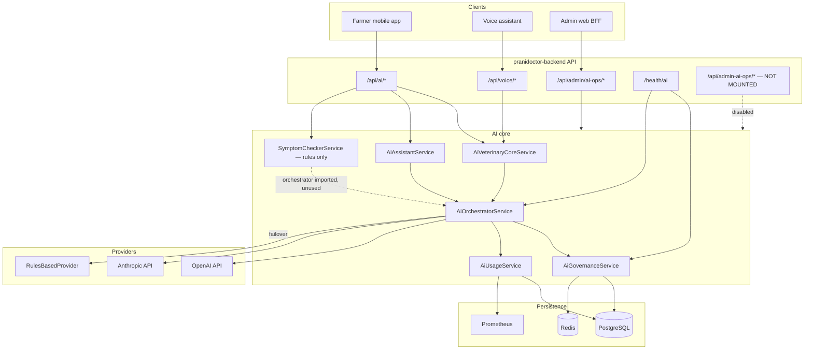
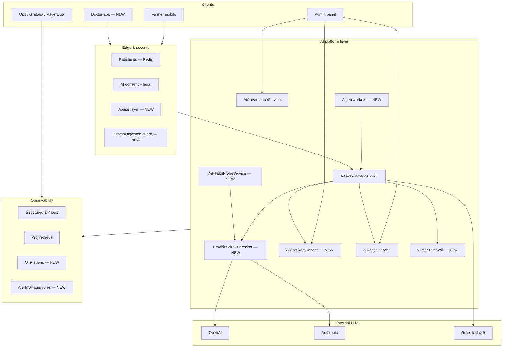
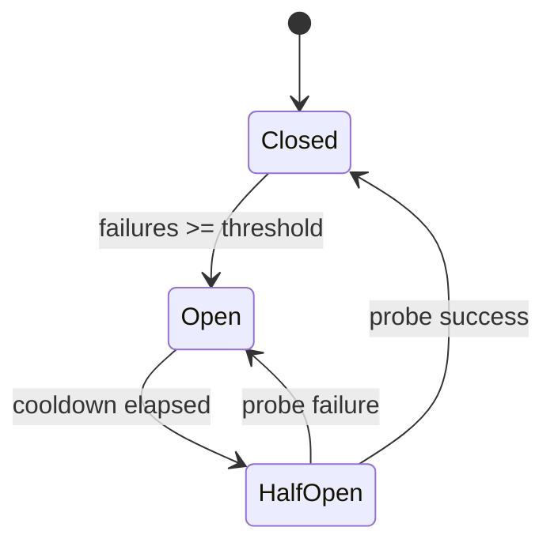
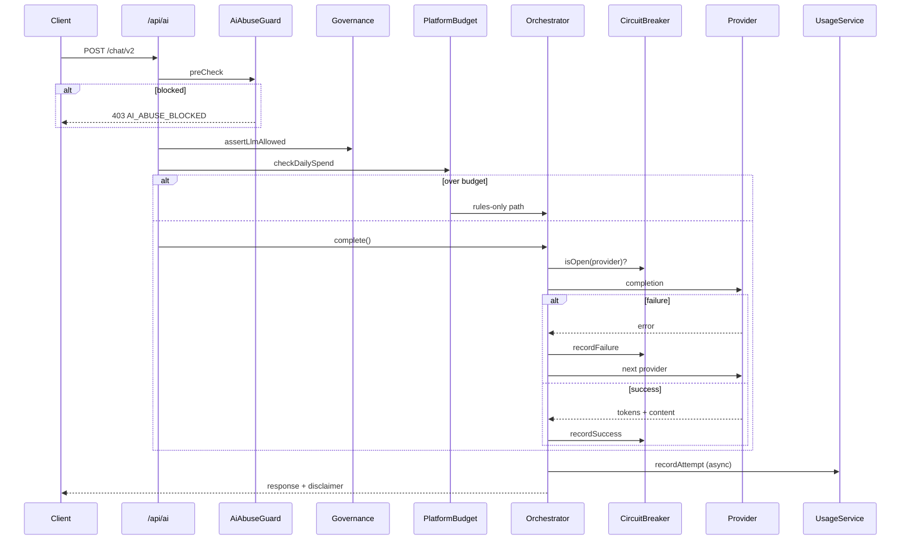

# AI Production Completion Plan

**Project:** Prani Doctor — LLM AI Platform  
**Role:** Principal AI Platform Architect  
**Date:** 2026-05-30  
**Scope:** Audit, gap analysis, and design for missing components — **Phase 0–1 implemented 2026-05-30** (see `docs/reports/AI_PRODUCTION_IMPLEMENTATION_REPORT.md`)

**Repositories in scope:**

| Repo | Role |
|------|------|
| `pranidoctor-backend` | Orchestrator, providers, governance, usage/cost, APIs |
| `pranidoctor-web` | Admin AI Ops panel (BFF proxy) |
| `pranidoctor_user` | Farmer/customer mobile AI features |

**Naming note:** “AI Technician” (`AiTechnicianProfile`, `/api/mobile/ai-technician/*`) is **human field staff for artificial insemination**, not LLM. This plan covers **LLM AI** only.

---

## Executive summary

The Prani Doctor LLM stack is **substantially built**: real OpenAI and Anthropic adapters, orchestrated provider failover to rules-based fallback, persisted kill switch with Redis sync, per-attempt usage and cost tracking with daily rollups, Prometheus metrics, and farmer-facing features on `/api/ai` and `/api/voice`. Admin governance, knowledge, prompts, overview, and risk panels exist in the web admin.

**Production blockers** cluster around **operational completeness** and **surface-area gaps**, not core orchestration:

1. LLM environment variables are undocumented and unvalidated at startup.
2. Admin usage, audit, escalations, and dedicated kill-switch APIs exist on an **unmounted** Express module; web usage proxies have **no legacy backend route**.
3. Provider health is config-only — no live probe or circuit breaker.
4. Cost rates are hard-coded with no admin sync or vendor reconciliation.
5. Doctor-facing LLM, vector RAG, async workers, and prompt-injection defenses are **not designed for production**.

This plan closes those gaps with **design-only** specifications: architecture, env contract, schema deltas, API surface, dashboards, monitoring, and a phased checklist.

---

## Current state inventory (confirmed)

| Capability | Status | Primary location |
|------------|--------|------------------|
| OpenAI provider | Implemented | `src/modules/ai/orchestrator/providers/openai.provider.ts` |
| Anthropic provider | Implemented | `src/modules/ai/orchestrator/providers/anthropic.provider.ts` |
| Rules-based fallback | Implemented | `src/modules/ai/orchestrator/providers/rules.provider.ts` |
| AI Orchestrator | Implemented | `src/modules/ai/orchestrator/ai-orchestrator.service.ts` |
| AI Usage Tracking | Implemented | `src/modules/ai/usage/ai-usage.service.ts` + Prisma rollups |
| AI Cost Tracking | Implemented | `src/modules/ai/usage/ai-usage.cost.ts` |
| AI Governance | Implemented | `src/modules/ai/governance/ai-governance.service.ts` |
| AI Kill Switch | Implemented | PG + Redis + fail-closed enforcement |
| Farmer AI (mobile) | Implemented | `pranidoctor_user/lib/features/ai/*` → `/api/ai/*` |
| Voice AI | Implemented | `/api/voice/*` → veterinary core |
| Admin AI Ops (partial) | Implemented | `pranidoctor-web` `/admin/ai-ops/*` + legacy BFF |
| Doctor LLM | **Missing** | No `/api/doctor/ai/*` |
| Embeddings / vector RAG | **Missing** | SQL `contains` search only |
| AI queue workers | **Defined, not running** | `infra/queue/queue.config.ts`, `worker.ts` |

---

## System architecture (as-built)



---

## Target production architecture (to-be)



---

## Gap analysis (15 audit dimensions)

### 1. Environment configuration completeness

| Item | Current | Gap | Severity |
|------|---------|-----|----------|
| `OPENAI_API_KEY`, `OPENAI_MODEL` | Read in provider | Not in `.env.example` / `.env.production.example` | **P0** |
| `ANTHROPIC_API_KEY`, `ANTHROPIC_MODEL` | Read in provider | Not documented | **P0** |
| `AI_PROVIDER` | Orchestrator + health | Not documented | **P0** |
| `INTERNAL_ADMIN_AI_OPS_TOKEN` | Express admin guard | Not documented | **P1** |
| `AI_KILL_SWITCH_*`, `AI_LLM_DISABLED` | Documented | OK | — |
| `AI_GOVERNANCE_POLL_INTERVAL_MS` | Commented in example | OK | — |
| `AI_HEALTH_PROBE_*` | Referenced in docs | **Not implemented** | **P1** |
| Zod validation in `config.schema.ts` | JWT, DB, Redis | **No AI block** | **P0** |
| Production startup guard | None for “zero LLM keys in prod” | **Missing** | **P1** |
| Per-environment model defaults | Single global env | No staging vs prod model tier | **P2** |

**Design:** Add `ai` section to config schema with optional keys in dev, required-at-least-one-provider in production when `AI_LLM_REQUIRED=true`.

---

### 2. Provider failover readiness

| Item | Current | Gap | Severity |
|------|---------|-----|----------|
| Chain ordering | Preferred env → other LLM → rules | OK | — |
| Governance scope filter | Per-provider disable | OK | — |
| Unconfigured skip | `isConfigured()` | OK | — |
| Retry on transient errors | Single attempt per provider | **No retry/backoff** | **P1** |
| Circuit breaker | None | **Opens after N failures** needed | **P1** |
| Failover metrics | `isFallback` on usage row | OK | — |
| Cross-region / multi-key | Single key per provider | **No key rotation pool** | **P2** |
| Failover runbook | Kill switch docs exist | **No provider-outage runbook** | **P2** |

**Design:** `AiProviderCircuitBreaker` (Redis-backed) with states CLOSED / OPEN / HALF_OPEN; orchestrator skips OPEN providers; half-open probe on interval.

---

### 3. Provider health monitoring

| Item | Current | Gap | Severity |
|------|---------|-----|----------|
| `GET /health/ai` | Config + kill switch only | **No LLM ping** | **P0** |
| Readiness impact | Degraded status only | Does not fail `/ready` on total LLM outage | **P1** |
| Synthetic probe cron | None | **Needed for SLO** | **P1** |
| Provider latency SLO | Histogram exists | No alert rules | **P1** |
| Dashboard | Grafana ai-ops.json | No provider-up panel | **P2** |

**Design:** `AiHealthProbeService` — optional lightweight completion (`max_tokens: 1`) on schedule; results in `AiProviderHealthSnapshot` table + gauge `ai_provider_up{provider}`.

---

### 4. Token accounting accuracy

| Item | Current | Gap | Severity |
|------|---------|-----|----------|
| Source of truth | Vendor `usage` in API response | OK for success path | — |
| Failed attempts | Tokens = 0 | OK | — |
| Billable flag | LLM success only | OK | — |
| Rules-based | Never billable | OK | — |
| Streaming responses | N/A (non-streaming fetch) | Future streaming needs delta accounting | **P2** |
| Rollup reconciliation | Upsert on write | **No periodic reconcile job** | **P2** |
| Idempotency | Chat has idempotency key (mobile) | Orchestrator does not dedupe by key | **P2** |

**Design:** Nightly `AiUsageReconcileJob` compares rollup sums vs raw `AiUsageRecord`; optional `requestId` column for idempotent retries.

---

### 5. Cost accounting accuracy

| Item | Current | Gap | Severity |
|------|---------|-----|----------|
| Rate table | Hard-coded USD/token | OK for MVP | — |
| `rateVersion` | `2026-05-30` stored per row | OK | — |
| Model-specific rates | Partial map | New models default to provider average | **P1** |
| Vendor invoice reconcile | None | **No import/compare** | **P2** |
| Budget caps | Daily user quota only | **No platform daily spend cap** | **P1** |
| Multi-currency / BDT | USD only | Product decision pending | **P3** |

**Design:** `AiCostRate` DB table + admin CRUD; orchestrator loads rates at boot + on pub/sub invalidation; `AiPlatformBudgetService` enforces daily `AI_PLATFORM_DAILY_BUDGET_USD`.

---

### 6. Admin reporting readiness

| Item | Current | Gap | Severity |
|------|---------|-----|----------|
| Overview (30d) | Legacy `GET .../overview` | OK | — |
| Risk analytics | Legacy `GET .../analytics/risk` | OK | — |
| Governance + kill switch | Legacy `GET/POST .../governance` | OK (POST doubles as kill switch) | — |
| User token usage | Express only + web proxy | **Legacy route missing → 404** | **P0** |
| Customer token usage | Express only + web proxy | **Legacy route missing** | **P0** |
| Escalations list | Express `AiAdminController` | **No legacy route / admin UI** | **P1** |
| Audit log | Express only | **No legacy route / admin UI** | **P1** |
| Top consumers / cost trends | Service methods exist | **No API or UI** | **P1** |
| Dedicated kill-switch POST | Express `/kill-switch` | Docs mention route; legacy uses governance POST | **P2** (doc alignment) |

**Design:** Consolidate admin surface on **legacy BFF** (cookie session) — add missing routes mirroring `configureAiAdminRoutes()`; deprecate unmounted Express module or mount behind internal token for automation only.

---

### 7. Doctor-facing AI readiness

| Item | Current | Gap | Severity |
|------|---------|-----|----------|
| Doctor LLM API | None | **Full greenfield** | **P1** |
| Knowledge audience `DOCTOR` | Schema supports | Not exposed on mobile/doctor APIs | **P1** |
| Escalation handoff | `AiEscalationRecord` → service request | Doctors see cases, not AI context bundle | **P1** |
| Doctor consent / disclaimer | Farmer-focused | **Doctor legal copy needed** | **P1** |
| Doctor rate limits | N/A | **Separate preset required** | **P2** |

**Design:** New module `doctor-ai` with scoped features: case summary, differential assist (non-diagnostic), knowledge search — all governed under new scope keys `DOCTOR_CHAT`, `DOCTOR_CASE_SUMMARY`.

---

### 8. Customer-facing AI readiness

| Item | Current | Gap | Severity |
|------|---------|-----|----------|
| Chat v1/v2 | Implemented | OK | — |
| Farm briefing / query | Implemented | OK | — |
| Symptom checker | Rules-only | LLM optional path designed but not wired | **P2** |
| Phase 8 pages (mobile) | Implemented | OK | — |
| Voice (Bangla) | Implemented; local STT/TTS | Cloud STT/TTS optional | **P3** |
| Offline AI queue | Outbox for chat | Partial sync story | **P2** |
| BN copy / compliance | Compliance wrappers | Ongoing QA (GA checklist I5) | **P1** |

**Design:** Wire symptom checker to orchestrator behind governance feature `SYMPTOM_CHECK` with strict rules-first + LLM narrative layer; extend mobile error UX for `AI_DAILY_LIMIT` and kill-switch degradation.

---

### 9. Rate limiting

| Item | Current | Gap | Severity |
|------|---------|-----|----------|
| `AI_CHAT` | 20/min burst | OK | — |
| `AI_CHAT_DAILY` | 100/24h per user | OK | — |
| Fail-closed in prod | Redis required | OK | — |
| Per-IP AI limits | Global presets only | **Shared IP abuse risk** | **P1** |
| Per-customer (tenant) cap | None | **Needed for B2B farms** | **P2** |
| Doctor endpoints | N/A | **New presets** | **P1** |
| Governance toggle RL | 10/hour/actor | OK | — |
| Dynamic limits from admin | None | **Future** | **P3** |

**Design:** Add `AI_CHAT_IP` preset; optional `customer:${id}` daily cap via env `AI_CUSTOMER_DAILY_LIMIT`.

---

### 10. Abuse prevention

| Item | Current | Gap | Severity |
|------|---------|-----|----------|
| Auth + AI consent | Required | OK | — |
| Input refusal (diagnosis/prescription) | `shouldRefuseUserInput()` | OK | — |
| Output guardrails | Sanitize + escalation | OK | — |
| Message length limits | Zod | OK | — |
| Prompt injection defense | System prompts only | **Dedicated classifier/layer** | **P1** |
| Automated account flagging | None | **Usage anomaly detector** | **P2** |
| Content moderation API | None | Optional OpenAI moderation | **P2** |

**Design:** `AiAbuseGuardService` — pre-orchestrator checks: injection heuristics, repetition flood, banned patterns; post-orchestrator optional moderation hook; writes `AiAbuseSignal` for admin review.

---

### 11. Secret management

| Item | Current | Gap | Severity |
|------|---------|-----|----------|
| Storage | Plain `process.env` | **No vault integration** | **P1** |
| Log redaction | `sanitizer.ts` | OK | — |
| Key rotation | Manual | **No runbook automation** | **P1** |
| Separate staging keys | Convention only | Document + enforce | **P1** |
| Least privilege admin token | Single shared token | **Scoped automation tokens** | **P2** |

**Design:** Document deployment pattern (Docker secrets / cloud SM); add `AI_SECRETS_SOURCE=vault|env`; never log provider error bodies at info level.

---

### 12. Logging

| Item | Current | Gap | Severity |
|------|---------|-----|----------|
| `logAiExecution()` | feature, provider, latency, success | OK | — |
| Workflow tracing | `traceWorkflow` | OK | — |
| PII in prompts | Not logged raw | Verify retention policy | **P1** |
| Correlation IDs | Governance history has fields | Not consistently on usage rows | **P2** |
| Audit export | DB tables | No admin export API | **P2** |

**Design:** Extend `AiUsageRecord` with optional `correlationId`, `sessionId`; structured log schema version `ai.log.v1`.

---

### 13. Observability

| Item | Current | Gap | Severity |
|------|---------|-----|----------|
| Prometheus metrics | requests, tokens, cost, fallback, latency, kill switch | OK | — |
| Grafana dashboard | `docs/monitoring/dashboards/ai-ops.json` | Missing usage rollups, abuse, provider health | **P1** |
| Sentry | Global bootstrap | AI-specific fingerprinting | **P2** |
| OpenTelemetry | None | **Span per provider call** | **P1** |
| Escalation metrics | `pranidoctor_ops_ai_escalation_*` | OK | — |
| SLO definitions | None documented | **Error budget for AI** | **P1** |

**Design:** OTel instrumentation in provider adapters; Alertmanager rules for fallback rate > 10%, p95 latency > 8s, daily cost > budget.

---

### 14. Security review

| Item | Current | Gap | Severity |
|------|---------|-----|----------|
| Fail-closed governance | Unhydrated → no LLM | OK | — |
| RBAC on admin AI ops | ADMIN / SUPER_ADMIN | OK | — |
| SUPER_ADMIN for prod enable | Enforced | OK | — |
| Express admin token | Header secret | OK if mounted; currently disabled | — |
| SSRF from AI tools | No tool calling yet | **Design before agents** | **P2** |
| Data residency | Vendor default | Document for BD compliance | **P1** |
| Threat model doc | Scattered | **Single AI threat model** | **P1** |

**Design:** Publish `docs/security/ai-threat-model.md`; review before enabling doctor AI or tool use.

---

### 15. Production deployment readiness

| Item | Current | Gap | Severity |
|------|---------|-----|----------|
| Kill switch drill | GA checklist K4 | Process exists | — |
| Migrations for AI tables | Applied | OK | — |
| Worker process | No AI processors | **Workers required for async** | **P2** |
| Load test AI paths | GA H7 generic | **No AI-specific load profile** | **P1** |
| Rollback with governance | Documented | OK | — |
| `.env.production.example` completeness | Governance only | **LLM vars missing** | **P0** |
| Health in k8s probes | `/health/ai` optional | Wire probe + alerts | **P1** |

**Design:** Production checklist section (below) gates GA for AI-specific criteria.

---

## Missing component designs (implementation specs)

### A. `AiHealthProbeService`

**Purpose:** Live provider reachability without blocking user requests.

**Behavior:**

- Runs on interval (`AI_HEALTH_PROBE_INTERVAL_SEC`, default 300) when `AI_HEALTH_PROBE_ENABLED=true`.
- Issues minimal chat completion to each configured provider.
- Updates Redis cache + `AiProviderHealthSnapshot` row.
- Sets Prometheus `ai_provider_up{provider}` and `ai_provider_probe_latency_seconds`.

**Failure modes:** Probe failure marks provider degraded; orchestrator may still try user requests until circuit opens.

---

### B. `AiProviderCircuitBreaker`

**Purpose:** Stop hammering failing providers; accelerate failover.

**State machine:**



**Config:** `AI_CB_FAILURE_THRESHOLD=5`, `AI_CB_COOLDOWN_SEC=60`, stored in Redis per provider.

---

### C. `AiCostRateService`

**Purpose:** Admin-manageable pricing without redeploy.

**Tables:** `AiCostRate` (see Database changes).

**Flow:** Admin updates rate → version bump → Redis pub/sub → orchestrator reloads → new attempts use new `rateVersion`.

---

### D. `AiPlatformBudgetService`

**Purpose:** Hard stop on runaway spend.

**Behavior:** Before orchestrator LLM call, sum today's `billableCostUsd` from rollups; if ≥ `AI_PLATFORM_DAILY_BUDGET_USD`, force rules-only and emit alert.

---

### E. `AiAbuseGuardService`

**Purpose:** Pre/post orchestrator abuse checks.

**Checks:**

1. Prompt injection pattern score (regex + optional small classifier).
2. Message velocity per user/IP.
3. Optional vendor moderation API.

**Output:** Block with `AI_ABUSE_BLOCKED` or allow with `riskScore` logged to `AiAbuseSignal`.

---

### F. `AiVectorRetrievalService` (RAG)

**Purpose:** Replace SQL `contains` for knowledge and symptom context.

**Components:**

- Embedding provider adapter (OpenAI `text-embedding-3-small` initial).
- `AiKnowledgeEmbedding` table with pgvector.
- Worker job `ai:embedding` processor (queue already defined).
- Retrieval API internal to `AiKnowledgeService.search()`.

---

### G. `DoctorAiModule`

**Purpose:** Doctor-scoped LLM with stricter governance.

**Routes (design):**

| Method | Path | Feature key |
|--------|------|-------------|
| POST | `/api/doctor/ai/case-summary` | `DOCTOR_CASE_SUMMARY` |
| POST | `/api/doctor/ai/chat` | `DOCTOR_CHAT` |
| GET | `/api/doctor/ai/knowledge/search` | `DOCTOR_KNOWLEDGE` |

**Auth:** Doctor JWT + clinic scope + new consent flag `DOCTOR_AI_PROCESSING`.

---

### H. Legacy admin route parity layer

**Purpose:** Expose Express `AiAdminController` capabilities on `/api/admin/ai-ops/*`.

**New legacy routes (mirror Express):**

- `GET /api/admin/ai-ops/usage/users/[userId]`
- `GET /api/admin/ai-ops/usage/customers/[customerId]`
- `GET /api/admin/ai-ops/usage/top-users`
- `GET /api/admin/ai-ops/usage/daily`
- `GET /api/admin/ai-ops/escalations`
- `GET /api/admin/ai-ops/audit`
- `GET /api/admin/ai-ops/providers/health`

**Decision:** Keep `createAiAdminModule()` unmounted for internal automation; document `INTERNAL_ADMIN_AI_OPS_TOKEN` for CI/scripts only.

---

### I. AI worker processors

**Purpose:** Async long-running AI tasks.

| Queue | Job | Processor |
|-------|-----|-----------|
| `ai:completion` | Batch summaries | Calls orchestrator |
| `ai:embedding` | Index knowledge doc | Embedding adapter |
| `ai:summary` | Farm report generation | Orchestrator + notify |

Register in `worker.ts` with concurrency limits from env.

---

## Required environment variables

### P0 — must document and validate before production

| Variable | Required | Default | Description |
|----------|----------|---------|-------------|
| `OPENAI_API_KEY` | One of OpenAI/Anthropic | — | OpenAI API key |
| `OPENAI_MODEL` | No | `gpt-4o-mini` | Default OpenAI model |
| `ANTHROPIC_API_KEY` | One of OpenAI/Anthropic | — | Anthropic API key |
| `ANTHROPIC_MODEL` | No | `claude-3-5-haiku-20241022` | Default Anthropic model |
| `AI_PROVIDER` | No | `openai` | Preferred provider in failover chain |
| `AI_KILL_SWITCH_PERSISTENCE_ENABLED` | Prod: `true` | `true` | Persist kill switch to PG |
| `REDIS_ENABLED` | Prod: `true` | `true` | Required for rate limits + governance |

### P1 — operational controls

| Variable | Required | Default | Description |
|----------|----------|---------|-------------|
| `AI_LLM_DISABLED` | No | `false` | Emergency rules-only at startup |
| `AI_GOVERNANCE_POLL_INTERVAL_MS` | No | `45000` | PG poll fallback for governance |
| `AI_LLM_REQUIRED` | Prod recommended | `false` | Fail startup if no LLM key |
| `AI_HEALTH_PROBE_ENABLED` | No | `false` | Enable synthetic provider probes |
| `AI_HEALTH_PROBE_INTERVAL_SEC` | No | `300` | Probe interval |
| `AI_PLATFORM_DAILY_BUDGET_USD` | No | `500` | Platform spend cap |
| `AI_CB_FAILURE_THRESHOLD` | No | `5` | Circuit breaker threshold |
| `AI_CB_COOLDOWN_SEC` | No | `60` | Circuit breaker cooldown |
| `INTERNAL_ADMIN_AI_OPS_TOKEN` | Automation only | — | Header `x-internal-admin-token` |
| `OPS_AI_ESCALATION_BACKLOG_THRESHOLD` | No | — | Escalation alert threshold |
| `OPS_AI_EMERGENCY_SYMPTOM_MINUTES` | No | — | Emergency symptom SLA alert |

### P2 — abuse, limits, RAG

| Variable | Required | Default | Description |
|----------|----------|---------|-------------|
| `AI_CHAT_DAILY_POINTS` | No | `100` | Override daily user quota |
| `AI_CUSTOMER_DAILY_LIMIT` | No | — | Per-tenant daily cap |
| `AI_ABUSE_ENABLED` | No | `true` | Enable abuse guard |
| `AI_MODERATION_ENABLED` | No | `false` | Vendor moderation hook |
| `AI_EMBEDDING_MODEL` | No | `text-embedding-3-small` | Embedding model id |
| `AI_EMBEDDING_ENABLED` | No | `false` | Enable vector RAG |

### P3 — future

| Variable | Description |
|----------|-------------|
| `AI_SECRETS_SOURCE` | `env` \| `vault` |
| `AI_DOCTOR_ENABLED` | Feature flag for doctor AI |
| `AI_STREAMING_ENABLED` | Streaming responses |

---

## Required database changes

### New models (Prisma)

```prisma
/// Admin-managed token pricing (replaces hard-coded-only rates)
model AiCostRate {
  id              String   @id @default(cuid())
  provider        String
  model           String?  // null = provider default
  inputPerToken   Decimal  @db.Decimal(16, 12)
  outputPerToken  Decimal  @db.Decimal(16, 12)
  effectiveFrom   DateTime @default(now())
  version         String   @db.VarChar(32)
  createdByUserId String?
  createdAt       DateTime @default(now())

  @@unique([provider, model, version])
  @@index([provider, model, effectiveFrom])
}

/// Point-in-time provider probe results
model AiProviderHealthSnapshot {
  id          String   @id @default(cuid())
  provider    String
  reachable   Boolean
  latencyMs   Int
  errorCode   String?  @db.VarChar(64)
  probedAt    DateTime @default(now())

  @@index([provider, probedAt])
}

/// Abuse signals for admin review
model AiAbuseSignal {
  id          String   @id @default(cuid())
  userId      String?
  customerId  String?
  feature     String
  signalType  String   // injection | velocity | moderation
  riskScore   Float
  blocked     Boolean  @default(false)
  metadataJson Json?
  createdAt   DateTime @default(now())

  @@index([createdAt, signalType])
  @@index([userId, createdAt])
}

/// Vector embeddings for knowledge RAG (requires pgvector extension)
model AiKnowledgeEmbedding {
  id               String   @id @default(cuid())
  knowledgeEntryId String
  chunkIndex       Int      @default(0)
  embedding        Unsupported("vector(1536)")?
  model            String
  createdAt        DateTime @default(now())

  @@unique([knowledgeEntryId, chunkIndex])
  @@index([knowledgeEntryId])
}
```

### Alter existing models

| Model | Change | Reason |
|-------|--------|--------|
| `AiUsageRecord` | Add `correlationId String?`, `sessionId String?`, `requestId String? @unique` | Tracing + idempotency |
| `AiGovernanceScope` | Seed scope keys `SYMPTOM_CHECK`, `DOCTOR_CHAT`, `DOCTOR_CASE_SUMMARY`, `VOICE` | Feature-level kill switch parity |
| `AiPromptTemplate` | No schema change | Add seed prompts for new features |

### Migrations dependency

- Enable `pgvector` extension migration before `AiKnowledgeEmbedding`.
- Backfill script: populate `AiCostRate` from current `ai-usage.cost.ts` constants.

---

## Required API endpoints

### Admin (legacy BFF — `/api/admin/ai-ops/*`)

| Method | Path | Status | Action |
|--------|------|--------|--------|
| GET | `/overview` | Exists | Extend with cost budget status |
| GET | `/governance` | Exists | — |
| POST | `/governance` | Exists | Kill switch + scopes |
| GET | `/analytics/risk` | Exists | — |
| GET | `/knowledge` | Exists | — |
| POST | `/knowledge` | Exists | — |
| POST | `/knowledge/:id/publish` | Exists | — |
| GET | `/prompts` | Exists | — |
| POST | `/prompts` | Exists | — |
| POST | `/prompts/:id/activate` | Exists | — |
| GET | `/usage/users/:userId` | **Missing backend** | **Add** |
| GET | `/usage/customers/:customerId` | **Missing backend** | **Add** |
| GET | `/usage/top-users` | **Missing** | **Add** |
| GET | `/usage/daily` | **Missing** | **Add** |
| GET | `/escalations` | **Missing** | **Add** |
| GET | `/audit` | **Missing** | **Add** |
| GET | `/providers/health` | **Missing** | **Add** |
| GET | `/cost-rates` | **Missing** | **Add** |
| POST | `/cost-rates` | **Missing** | **Add** (SUPER_ADMIN) |
| GET | `/abuse/signals` | **Missing** | **Add** |

### Farmer (existing — enhancements only)

| Method | Path | Enhancement |
|--------|------|-------------|
| POST | `/api/ai/symptom-check` | Optional LLM narrative layer behind governance |
| POST | `/api/ai/chat/v2` | Abuse guard + correlation headers |
| GET | `/api/ai/knowledge/search` | Vector search when `AI_EMBEDDING_ENABLED` |

### Doctor (new — `/api/doctor/ai/*`)

| Method | Path | Description |
|--------|------|-------------|
| POST | `/case-summary` | Summarize case file for doctor (non-diagnostic) |
| POST | `/chat` | Doctor-scoped assistant |
| GET | `/knowledge/search` | Doctor audience knowledge |
| GET | `/escalations/:id/context` | AI transcript bundle for escalation |

### Health & ops

| Method | Path | Description |
|--------|------|-------------|
| GET | `/health/ai` | Extend with last probe results |
| GET | `/metrics` | Add new gauges (existing endpoint) |

### Internal automation (optional Express `/api/admin-ai-ops/*`)

Keep token-gated mirror for CI kill-switch drills and usage export — only if `INTERNAL_ADMIN_AI_OPS_TOKEN` set.

---

## Required admin dashboards

### Web admin (`pranidoctor-web`)

| Page | Route | Status | Design |
|------|-------|--------|--------|
| AI Operations overview | `/admin/ai-ops` | Exists | Add cost/budget widgets, fallback % |
| Governance & kill switch | `/admin/ai-ops/governance` | Exists | Add scope matrix for new features |
| Risk monitoring | `/admin/ai-ops/risk` | Exists | — |
| Knowledge CMS | `/admin/ai-ops/knowledge` | Exists | Embedding status badge |
| Prompt management | `/admin/ai-ops/prompts` | Exists | — |
| **Token & cost usage** | `/admin/ai-ops/usage` | **Missing UI** | Top users, daily chart, export CSV |
| **Escalation queue** | `/admin/ai-ops/escalations` | **Missing UI** | Filter by status, link to service request |
| **Safety audit log** | `/admin/ai-ops/audit` | **Missing UI** | Paginated `AiSafetyAuditLog` |
| **Provider health** | `/admin/ai-ops/providers` | **Missing** | Probe history, circuit state |
| **Cost rate admin** | `/admin/ai-ops/cost-rates` | **Missing** | SUPER_ADMIN only |
| **Abuse review** | `/admin/ai-ops/abuse` | **Missing** | Signal queue + block user action |

### Grafana (`docs/monitoring/dashboards/`)

Extend `ai-ops.json` with panels:

- Provider up (`ai_provider_up`)
- Platform daily spend vs budget
- Token volume by feature
- Abuse blocks rate
- Rollup reconcile drift (gauge)
- Doctor vs farmer request split (when live)

---

## Required monitoring & alerting

### SLO targets (proposed)

| SLI | Target | Window |
|-----|--------|--------|
| AI chat availability (non-5xx) | 99.5% | 30d |
| LLM success rate (non-fallback) | ≥ 95% | 24h |
| p95 orchestrator latency | < 8s | 24h |
| Kill switch propagation | < 60s | incident |

### Alert rules (Alertmanager)

| Alert | Condition | Severity |
|-------|-----------|----------|
| `AiHighFallbackRate` | fallback ratio > 10% for 15m | warning |
| `AiProviderDown` | `ai_provider_up == 0` for 10m | critical |
| `AiDailyBudgetExceeded` | rollup cost ≥ budget | critical |
| `AiLlmDisabled` | `ai_llm_disabled == 1` | info (page on-call if unplanned) |
| `AiEscalationBacklog` | existing ops metric > threshold | warning |
| `AiRateLimitUnavailable` | 503 `RATE_LIMIT_UNAVAILABLE` spike | critical |

### Runbooks (link from alerts)

- `docs/operations/ai-kill-switch.md` (exists)
- `docs/operations/ai-emergency-runbook.md` (exists)
- **New:** `docs/operations/ai-provider-outage-runbook.md`
- **New:** `docs/operations/ai-cost-overrun-runbook.md`

### Logging retention

- `AiUsageRecord`: 90d hot, archive to cold storage 1y
- `AiGovernanceStateHistory`: indefinite
- `AiAbuseSignal`: 180d

---

## Orchestrator request flow (target)



---

## Final implementation checklist

### Phase 0 — Production blockers (P0)

- [ ] Add LLM env vars to `.env.example` and `.env.production.example`
- [ ] Add `ai` block to `config.schema.ts` with production validation
- [ ] Implement legacy BFF routes: usage users/customers, top-users, daily rollups
- [ ] Verify web proxy paths return 200 against legacy routes
- [ ] Document `AI_PROVIDER` failover behavior in ops docs
- [ ] GA gate: at least one LLM provider key in production secret store

### Phase 1 — Reliability & observability (P1)

- [ ] Implement `AiHealthProbeService` + `/health/ai` enrichment
- [ ] Implement `AiProviderCircuitBreaker` in orchestrator chain
- [ ] Add transient retry (1–2 attempts) with jitter per provider
- [ ] Add OpenTelemetry spans on provider HTTP calls
- [ ] Extend Grafana dashboard + Alertmanager rules
- [ ] Implement `AiPlatformBudgetService`
- [ ] Add admin pages: usage, escalations, audit
- [ ] Implement `AiAbuseGuardService` (baseline heuristics)
- [ ] Publish `docs/security/ai-threat-model.md`
- [ ] AI-specific load test profile (20 RPS chat mix)
- [ ] Secret rotation runbook for OpenAI/Anthropic keys

### Phase 2 — Cost & accounting accuracy (P1–P2)

- [ ] Migration: `AiCostRate` + seed from hard-coded table
- [ ] Implement `AiCostRateService` + admin API/UI
- [ ] Nightly `AiUsageReconcileJob`
- [ ] Add `correlationId` / `requestId` to usage records
- [ ] Vendor invoice compare script (manual monthly)

### Phase 3 — Customer & doctor product (P1–P2)

- [ ] Add governance scopes: `SYMPTOM_CHECK`, `VOICE`, doctor features
- [ ] Wire symptom checker LLM narrative (optional, governed)
- [ ] Implement `DoctorAiModule` + mobile/doctor client stubs
- [ ] Doctor AI consent + disclaimer CMS keys
- [ ] Mobile UX for degradation modes (kill switch, daily limit, rules-only)
- [ ] Per-IP rate limit preset `AI_CHAT_IP`

### Phase 4 — RAG & async (P2)

- [ ] pgvector migration + `AiKnowledgeEmbedding`
- [ ] Implement `ai:embedding` worker processor
- [ ] Implement `AiVectorRetrievalService`
- [ ] Implement `ai:completion` and `ai:summary` processors
- [ ] Knowledge admin: re-index action

### Phase 5 — Hardening & cleanup (P2–P3)

- [ ] Remove or repurpose stub `AiService.chat()` TODO
- [ ] Remove dead orchestrator import in symptom checker OR wire LLM
- [ ] Align kill-switch docs with governance POST (or add dedicated route)
- [ ] Decide fate of `createAiAdminModule()` — document automation-only
- [ ] Optional: vendor moderation hook
- [ ] Optional: cloud STT/TTS for voice
- [ ] Streaming support with token delta accounting

---

## Risk register

| Risk | Impact | Mitigation |
|------|--------|------------|
| Admin usage API 404 in production | Ops blind to token spend | Phase 0 legacy routes |
| Hard-coded cost drift | Wrong budget decisions | Phase 2 `AiCostRate` |
| Provider outage without CB | Latency cascade | Phase 1 circuit breaker |
| Prompt injection | Harmful or leaked guidance | Phase 1 abuse guard |
| Runaway spend | Financial | Phase 1 platform budget |
| Doctor AI without legal review | Compliance | Phase 3 gated on counsel sign-off |

---

## Appendix — key file index

```
src/modules/ai/
  orchestrator/ai-orchestrator.service.ts
  orchestrator/providers/{openai,anthropic,rules}.provider.ts
  governance/ai-governance.service.ts
  usage/{ai-usage.service,ai-usage.cost,ai-usage.metrics}.ts
  ai.routes.ts                    # configureAiAdminRoutes (Express, unmounted)
  ai.module.ts                    # AiAdminModule defined, not in createAllModules()

src/legacy/web/routes/admin/ai-ops/   # Primary admin BFF (incomplete vs Express)

src/api/health/ai-health.service.ts   # Config-only health

prisma/schema.prisma                  # AiUsage*, AiGovernance*, AiPrompt*

docs/monitoring/dashboards/ai-ops.json
docs/operations/ai-kill-switch.md
docs/operations/ai-emergency-runbook.md

pranidoctor-web/src/app/admin/(dashboard)/ai-ops/
pranidoctor_user/lib/features/ai/
```

---

## Document control

| Version | Date | Author | Notes |
|---------|------|--------|-------|
| 1.0 | 2026-05-30 | AI Platform Architecture | Initial audit + completion plan |

**Next review:** After Phase 0 completion or before GA Launch Governance Board vote (checklist M4).
