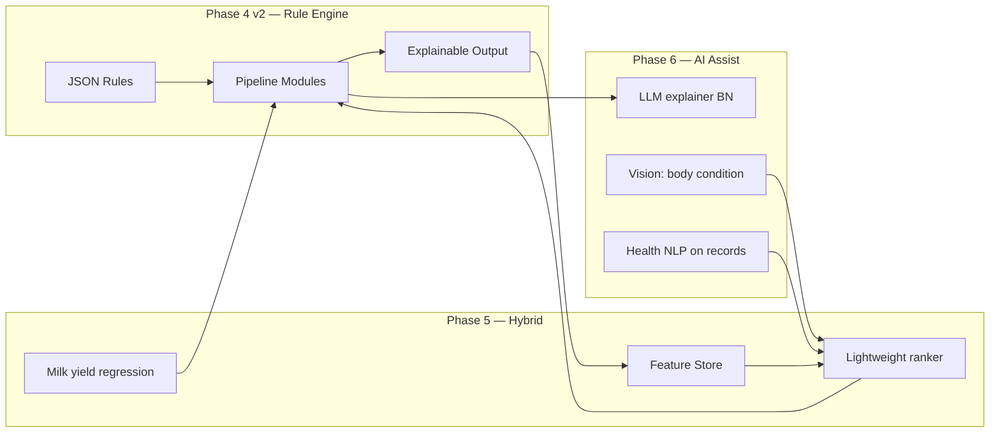

# Phase 4 — Feed Intelligence Engine V1

**Plan ID:** `PHASE_4_FEED_INTELLIGENCE_ENGINE_V1`  
**Engine version:** `intelligence-v1`  
**Rules version:** `bd-v2`  
**Location:** `pranidoctor-backend/src/modules/feed-recommendation/`

---

## 1. Architecture analysis (before)

| Layer | State |
|-------|--------|
| Engine | Single `runRecommendationEngine()` — DM × category %, first item by `sortOrder` |
| Rules | Static `bd-default.json` at process start; admin `Setting` JSON **not loaded** |
| Nutrition | `FeedNutrition` in DB — **unused** by engine |
| Seasonal | Text warnings only — no allocation shift |
| Disease | `healthStatus` multiplier only — no health record linkage |
| Lactation | Not used (`lactationNumber`, `lastCalvingDate` ignored) |
| Affordability | Sum of `approxPriceBdt` — no scoring or alternatives |
| Explainability | `warnings[]` only |
| Analytics | `FeedRecommendationLog.totalsJson` — basic totals |

---

## 2. Scoring architecture (v2)

```
┌─────────────────────────────────────────────────────────────┐
│  Rules loader (Setting → cache 60s → bd-v2-default.json)    │
└───────────────────────────┬─────────────────────────────────┘
                            ▼
┌─────────────────────────────────────────────────────────────┐
│  Pipeline state (mutable, pure module transforms)             │
│  input + context + feedItems + allocation + scores          │
└───────────────────────────┬─────────────────────────────────┘
                            ▼
  dm-base → lactation → pregnancy → health → disease →
  young-animal → seasonal → item-selection
                            ▼
┌─────────────────────────────────────────────────────────────┐
│  buildRecommendationFromState()                             │
│  • items + costs                                            │
│  • nutritionFit / affordability / seasonal / health scores  │
│  • explanations[] + alternatives[]                          │
│  • totals.intelligence (analytics payload)                  │
└─────────────────────────────────────────────────────────────┘
```

### Composite scores (0–100)

| Score | Formula |
|-------|---------|
| **nutritionFit** | `100 × (1 − 0.55×|CP−target|/target − 0.45×|TDN−target|/target)` |
| **affordability** | `100 × (1 − estimatedCost / budget)`; budget from context or rules default |
| **seasonalFit** | Base 80; 95 when seasonal allocation shift applied; item-level seasonal in selection |
| **healthSafety** | 100 healthy; 70 recovering/observation; 40 sick; min 55 when disease rule hits |
| **overall** | `0.35×nutrition + 0.25×affordability + 0.20×seasonal + 0.20×health` |

### Per-item selection score

```
itemScore = 100 × (
  w_n × nutritionMatch +
  w_a × affordability +
  w_s × seasonalFit +
  w_u × suitability
)
```

Default weights (`scoringWeights`): nutrition 40%, affordability 30%, seasonal 15%, suitability 15%.

**nutritionMatch** = `1 − (0.6×|cp−target|/target + 0.4×|tdn−target|/target)`  
**affordability** = `1 − price / maxPriceInCategory`  
**seasonalFit** = boosted for `bangladeshContext.monsoonRoughageCodes` in monsoon; penalized GREEN in monsoon  
**suitability** = 1 if `suitabilityJson.animalTypes` empty or contains species; +0.15 for `preferredCodes`

---

## 3. Recommendation formulas

### Base dry matter

```
totalDmKg = weightKg × baseDmPercent[species]
```

### Lactation add-on (DAIRY COW/BUFFALO)

```
extraDmKg = dailyMilkLiters × dmPerLiterMilk    (default 0.4)
totalDmKg += extraDmKg
```

Phase by `daysSinceCalving`:
- **early** (≤100d): concentrate × 1.15, CP target +10%
- **mid** (≤200d): concentrate × 1.05, CP target +5%
- **late** (≤305d): baseline
- **dry** (>305d): concentrate × 0.7

### Category allocation

Start from `categoryAllocation[species][purpose]`, then apply modifiers:

| Modifier | Effect |
|----------|--------|
| Health SICK | concentrate × 0.5 |
| Health RECOVERING | concentrate × 0.75 |
| Pregnancy PREGNANT (female) | concentrate × 1.12, mineral × 1.20 |
| Young animal (age ≤ 12 mo) | concentrate × 1.15 |
| Seasonal shift | add/subtract category fractions, renormalize |
| Disease rules | per-disease concentrate/green/mineral multipliers |

Normalize: `allocation[c] /= sum(allocation)`

### Item amount & cost

```
amountKg[c] = totalDmKg × allocation[c]
costBdt = amountKg × feedItem.approxPriceBdt
```

### Nutrition achieved (blended ration)

```
achievedCp = Σ (amountKg_i / totalDmKg) × cpPercent_i
achievedTdn = Σ (amountKg_i / totalDmKg) × tdnPercent_i
```

### Low-cost alternative

For selected item, find same-category candidate where:
- `candidateScore ≥ winnerScore × alternativeMinScoreRatio` (default 0.85)
- `candidatePrice < winnerPrice`

---

## 4. Rule definitions (bd-v2-default.json)

| Section | Purpose |
|---------|---------|
| `baseDmPercentOfBodyWeight` | Species DM requirement |
| `nutritionTargets` | CP/TDN targets by species × purpose |
| `categoryAllocation` | Roughage/green/concentrate/mineral/silage splits |
| `scoringWeights` | Item ranking weights |
| `modifiers.healthStatus` | Sick/recovering concentrate adjustment |
| `modifiers.pregnancyStatus` | Pregnant boost |
| `lactation` | Milk DM, phases, dry period |
| `seasonal` | BD monsoon/winter/summer shifts + warnings |
| `diseaseRules` | Keyword → ration adjustment (mastitis, bloat, parasite, fever) |
| `affordability` | Alternative threshold, budget warnings |
| `bangladeshContext` | Preferred feed codes, monsoon roughage preference |

### Bangladesh seasonal logic

| Season | Months | Allocation shift |
|--------|--------|------------------|
| Monsoon | Jun–Oct | ROUGHAGE +10%, GREEN −8%, SILAGE +2% |
| Winter | Nov–Feb | CONCENTRATE +5%, ROUGHAGE +5%, GREEN −5% |
| Summer | Mar–May | GREEN +8%, ROUGHAGE −5% |

### Disease-aware rules (keyword match on recent health records)

| Rule ID | Keywords | Action |
|---------|----------|--------|
| mastitis | mastitis, মাস্টাইটিস | concentrate × 0.8 |
| bloat | bloat, পেট ফোলা | green × 0.5 |
| parasite | parasite, কৃমি | mineral +15% |
| fever | fever, জ্বর | concentrate × 0.6 |

---

## 5. Configurable admin rules

- **API:** `GET/PUT /api/admin/recommendation-rules`
- **Storage:** `Setting.key = feedRecommendationRules`
- **Runtime:** `loadIntelligenceRules()` reads Setting first, validates via Zod + `coerceLegacyRules()`, caches 60s
- **Invalidation:** `invalidateRulesCache()` on admin save
- **Fallback:** `rules/bd-v2-default.json` → `rules/bd-default.json` (coerced to v2)

Admin panel can edit full JSON; invalid keys rejected at save or coerced with defaults.

---

## 6. Analytics-ready outputs

API response extensions (backward compatible):

```json
{
  "ruleVersion": "bd-v2",
  "items": [{ "feedItemId", "nameBn", "amountKg", "costBdt", "itemScore" }],
  "totals": {
    "dryMatterKg", "estimatedCostBdt", "itemCount",
    "intelligence": {
      "engineVersion", "rulesSource", "rulesVersion",
      "appliedRuleIds", "scores", "explanations", "alternatives",
      "nutritionTargets", "nutritionAchieved"
    }
  },
  "scores": { "nutritionFit", "affordability", "seasonalFit", "healthSafety", "overall" },
  "explanations": [{ "ruleId", "ruleNameBn", "effect", "impactBn" }],
  "alternatives": [{ "originalFeedItemId", "alternativeFeedItemId", "nameBn", "savingsBdt", "tradeoffBn" }],
  "warnings": []
}
```

`FeedRecommendationLog.totalsJson` stores `intelligence` nested object for platform analytics aggregation.

---

## 7. Optimization notes

| Goal | Approach |
|------|----------|
| **Low compute** | O(categories × items) ≈ 5×50 = 250 score ops; no ML; rules cached 60s |
| **Modular rules** | Each `RuleModule` is pure `state → state`; add module = one file + pipeline register |
| **Explainability** | Every module appends structured `explanations[]` with Bengali impact text |
| **Admin safety** | Zod schema + legacy coerce; invalid admin JSON falls back to file |
| **BD context** | Preferred codes, monsoon roughage boost, Bangla warnings/disclaimer |

### Known limitations (v1 intelligence)

- Milk liters not yet pulled from milk records (defaults from rules)
- No inventory-aware selection (stock not in scoring)
- Pregnancy trimester not inferred (binary PREGNANT)
- Disease matching is keyword-based, not ICD/normalized taxonomy
- `gender` used only for pregnancy gate

---

## 8. Future AI roadmap



| Phase | Capability | Integration point |
|-------|------------|-------------------|
| **5a** | Milk yield estimate from 7-day milk logs | `context.estimatedDailyMilkLiters` |
| **5b** | Inventory-aware scoring (+stock bonus) | `item-selection` module |
| **5c** | Farmer budget preference profile | `context.budgetBdt` from settings |
| **5d** | Gradient boosted ranker for item pick | Replace `scoreFeedItem()` weights; keep pipeline |
| **6a** | LLM generates `impactBn` from structured facts | Post-processor on `explanations` |
| **6b** | Accept/reject feedback loop | Train on `FeedRecommendationLog.accepted` + consumption |
| **6c** | Multimodal BCS from photo | Adjust `totalDmKg` modifier |

**AI design principles:** Keep rule engine as **constraint layer** (safety, disease, pregnancy caps). ML ranks only within safe feasible set. All AI outputs must attach to existing `explanations[]` schema.

---

## 9. File map

```
src/modules/feed-recommendation/
├── intelligence.engine.ts          # async/sync entry
├── recommendation.engine.ts        # input builders + legacy alias
├── engine/
│   ├── rules-schema.ts             # Zod validation
│   ├── rules-loader.ts             # Setting + cache
│   ├── rules-coerce.ts             # v1 → v2 upgrade
│   ├── pipeline.ts                 # orchestration + scoring
│   ├── engine-utils.ts             # math + item scoring
│   └── modules/                    # pluggable rule modules
├── rules/
│   ├── bd-v2-default.json          # intelligence rules
│   └── bd-default.json             # legacy fallback
```

---

## 10. API (unchanged paths)

| Method | Path |
|--------|------|
| GET | `/api/mobile/recommendations/daily?livestockId=&planDate=` |
| POST | `/api/mobile/recommendations/preview` |
| POST | `/api/mobile/recommendations/accept` |
| GET/PUT | `/api/admin/recommendation-rules` |

Response now includes `scores`, `explanations`, `alternatives` when engine v2 runs.
