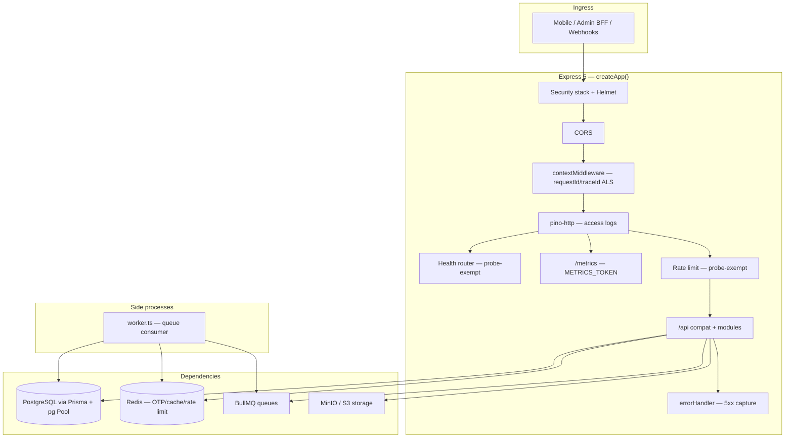
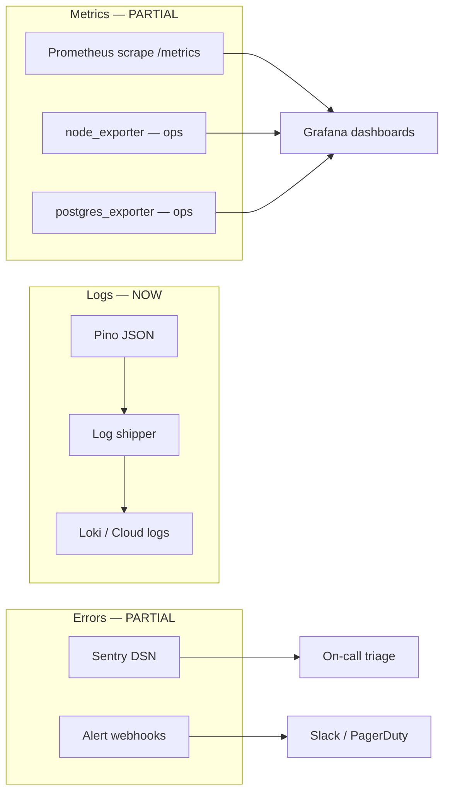

# Backend Monitoring Plan — Prani Doctor API

**Status:** Implemented (Phase 1 — in-process Prometheus metrics + structured HTTP/DB logs)  
**Last updated:** 2026-05-30  
**Repo:** `pranidoctor-backend`  
**Related:** [sentry-integration-plan.md](./sentry-integration-plan.md), [sentry-verification-report.md](./sentry-verification-report.md), [backend-monitoring-verification-report.md](./backend-monitoring-verification-report.md), [health-check-plan.md](./health-check-plan.md), [escalation-monitoring-plan.md](../operations/escalation-monitoring-plan.md), [deploy/monitoring/prometheus-alerts.yml](../../../deploy/monitoring/prometheus-alerts.yml)

---

## 1. Executive summary

The Prani Doctor API (`pranidoctor-backend`) ships a **production-grade observability foundation**: structured Pino logging with request correlation, layered health probes, token-gated Prometheus scrape endpoint, in-process HTTP/DB/queue/resource metrics (Phase 1), production alerting webhooks, Sentry error capture, and BullMQ failure hooks.

This plan defines a **three-pillar monitoring strategy** (logs, metrics, errors/traces), maps each required metric to signal sources, and specifies dashboard and alert designs that reuse existing infrastructure without breaking API contracts.

| Pillar | Maturity | Primary tooling |
|--------|----------|-----------------|
| **Logs** | Production-ready | Pino JSON + `pino-http` |
| **Health / synthetic** | Production-ready | `/live`, `/ready`, `/health/*` |
| **Errors** | Partial (Sentry + webhooks) | Sentry, `captureException`, alerting |
| **Metrics (HTTP/DB/queue)** | Phase 1 shipped | `/metrics` — HTTP, DB, queue, deps, resources + AI |
| **Dashboards** | Not deployed | Prometheus + Grafana (recommended) |
| **Log aggregation** | Ops-dependent | Loki / CloudWatch / VPS files |

---

## 2. Express architecture (observability-relevant)



### 2.1 Request lifecycle

| Stage | Component | Observability output |
|-------|-----------|---------------------|
| Entry | `contextMiddleware` | `X-Request-Id`, `X-Trace-Id`; ALS context for all logs |
| Access | `createLoggerMiddleware` (pino-http) | Method, path, status, level by status class; **health paths excluded** |
| Auth | `auth.middleware` / mobile JWT | `userId` in ALS → Pino mixin |
| Handler | Module routes + compat `/api/*` | Business logs via `logInfo` / `logError` |
| Error | `errorHandler` | 5xx → Pino + Sentry + `ALT-ERR-01` webhook alert |
| Fatal | `server.ts` process handlers | Sentry + `ALT-ERR-02` + graceful shutdown |

### 2.2 Route surfaces

| Mount | Purpose | Monitoring notes |
|-------|---------|------------------|
| `/live` | Liveness | No DB; rate-limit exempt |
| `/ready` | Readiness (DB + Redis) | Failing → `ALT-DOWN-02` |
| `/health`, `/health/db`, `/health/redis`, … | Aggregate + granular | DB latency in JSON response |
| `/metrics`, `/metrics/json` | Prometheus / debug JSON | `METRICS_TOKEN` in production |
| `/api/*` | Mobile + admin compat + modules | Primary SLO surface |
| `/api/docs` | Swagger | Optional `API_DOCS_KEY` in prod |

### 2.3 Worker process

`worker.ts` runs a separate Node process for BullMQ consumers. It shares:

- Pino logger, Sentry bootstrap, Prisma, Redis, queue connection
- Uncaught/unhandled → Sentry + alerts (same as API)

Queue job failures are logged in `queue.service.ts`; **permanent** failures (retries exhausted) → Sentry with `source=background_job`.

---

## 3. PostgreSQL & Prisma

### 3.1 Connection model

| Setting | Source | Default |
|---------|--------|---------|
| Client | `PrismaClient` + `@prisma/adapter-pg` | — |
| Pool | `pg.Pool` | min 2, max 10 (`DB_POOL_*`) |
| URL | `DATABASE_URL` | Required at startup |

### 3.2 Observability hooks (current)

| Signal | Where | Environment |
|--------|-------|-------------|
| Connectivity probe | `checkDatabaseConnection()` → `SELECT 1` | All — `/health/db`, `/ready` |
| Probe latency | `HealthCheckResult.latency` (ms) | Health JSON only |
| Prisma errors | `$on('error')` → Pino | All |
| Slow queries (>DB_SLOW_QUERY_MS) | Prisma `$on('query')` → metrics + structured `db.query.slow` log | All (when `DB_QUERY_METRICS_ENABLED`) |
| Query duration histogram | `pranidoctor_db_query_duration_seconds` | All |
| Prisma warnings | `$on('warn')` | Development only |
| ORM errors → API | `mapPrismaError` → HTTP 4xx/5xx | All |

### 3.3 Remaining gaps (Phase 2+)

- Pool exhaustion / waiting clients not exposed as metrics.
- `pg_stat_statements` not integrated (use Postgres exporter for deep DB dashboards).

### 3.4 Phase 1 implementation (shipped)

| Component | Path |
|-----------|------|
| Shared Prometheus helpers | `src/shared/monitoring/metrics/prometheus-series.ts` |
| HTTP RED metrics middleware | `src/shared/monitoring/metrics/http.metrics.ts` |
| Prisma query metrics | `src/shared/database/prisma.ts` + `db.metrics.ts` |
| Dependency gauges | `dependency.metrics.ts` — updated on health/readiness probes |
| Queue job metrics | `queue.metrics.ts` — `queue.service.ts` hooks |
| Resource gauges | `resource.metrics.ts` — RSS, heap, event-loop lag on scrape |
| Metrics aggregator | `renderAllPrometheusLines()` in `metrics/index.ts` |

---

## 4. Existing logs

### 4.1 Logger stack

**File:** `src/shared/logger/logger.ts`

- **Engine:** Pino with ISO timestamps
- **Base fields:** `service`, `version`, `env`
- **Context mixin:** `requestId`, `traceId`, `spanId`, `userId`, `tenantId` (from ALS)
- **Redaction:** passwords, tokens, OTP, authorization, cookie paths
- **Format:** `LOG_FORMAT=pretty` (dev) / `json` (production — `docker-compose.prod.yml`)

### 4.2 HTTP access logs

**File:** `src/shared/middleware/logger.middleware.ts`

| Behavior | Detail |
|----------|--------|
| Ignored paths | `/health`, `/live`, `/ready` (not `/metrics`) |
| Log level | 5xx → error; 4xx → warn; else info |
| Serializers | method, url, path, statusCode (query in dev only) |
| Structured fields | `event=http.request`, `route` (normalized), `statusClass`, `requestId` |
| Response time | Provided by `pino-http` as `responseTime` (ms) on log line |
| Ignored paths | All probe paths (`/live`, `/ready`, `/health/*`, `/metrics`) |

**Deriving HTTP metrics from logs (today):**

```logql
# Example — if using Loki
sum(rate({service="pranidoctor-api"} | json | statusCode >= 500 [5m]))
/
sum(rate({service="pranidoctor-api"} | json [5m]))
```

### 4.3 Error & alert logs

| Event | Level | Fields |
|-------|-------|--------|
| `Captured exception` | error | error, requestId, route |
| `Server error` | error | code, statusCode, path, elapsed |
| `Job permanently failed` | error | queue, jobId, attempts |
| `Alert suppressed` | info/warn | alertId, severity |
| `Health check degraded` | warn | check names |

### 4.4 Log shipping (ops)

Not implemented in repo. Recommended:

- Production VPS: journald → Promtail → Loki, or structured log files + `vector`
- Retention: 14–30 days hot, 90 days cold
- **Never** ship raw `authorization` headers (already redacted at source)

---

## 5. Existing metrics (`GET /metrics`)

**File:** `src/api/metrics/metrics.routes.ts`  
**Auth:** `Authorization: Bearer $METRICS_TOKEN` or `?token=` (open in non-production if token unset)  
**Toggle:** `METRICS_ENABLED=false` disables router mount

### 5.1 Exported series (Phase 1)

| Metric | Type | Source |
|--------|------|--------|
| `pranidoctor_process_uptime_seconds` | gauge | `process.uptime()` |
| `pranidoctor_heap_used_bytes` | gauge | Legacy heap alias |
| `pranidoctor_compat_routes` | gauge | Legacy route count |
| `pranidoctor_http_requests_total{method,route,status_class}` | counter | HTTP middleware |
| `pranidoctor_http_request_duration_seconds` | histogram | HTTP middleware |
| `pranidoctor_db_queries_total{model,operation}` | counter | Prisma query events |
| `pranidoctor_db_query_duration_seconds` | histogram | Prisma query events |
| `pranidoctor_db_slow_queries_total` | counter | Queries ≥ `DB_SLOW_QUERY_MS` |
| `pranidoctor_db_up` | gauge | DB probe (last health/readiness) |
| `pranidoctor_db_probe_latency_ms` | gauge | DB probe latency |
| `pranidoctor_redis_up` | gauge | Redis probe |
| `pranidoctor_redis_probe_latency_ms` | gauge | Redis probe latency |
| `pranidoctor_ready` | gauge | Last `/ready` aggregate |
| `pranidoctor_queue_jobs_total{queue,job,outcome}` | counter | BullMQ worker |
| `pranidoctor_queue_job_duration_seconds` | histogram | BullMQ worker |
| `pranidoctor_process_rss_bytes` | gauge | Scrape-time |
| `pranidoctor_process_heap_used_bytes` | gauge | Scrape-time |
| `pranidoctor_process_heap_total_bytes` | gauge | Scrape-time |
| `pranidoctor_event_loop_lag_ms` | gauge | Background sampler |
| `ai_*` | various | AI orchestrator (unchanged) |

### 5.2 Required metrics — status

| Required metric | Signal | Status |
|-----------------|--------|--------|
| **Request count** | `pranidoctor_http_requests_total` | ✅ Phase 1 |
| **Error rate** | 5xx ratio from `status_class` label + Sentry | ✅ Phase 1 |
| **Response time** | `pranidoctor_http_request_duration_seconds` | ✅ Phase 1 |
| **DB latency** | `pranidoctor_db_probe_latency_ms` + query histogram | ✅ Phase 1 |
| **Slow queries** | `pranidoctor_db_slow_queries_total` + structured logs | ✅ Phase 1 |
| **Queue failures** | `pranidoctor_queue_jobs_total{outcome="failed"}` | ✅ Phase 1 |
| **Memory / resources** | RSS, heap, event-loop lag gauges | ✅ Phase 1 |
| **CPU** | `/health/system` (non-prod only) | P2 — use node_exporter |

### 5.3 Prometheus alerts (aligned)

`deploy/monitoring/prometheus-alerts.yml` uses exported series:

| Alert rule | Metric |
|------------|--------|
| `High5xxRate` | `pranidoctor_http_requests_total{status_class="5xx"}` |
| `ApiReadinessFailed` | `pranidoctor_ready == 0` |
| `RedisUnavailable` | `pranidoctor_redis_up == 0` |
| `DatabaseDown` | `pranidoctor_db_up == 0` |
| `HighApiLatencyP95` | HTTP duration histogram |
| `SlowDbQueries` | `pranidoctor_db_slow_queries_total` |
| `QueueJobFailures` | `pranidoctor_queue_jobs_total{outcome="failed"}` |

---

## 6. Monitoring strategy

### 6.1 Design principles

1. **Probe-first** — Use existing `/ready` and `/health/*` before adding instrumentation.
2. **Logs are source of truth** — JSON Pino already supports SLO calculation via log aggregation.
3. **Additive metrics** — New Prometheus series must not change API responses or middleware order.
4. **Correlation** — Always tie errors to `requestId` (logs ↔ Sentry ↔ alerts).
5. **Environment separation** — `APP_ENV` / `NODE_ENV` on all alerts and dashboards.
6. **Fail-safe** — Metrics/alert failures must not block requests (already true).

### 6.2 Three pillars



### 6.3 Phase roadmap

| Phase | Scope | Effort |
|-------|-------|--------|
| **0 — Ops (no code)** | Prometheus scrape `/metrics`; blackbox `/ready`; log shipping; Grafana | 2–3 days |
| **1 — HTTP metrics (code)** | `prom-client` or pino-http hook → `http_requests_total`, duration histogram | 1–2 days |
| **2 — DB & queue (code)** | DB probe gauge; queue failed counter; optional Prisma middleware | 2–3 days |
| **3 — Dashboards & burn rates** | SLO panels, AI cost dashboard | 1–2 days |

---

## 7. Architecture plan (target state)

### 7.1 Scrape topology

```
┌─────────────────┐     scrape 30s      ┌──────────────┐
│  pranidoctor-api │ ──────────────────► │ Prometheus   │
│  :3000/metrics   │   Bearer token      │              │
└─────────────────┘                     └──────┬───────┘
┌─────────────────┐     scrape 30s             │
│  node_exporter   │ ───────────────────────────┤
│  :9100           │                            ▼
└─────────────────┘                     ┌──────────────┐
┌─────────────────┐     probe 60s         │ Grafana      │
│  blackbox        │ ── GET /ready ───────►│ + Alertmanager│
└─────────────────┘                     └──────────────┘
┌─────────────────┐
│  Loki            │ ◄── Promtail (JSON logs)
└─────────────────┘
```

### 7.2 Metric naming convention (target)

Prefix: `pranidoctor_`

| Metric | Labels |
|--------|--------|
| `http_requests_total` | `method`, `route` (template), `status_class` |
| `http_request_duration_seconds` | `method`, `route` |
| `db_probe_latency_seconds` | `check=health` |
| `db_query_duration_seconds` | `model` (optional Phase 2) |
| `queue_jobs_failed_total` | `queue`, `job_name` |
| `process_heap_used_bytes` | *(existing)* |
| `process_resident_memory_bytes` | *(add RSS)* |

Route labels should use **path templates** (`/api/mobile/livestock/:id`) not raw IDs — requires route registry or Express layer normalization in Phase 1.

### 7.3 SLO definitions (recommended)

| SLI | Target (production) | Measurement |
|-----|---------------------|-------------|
| Availability | 99.5% monthly | `/ready` == 200 |
| Latency p95 | < 800ms mobile API | `http_request_duration_seconds` or log p95 |
| Error rate | < 1% 5xx | 5xx / total requests |
| DB probe | < 200ms p95 | `/health/db` latency |
| Queue permanent failure | < 5/hour per queue | failed job counter |

---

## 8. Dashboard plan

### 8.1 Dashboard: API Overview (Grafana)

| Row | Panels | Data source |
|-----|--------|-------------|
| **SLO** | Availability %, 5xx rate, p50/p95 latency | Prometheus or Loki |
| **Traffic** | Requests/sec by status class | `http_requests_total` or logs |
| **Errors** | 5xx count, top routes by error | Prometheus + Sentry link |
| **Dependencies** | DB/Redis/Storage probe latency | Blackbox or health JSON exporter |
| **Process** | Heap, RSS, uptime, event loop | `/metrics` + node_exporter |
| **Version** | `APP_VERSION` annotation | Deploy webhook |

### 8.2 Dashboard: PostgreSQL

| Panel | Source |
|-------|--------|
| Active connections | `postgres_exporter` |
| Query p95 | `pg_stat_statements` |
| Disk usage | Node / PG exporter |
| Prisma pool saturation | Phase 2 app metric or PG `numbackends` |
| Slow queries (>500ms) | Log query or PG stats |

### 8.3 Dashboard: Queues (BullMQ)

| Panel | Source |
|-------|--------|
| Waiting / active / failed counts | Phase 2: poll `getQueueStats` exporter or Redis exporter |
| Permanent failures/min | `queue_jobs_failed_total` or Sentry `source=background_job` |
| Job duration p95 | Worker logs `duration` field |

### 8.4 Dashboard: AI usage

**Already supported** via `/metrics` AI series — wire existing panels:

- `rate(ai_requests_total[5m])` by feature/provider
- `ai_request_duration_seconds` histogram
- `rate(ai_cost_usd_total[1h])`
- `ai_llm_disabled`

### 8.5 Dashboard: Logs (Loki)

| Explore query | Purpose |
|---------------|---------|
| `{service="pranidoctor-api"} \| json \| requestId="$id"` | Trace single request |
| `{service="pranidoctor-api"} \| json \| statusCode >= 500` | Error stream |
| `{service="pranidoctor-api"} \| json \| msg="Job permanently failed"` | Queue failures |

---

## 9. Alert plan

### 9.1 In-app alerts (shipped)

**Config:** `MONITORING_ENABLED`, `MONITORING_ALERT_WEBHOOK_URL`, dedup/storm limits in `alert-config.ts`

| Alert ID | Trigger | Severity | Source file |
|----------|---------|----------|-------------|
| ALT-DOWN-02 | `/ready` fails | critical | `health.routes.ts` |
| ALT-DB-01 | `/health/db` unhealthy | critical | `health.routes.ts` |
| ALT-DOWN-03 | Other dependency unhealthy | critical | `health.routes.ts` |
| ALT-SEC-02 | Redis unhealthy (prod only) | critical | `health.routes.ts` |
| ALT-ERR-01 | API 5xx | warning | `error.handler.ts` |
| ALT-ERR-02 | uncaughtException / unhandledRejection | critical | `server.ts` |

Features: deduplication (15m window), storm suppression, escalation metadata, runbook URL in payload.

### 9.2 Prometheus alerts (template — `deploy/monitoring/prometheus-alerts.yml`)

| Alert | Condition | Notes |
|-------|-----------|-------|
| ApiDown | `up{job="pranidoctor-api"} == 0` | Requires Prometheus target |
| ApiReadinessFailed | `pranidoctor_ready == 0` | **Replace with blackbox probe** until metric exists |
| High5xxRate | 5xx rate > 1% | **Requires `http_requests_total`** |
| RedisUnavailable | `pranidoctor_redis_up == 0` | **Replace with `/health/redis` probe** |

### 9.3 Recommended alert catalog (production)

| Priority | Alert | Condition | Channel |
|----------|-------|-----------|---------|
| P0 | API down | Blackbox `/ready` non-200 for 3m | PagerDuty / Slack critical |
| P0 | Database unreachable | `/health/db` 503 for 2m | Critical |
| P0 | Uncaught process error | Sentry + `ALT-ERR-02` | Critical |
| P1 | 5xx rate > 1% for 5m | Logs or Prometheus | Warning |
| P1 | p95 latency > 2s for 10m | Logs or Prometheus | Warning |
| P1 | Heap > 85% for 15m | `pranidoctor_heap_used_bytes` / health memory | Warning |
| P1 | Queue permanent failure spike | >10/hour per queue | Warning |
| P2 | DB probe latency > 500ms | Health JSON scrape | Info |
| P2 | AI cost hourly threshold | `rate(ai_cost_usd_total[1h])` | Info |
| P2 | Disk > 85% on VPS | node_exporter | Warning |

### 9.4 Alert routing

```
Critical → PagerDuty (or Slack @channel) + Sentry issue link
Warning  → Slack #ops-alerts
Info     → Slack #ops-info (digest)
```

Include in every alert: `service`, `environment`, `version`, `requestId` (when applicable), link to runbook section below.

---

## 10. Rollback plan

Monitoring changes are designed to be **non-invasive**. Rollback is configuration-only unless Phase 1+ code ships.

| Scenario | Rollback action | API impact |
|----------|-----------------|------------|
| Prometheus scrape causing load | Increase scrape interval; restrict to internal IP | None |
| `METRICS_TOKEN` leak | Rotate token in `.env`; reload process | None |
| Alert storm / noise | Set `MONITORING_ENABLED=false` or remove webhook URL | Alerts stop; API normal |
| Sentry cost spike | `SENTRY_ENABLED=false` or blank DSN | None |
| Log volume / disk fill | Reduce `LOG_LEVEL` to `warn`; disable debug | None |
| Bad Phase 1 metrics code | Redeploy previous image; `METRICS_ENABLED=false` | None if metrics mount disabled |
| Grafana misconfiguration | Disable alert rules in Alertmanager | None |

**Emergency silence (5 minutes):**

1. `MONITORING_ENABLED=false` on API container → in-app webhooks stop  
2. Mute Alertmanager routes  
3. Disable Sentry DSN  

No database migration or API contract change is involved in any monitoring rollback.

---

## 11. Verification checklist

| # | Check | Command / action | Pass criteria |
|---|-------|----------------|---------------|
| V1 | Liveness | `curl -s -o /dev/null -w "%{http_code}" http://127.0.0.1:3000/live` | 200 |
| V2 | Readiness | `curl -s http://127.0.0.1:3000/ready` | `"ready": true` |
| V3 | DB latency in health | `curl -s http://127.0.0.1:3000/health/db` | `"status":"healthy"`, latency < 200ms local |
| V4 | Metrics auth | `curl -s -o /dev/null -w "%{http_code}" http://127.0.0.1:3000/metrics` | 401 without token |
| V5 | Metrics scrape | `curl -s -H "Authorization: Bearer $METRICS_TOKEN" http://127.0.0.1:3000/metrics` | Contains `pranidoctor_heap_used_bytes` |
| V6 | AI metrics | Same as V5 | Contains `ai_requests_total` after AI call |
| V7 | Request correlation | Call API with `X-Request-Id: test-123`; grep logs | Log line contains `test-123` |
| V8 | 5xx alert path | Staging test 500 | Webhook receives `ALT-ERR-01`; Sentry issue |
| V9 | Probe exempt | Hit `/ready` 100× rapidly | No 429 from rate limiter |
| V10 | JSON logs prod | `LOG_FORMAT=json` container | Valid JSON lines, redacted secrets |

---

## 12. Environment configuration reference

From `.env.production.example`:

```env
LOG_LEVEL=info
LOG_FORMAT=json
METRICS_ENABLED=true
METRICS_TOKEN=REPLACE_METRICS_TOKEN
MONITORING_ENABLED=true
MONITORING_ALERT_WEBHOOK_URL=https://...
APP_ENV=production
APP_VERSION=1.x.x
SENTRY_DSN=...
```

| Variable | Monitoring role |
|----------|-----------------|
| `LOG_FORMAT=json` | Machine-parseable logs |
| `METRICS_TOKEN` | Protect `/metrics` |
| `HTTP_METRICS_ENABLED` | Toggle HTTP RED counters (default on) |
| `DB_QUERY_METRICS_ENABLED` | Toggle Prisma query metrics (default on) |
| `DB_SLOW_QUERY_MS` | Slow query threshold (default 200) |
| `MONITORING_ALERT_WEBHOOK_URL` | Production alert delivery |
| `APP_ENV` | Alert + Sentry environment tag |
| `APP_VERSION` | Alert payload + health JSON version |
| `ALERT_DEDUP_WINDOW_MS` | Suppress repeat alerts (default 15m) |

---

## 13. Open items & document maintenance

- [ ] Deploy Prometheus + blackbox probes (Phase 0 ops)
- [x] Align `prometheus-alerts.yml` with exported metrics
- [x] Implement HTTP RED + DB + queue metrics (Phase 1)
- [ ] Enable log shipping on production VPS
- [ ] Import Grafana dashboards after Phase 0
- [ ] Postgres exporter + `pg_stat_statements` (Phase 2)

Update this plan when Phase 2 metrics (pool stats, CPU) land or Grafana dashboards are deployed.

---

## 14. Quick reference — key files

| Area | Path |
|------|------|
| Express app | `src/app.ts`, `src/server.ts` |
| Access logs | `src/shared/middleware/logger.middleware.ts` |
| Request context | `src/shared/context/request-context.ts` |
| Prisma / PG | `src/shared/database/prisma.ts` |
| Health | `src/api/health/health.routes.ts`, `health.service.ts` |
| Metrics router | `src/api/metrics/metrics.routes.ts` |
| Monitoring metrics | `src/shared/monitoring/metrics/` |
| AI metrics | `src/modules/ai/usage/ai-usage.metrics.ts` |
| Queues | `src/infra/queue/queue.service.ts` |
| Alerts | `src/shared/monitoring/alerting/` |
| Sentry | `src/shared/monitoring/sentry-*.ts` |
| Prometheus rules | `deploy/monitoring/prometheus-alerts.yml` |
