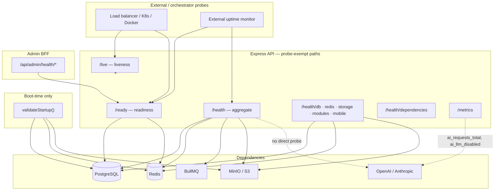

# Health Check Plan — Prani Doctor Platform

**Status:** Phase 1 implemented (2026-05-30)  
**Date:** 2026-05-30  
**Scope:** `pranidoctor-backend` (primary), `pranidoctor-web` (admin BFF), operational dependencies  
**Related:** [backend-monitoring-plan.md](./backend-monitoring-plan.md), [backend-monitoring-verification-report.md](./backend-monitoring-verification-report.md), [health-check-readiness-report.md](./health-check-readiness-report.md), [escalation-monitoring-plan.md](../operations/escalation-monitoring-plan.md), [alerting-plan.md](../../../pranidoctor_user/docs/production/monitoring/alerting-plan.md)

### Phase 1 delivery (this release)

| Change | Detail |
|--------|--------|
| **`GET /health/ai`** | Config-based AI probe (kill switch, provider keys); no external LLM calls |
| **Aggregate `/health`** | Includes `ai` check (soft — `degraded` only, never blocks liveness) |
| **`/health/dependencies`** | Adds AI service row |
| **Readiness `/ready`** | Storage included when `isStorageRequired(config)` |
| **Lite responses** | `?lite=1` on probe endpoints omits verbose fields |
| **Liveness `/live`** | Adds `service: "api"` (additive field) |
| **Docker Compose** | API healthcheck uses `/ready` |

---

## 1. Executive summary

Prani Doctor uses a **layered health model** centered on the Express API:

| Layer | Purpose | Primary endpoints |
|-------|---------|-------------------|
| **Liveness** | Process up; restart if hung | `GET /live` |
| **Readiness** | Accept traffic; core deps OK | `GET /ready` |
| **Aggregate health** | Ops dashboard + Docker default | `GET /health` |
| **Granular probes** | Targeted dependency diagnosis | `GET /health/{db,redis,storage,...}` |
| **Startup validation** | Boot gate before listening | `validateStartup()` in `server.ts` |

Dependencies monitored at runtime: **PostgreSQL**, **Redis**, **BullMQ (partial)**, **object storage**, **AI configuration (kill switch + provider keys)**, plus **process signals** (memory, event loop). External LLM APIs are **not** called during health probes — availability at runtime is still inferred from metrics and request error rates.

**Lite mode:** append `?lite=1` to any probe endpoint to omit verbose fields (checks details, messages, dependency latency).

The admin Next.js BFF (`pranidoctor-web`) exposes **proxy health** endpoints that delegate readiness to the backend API.

---

## 2. Critical services inventory

### 2.1 Runtime processes

| Service | Repo / entry | Health HTTP | Criticality |
|---------|--------------|-------------|-------------|
| **Express API** | `pranidoctor-backend` — `server.ts` | ✅ Full probe suite | **P0** — all mobile + compat traffic |
| **Background worker** | `pranidoctor-backend` — `worker.ts` | ❌ No HTTP server | **P1** — queues (when processors registered) |
| **Admin web (BFF)** | `pranidoctor-web` — Next.js | ✅ Process + backend proxy | **P0** — admin panel |
| **Flutter mobile app** | `pranidoctor_user` | N/A (client) | **P0** — consumer surface |

### 2.2 Platform dependencies

| Dependency | Technology | Used for | Required in prod? |
|------------|------------|----------|-------------------|
| **PostgreSQL** | Prisma + `pg` Pool | All persistence | **Yes** — always |
| **Redis** | ioredis | OTP, sessions, cache, rate limits, BullMQ | **Yes** when `REDIS_ENABLED=true` (staging/prod) |
| **BullMQ** | Redis-backed queues | Notifications, SMS, email, AI jobs, exports | **Soft** — degraded if unavailable |
| **Object storage** | MinIO / S3 / local | Media uploads, documents | **Conditional** — required when `MEDIA_STORAGE=s3` or prod/staging storage enabled |
| **External LLM APIs** | OpenAI, Anthropic | AI chat, symptom check, recommendations | **Soft** — rules-based fallback + kill switch |
| **External SMS/email** | Queue workers (future) | OTP, notifications | **Soft** — not probed at HTTP layer |

### 2.3 Application modules (Express `/api/*`)

Mounted via `createAllModules()` — health surface is **`GET /health/modules`** (registry list, not per-module deep probe):

| Module area | Mount prefix | Health probe today |
|-------------|--------------|-------------------|
| Auth / identity | `/api/auth`, `/api/identity` | Indirect via `/health/mobile` (JWT + profile routes) |
| AI ecosystem | `/api/ai` | Metrics `ai_*`; admin `/api/admin/ai-ops/*` |
| AI veterinary core | nested under AI routes | Same as AI |
| Media / storage | `/api/media` | `/health/storage` |
| Treatment workflow | `/api/cases` | DB only |
| Notifications | `/api/notifications` | Queue probe (notification queue) |
| Livestock / feed | `/api/livestock`, feed modules | DB only |
| Compat legacy web | `/api/*` (Next-style routes) | `/health/modules` compat count |

---

## 3. Health architecture



### 3.1 Design principles (as implemented)

1. **Liveness is cheap** — no I/O; answers “should the container restart?”
2. **Readiness is strict on hard deps** — DB + Redis (when enabled) must be `healthy`
3. **Aggregate `/health` is informative** — includes soft deps + process checks; may return `200` with `degraded`
4. **Granular routes fire alerts** — `/health/db` and `/health/redis` trigger `ALT-DB-01` / Redis webhook on unhealthy
5. **Probes exempt from rate limiting** — `probe-exempt.ts` + access log exclusion
6. **Startup validation ≠ runtime probes** — boot can exit before listen; probes assume process already up

### 3.2 Status semantics

| Status | Meaning | Typical HTTP (granular) | Affects `/ready`? | Affects aggregate `/health`? |
|--------|---------|---------------------------|-------------------|------------------------------|
| `healthy` | Dependency OK | 200 | Yes — must be healthy | Counts toward healthy |
| `degraded` | Optional / soft failure | 200 | No (redis disabled, storage optional) | Aggregate → `degraded`, still **200** |
| `unhealthy` | Hard failure | 503 | Fails readiness | Aggregate → `unhealthy`, **503** |

**Readiness rule:** `ready = all required checks healthy` — DB always; Redis only if `REDIS_ENABLED`.

---

## 4. Health strategy by component

### 4.1 API (Express)

| Signal | Mechanism | File |
|--------|-----------|------|
| Process liveness | `GET /live` → `{ alive: true }` | `health.service.ts` |
| Traffic readiness | `GET /ready` | DB + Redis probes |
| Full snapshot | `GET /health` | All checks + version/uptime |
| Module registry | `GET /health/modules` | `moduleRegistry`, compat route count |
| Mobile contract | `GET /health/mobile` | Profile modules + JWT secret configured |
| System debug | `GET /health/system` | **Non-production only** — CPU, memory, pid |
| Metrics side effect | DB/Redis/readiness probes update Prometheus gauges | `dependency.metrics.ts` |

**Mount order:** Health router registered **before** rate limiter in `app.ts` — probes always reachable.

**Docker default:** `docker-compose.yml` API healthcheck uses `GET /health` (aggregate), not `/ready`.

### 4.2 Database (PostgreSQL)

| Phase | Check | Implementation |
|-------|-------|----------------|
| **Startup** | `SELECT 1` via Prisma | `checkDatabaseConnection()` in `startup-validation.ts` |
| **Runtime** | Same probe + latency ms | `/health/db`, included in `/ready` and `/health` |
| **Metrics** | `pranidoctor_db_up`, `pranidoctor_db_probe_latency_ms` | Updated on each probe |
| **Compat mobile** | `GET /api/mobile/health` → `{ database: "up" }` | Legacy compat route (DB only) |

**Pool:** `pg.Pool` via `@prisma/adapter-pg` — pool exhaustion **not** exposed as a health check (use logs/Sentry/metrics).

**Failure impact:** All API traffic; readiness **503**; alert `ALT-DB-01` on granular unhealthy.

### 4.3 Cache (Redis)

| Phase | Check | Implementation |
|-------|-------|----------------|
| **Startup** | `PING` → `PONG` | `startup-validation.ts` (if initialized) |
| **Runtime** | `checkRedisConnection()` | `/health/redis`, `/ready`, `/health` |
| **Disabled** | `REDIS_ENABLED=false` → status `degraded` | Readiness **excludes** Redis check |
| **Metrics** | `pranidoctor_redis_up`, probe latency | On probe |

**Production behavior:** Redis required in staging/prod when enabled (`isRedisRequired`). Rate limiting **fails closed (503)** when Redis unavailable — treat Redis as **P0** in production.

**Failure impact:** OTP, sessions, cache, queues; alert on `/health/redis` unhealthy (`alertRedisUnavailable` — production only for `ALT-SEC-02` path).

### 4.4 Queue (BullMQ)

| Check | Scope | Gap |
|-------|-------|-----|
| `checkQueues()` | `NOTIFICATION` queue — `getWaitingCount()` | **Only one queue** probed |
| Readiness | **Not included** | Queue failure does not block `/ready` |
| Aggregate `/health` | Included as `queues` check | Unhealthy if Redis/queue unreachable |
| Worker process | No HTTP health | Separate deployment concern |

**Defined queues** (not all probed): `notification`, `email`, `sms`, `push`, `ai:completion`, `ai:embedding`, `ai:summary`, `report`, `export`, `cleanup`, `backup`, `scheduled`.

**Strategy:** Queue health is **best-effort** via notification queue Redis round-trip. Deep queue monitoring → metrics `pranidoctor_queue_jobs_*` + worker logs (see backend monitoring plan).

### 4.5 AI services

| Layer | Signal | How to verify |
|-------|--------|---------------|
| **Granular probe** | `GET /health/ai` | Kill switch + provider key configuration (no external calls) |
| **Aggregate** | `/health` checks array includes `ai` | Soft — `degraded` only, never fails liveness/readiness |
| **Dependencies** | `/health/dependencies` row `AI Services` | type `ai`, `required: false` |
| **LLM kill switch** | In-memory `aiOrchestrator.isLlmDisabled()` | Admin governance + `/health/ai` |
| **Prometheus** | `ai_llm_disabled`, `ai_requests_total{status}` | `GET /metrics` |
| **Provider reachability** | OpenAI / Anthropic adapters | **Not probed at HTTP layer** — use metrics + smoke tests |

**Degraded modes:**

- Kill switch ON → rules-based responses only (`ai_llm_disabled=1`)
- Provider outage → orchestrator fallback chain; elevated `ai_fallbacks_total`
- DB up but AI module error → general API `/health` may still be `healthy`

**Recommended ops treat AI as soft dependency** — platform stays up; feature degraded.

### 4.6 Storage (MinIO / S3 / local)

| Condition | Health status | Readiness impact |
|-----------|---------------|------------------|
| `STORAGE_ENABLED=false` | `degraded` | None |
| Driver disabled | `degraded` | None |
| Runtime degraded flag | `degraded` | None |
| Probe failure, not required | `degraded` | None |
| Probe failure, **required** | `unhealthy` | Fails aggregate `/health` (503) |
| `MEDIA_STORAGE=s3` | Storage **required** at boot | Boot exit if bootstrap fails |

**Probe:** `storage.checkHealth()` via factory — bucket/endpoint reachability.

**Startup:** `bootstrapMinioStorage()` + optional runtime degrade without crashing API (non-s3 prod).

---

## 5. Endpoint catalog

### 5.1 Backend API (`pranidoctor-backend`)

| Method | Path | Type | Auth | Returns 503 when |
|--------|------|------|------|------------------|
| GET | `/live` | Liveness | Public | Never |
| GET | `/ready` | Readiness | Public | DB, required Redis, or required storage unhealthy |
| GET/POST | `/health` | Aggregate | Public | Any check `unhealthy` |
| GET | `/health/db` | Granular | Public | DB unhealthy |
| GET | `/health/redis` | Granular | Public | Redis unhealthy (not degraded-disabled) |
| GET | `/health/storage` | Granular | Public | Storage unhealthy when required |
| GET | `/health/ai` | Granular | Public | Never 503 (soft dep — `degraded` only) |
| GET | `/health/modules` | Registry | Public | Never |
| GET | `/health/mobile` | Mobile contract | Public | Mobile modules/JWT misconfigured → **500** |
| GET | `/health/dependencies` | Summary list | Public | Never (always 200 + data) |
| GET | `/health/system` | Debug | Public | **Non-production only** |
| GET | `/metrics` | Metrics | Token (prod) | N/A |
| GET | `/api/mobile/health` | Compat DB ping | Public | DB down → 503 |

**Source:** `src/api/health/health.routes.ts`, `src/app.ts`

### 5.2 Admin web BFF (`pranidoctor-web`)

| Path | Behavior |
|------|----------|
| `GET /api/admin/health/live` | BFF process liveness |
| `GET /api/admin/health/ready` | Proxies backend `/ready` or `/health` |
| `GET /api/admin/health` | Full snapshot; alerts on backend failure |
| `GET /api/admin/uptime` | Version + uptime metadata |

**Source:** `src/lib/monitoring/health.ts`, `src/app/api/admin/health/**`

### 5.3 Infrastructure (Docker Compose)

| Service | Healthcheck |
|---------|-------------|
| `postgres` | `pg_isready` |
| `redis` | `redis-cli ping` |
| `minio` | `curl minio/health/live` |
| `api` | `wget /ready` |

---

## 6. Readiness checks

**Endpoint:** `GET /ready`

**Pass criteria:**

```text
ready === true
⟺ database.status === 'healthy'
⟺ (redis.status === 'healthy' OR REDIS_ENABLED === false)
⟺ (storage.status === 'healthy' OR storage not required)
```

**Implementation:** `getReadinessStatus()` — `health.service.ts`

| Check | Included | Blocks ready if unhealthy |
|-------|----------|---------------------------|
| PostgreSQL `SELECT 1` | ✅ | ✅ |
| Redis ping | ✅ if enabled | ✅ |
| Object storage | ✅ if `isStorageRequired(config)` | ✅ |
| BullMQ | ❌ | — |
| AI providers | ❌ | — |
| Memory / event loop | ❌ | — |

**Side effects on failure:**

- Webhook alert `ALT-DOWN-02` (`alertReadinessFailure`)
- Prometheus gauge `pranidoctor_ready = 0`

**Recommended use:**

- Kubernetes / load balancer **traffic gate**
- External synthetic monitor every **30–60s**
- **Not** for “is AI working?” — use AI metrics + smoke tests

---

## 7. Liveness checks

**Endpoint:** `GET /live`

**Pass criteria:** `alive === true` and `service === "api"` (if Node event loop responds)

**Does not verify:** Database, Redis, queues, storage, AI, or hung middleware.

**Recommended use:**

- Kubernetes `livenessProbe` — restart pod on total hang only
- Pair with **readiness** for complete orchestration:

```yaml
# Illustrative — adapt to your orchestrator
livenessProbe:
  httpGet:
    path: /live
    port: 3000
  periodSeconds: 10
  failureThreshold: 3

readinessProbe:
  httpGet:
    path: /ready
    port: 3000
  periodSeconds: 10
  failureThreshold: 3
```

**Admin BFF liveness:** `GET /api/admin/health/live` — process-only.

---

## 8. Startup validation (boot gate)

Separate from HTTP probes — runs in `server.ts` before `app.listen()` when `SKIP_STARTUP_VALIDATION` is not set.

| Check | Source | Fail boot in strict mode? |
|-------|--------|---------------------------|
| PostgreSQL | `checkDatabaseConnection` | ✅ |
| Redis ping | If enabled + initialized | ✅ in prod/staging when required |
| Storage | `storage.checkHealth()` | ✅ when storage required |
| Mobile profile modules | Route/module presence | Warning / strict fail per config |

**File:** `src/shared/config/startup-validation.ts`

**Distinction:** A process can pass startup then later fail readiness (e.g. DB outage mid-flight).

---

## 9. Alerting integration

| Probe event | Alert ID | Trigger |
|-------------|----------|---------|
| `/ready` fails | ALT-DOWN-02 | `alertReadinessFailure` |
| `/health/db` unhealthy | ALT-DB-01 | `alertDependencyUnhealthy('database')` |
| `/health/redis` unhealthy | ALT-SEC-02 (prod) | `alertRedisUnavailable` |
| Aggregate 503 storm | ALT-ERR-01 | Via 5xx logs / metrics |

**Prometheus (post Phase 1 metrics):**

- `pranidoctor_ready`, `pranidoctor_db_up`, `pranidoctor_redis_up` — refresh when probes run
- Recommend blackbox scrape of `/ready` even if app metrics scraped separately

---

## 10. Gaps and recommended evolution

| ID | Gap | Risk | Phase 2 recommendation |
|----|-----|------|------------------------|
| H-01 | ~~Docker healthcheck uses `/health` not `/ready`~~ | — | **Resolved** — compose uses `/ready` |
| H-02 | Only **notification** queue probed | AI/SMS queue Redis issues undetected | Rotate queue probes or Redis-centric check |
| H-03 | ~~No `/health/ai`~~ | — | **Resolved** — config-based probe; optional provider ping in Phase 2 |
| H-04 | **Worker** has no HTTP health | Worker down invisible to LB | Sidecar `/live` or queue consumer heartbeat metric |
| H-05 | **Pool exhaustion** not in health | Slow API under load | pg pool metrics + `/health/db` latency SLO |
| H-06 | **`/health/mobile` returns 500** not 503 | Mobile monitor semantics differ | Document or align status codes |
| H-07 | Redis disabled → `degraded` but `/ready` passes | Intended; document for ops | — |
| H-08 | Multi-instance `pranidoctor_ready` gauge | Stale unless each instance probed | Probe per replica or aggregate in LB |

---

## 11. Verification plan

### 11.1 Static verification (CI / docs)

| ID | Check | Command / action | Expected |
|----|-------|------------------|----------|
| V-H01 | Health routes registered | Code review `health.routes.ts` | All paths in §5.1 exist |
| V-H02 | Probe exempt from rate limit | Hit `/ready` 100× rapidly | No 429 |
| V-H03 | Unit tests | `ai-health.service.test.ts`, `health-response.util.test.ts` | Pass |
| V-H04 | Metrics include dependency gauges | Scrape `/metrics` after `/ready` | `pranidoctor_ready 1` |
| V-H05 | Readiness report | [health-check-readiness-report.md](./health-check-readiness-report.md) | Conditionally ready |

### 11.2 Local smoke (docker compose)

| Step | Action | Expected |
|------|--------|----------|
| 1 | `docker compose up postgres redis minio -d` | All `healthy` |
| 2 | Start API with valid `.env` | Startup validation OK in logs |
| 3 | `curl localhost:3000/live` | `200`, `alive: true` |
| 4 | `curl localhost:3000/ready` | `200`, `ready: true` |
| 5 | `curl localhost:3000/health/ai` | `200`, `status: healthy` or `degraded` |
| 6 | `curl 'localhost:3000/health?lite=1'` | `200`, no `checks` array |
| 7 | Stop postgres | `/ready` → `503`; `/live` still `200` |
| 8 | Stop redis (enabled) | `/ready` → `503`; rate limit may 503 API calls |
| 9 | Stop minio (storage required) | `/ready` → `503`; `/health` → `degraded` or `unhealthy` |

### 11.3 Staging / production synthetic monitors

Configure external checks (UptimeRobot, Grafana Cloud, etc.):

| Monitor | URL | Interval | Alert if |
|---------|-----|----------|----------|
| API liveness | `GET /live` | 60s | Non-200 or timeout >5s |
| API readiness | `GET /ready` | 30s | Non-200 or `ready: false` |
| API aggregate | `GET /health` | 5m | `status: unhealthy` or 503 |
| DB granular | `GET /health/db` | 2m | 503 or latency >500ms |
| Admin BFF | `GET /api/admin/health/ready` | 60s | 503 |
| Metrics scrape | `GET /metrics` + token | 30s | 401/timeout |

### 11.4 AI-specific verification (manual / scheduled)

| Step | Action | Pass criteria |
|------|--------|---------------|
| 1 | `GET /health/ai` | `200`; `check.name === "ai"` |
| 2 | `GET /health/modules` | `ai` module listed |
| 2 | Scrape `/metrics` | `ai_requests_total` present after traffic |
| 3 | Admin `GET /api/admin/ai-ops/overview` | 200 with session stats |
| 4 | Toggle kill switch (staging) | `ai_llm_disabled=1`; chat still returns rules-based |
| 5 | Simulate provider key removal | Elevated failures in metrics, not `/ready` failure |

### 11.5 Sign-off checklist

- [ ] `/live` and `/ready` monitored independently in production
- [ ] `MONITORING_ALERT_WEBHOOK_URL` routes readiness failures to on-call
- [ ] Docker/K8s readiness probe aligned with `/ready` (not only `/health`)
- [ ] Storage requirement documented per environment (`MEDIA_STORAGE`, `STORAGE_ENABLED`)
- [ ] Runbook links in alerting plan §3 reference this document
- [ ] Post-deploy smoke: `/ready` + `/health/mobile` + one authenticated API call

---

## 12. Quick reference — key files

| Area | Path |
|------|------|
| Health routes | `src/api/health/health.routes.ts` |
| Health logic | `src/api/health/health.service.ts` |
| AI health | `src/api/health/ai-health.service.ts` |
| Lite responses | `src/api/health/health-response.util.ts` |
| Types | `src/api/health/health.types.ts` |
| Mobile health | `src/api/health/mobile-health.service.ts` |
| Startup validation | `src/shared/config/startup-validation.ts` |
| Infra flags | `src/shared/config/infra.flags.ts` |
| DB probe | `src/shared/database/prisma.ts` |
| Redis probe | `src/infra/redis/redis.client.ts` |
| Queue probe | `src/infra/queue/queue.service.ts` |
| Storage probe | `src/modules/media/storage/storage.factory.ts` |
| Probe exempt | `src/shared/security/rate-limit/probe-exempt.ts` |
| Dependency metrics | `src/shared/monitoring/metrics/dependency.metrics.ts` |
| Health alerts | `src/shared/monitoring/alerting/health-alerts.ts` |
| Docker healthchecks | `docker-compose.yml` |
| Admin BFF health | `pranidoctor-web/src/lib/monitoring/health.ts` |

---

## 13. Document maintenance

Update this plan when:

- New `/health/*` granular routes are added (especially AI or queue)
- Readiness criteria change (e.g. storage added to `/ready`)
- Worker HTTP health or queue probe expansion ships
- Docker/K8s probe paths change from `/health` to `/ready`

---

**Report status:** Phase 1 implemented — `/health/ai`, lite mode, storage-aware readiness, Docker `/ready` probe.
