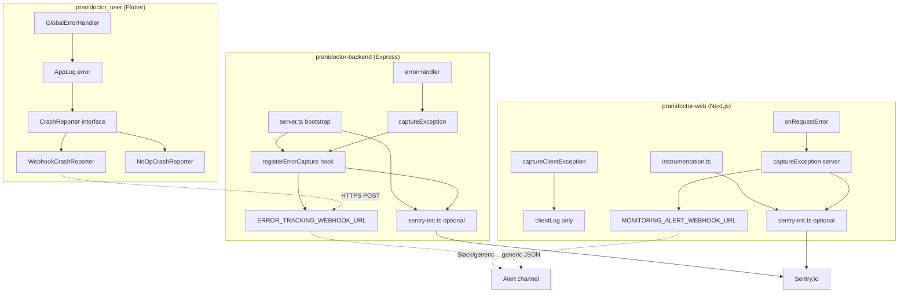

# Sentry Integration Plan — Prani Doctor Platform

**Status:** Implemented (2026-05-30)  
**Last updated:** 2026-05-30  
**Repos:** `pranidoctor-backend`, `pranidoctor-web`, `pranidoctor_user`  
**Related docs:** [monitoring-guide.md](../../../pranidoctor_user/docs/monitoring-guide.md) (Flutter), [MONITORING_COMPLETE.md](../../../pranidoctor-web/docs/MONITORING_COMPLETE.md) (Web), [ARCHITECTURE_DECISION_RECORD.md](../../ops/ARCHITECTURE_DECISION_RECORD.md)

---

## 1. Executive summary

Prani Doctor already has a **provider-agnostic observability foundation** across all three runtimes: structured logging, health probes, webhook-based alerting, and error-capture hooks. **Sentry SDKs are partially wired** on the Node/Next.js side (`@sentry/node`, `@sentry/nextjs`) behind optional `SENTRY_DSN` env vars. **Mobile has no Sentry SDK** but ships a complete `CrashReporter` abstraction with webhook fallback.

This plan defines how to **complete Sentry integration additively** — gated by DSN presence, preserving existing webhook/console paths, API response shapes, and compile-time env patterns. No breaking API or middleware contract changes are required.

| Runtime | SDK in repo | Init hook | Error capture hook | Symbols / source maps |
|---------|-------------|-----------|-------------------|------------------------|
| **Backend (Express)** | `@sentry/node` ✅ | `server.ts` → `initSentry()` | `errorHandler` 5xx + `registerErrorCapture` | N/A (Node stack traces) |
| **Admin web (Next.js)** | `@sentry/nextjs` ✅ | `instrumentation.ts` → `initSentry()` | `onRequestError`, `captureException` | CI upload not wired |
| **Mobile (Flutter)** | ❌ not installed | `bootstrap.dart` → `resolveCrashReporter()` | `GlobalErrorHandler` + `AppLog.error` | `split-debug-info` artifact in CI; no upload |

**Target outcome:** Three Sentry projects (or one org with three projects), environment-separated DSNs, unified release naming, dual-path delivery (Sentry + existing webhooks) during rollout.

---

## 2. Current architecture (as-is)



### 2.1 Backend (`pranidoctor-backend`)

| Component | Location | Behavior |
|-----------|----------|----------|
| Env loading | `src/shared/config/load-env.ts` | dotenv + resolver; idempotent |
| Logger | `src/shared/logger/logger.ts` | Pino JSON; redacts tokens/passwords/OTP |
| Sentry init | `src/shared/monitoring/sentry-init.ts` | No-op unless `SENTRY_DSN` set; strips `authorization`/`cookie` in `beforeSend` |
| Error tracking | `src/shared/monitoring/error-tracking.ts` | `captureException` → Pino + registered hook + optional webhook |
| Bootstrap wiring | `src/server.ts` | `initSentry()` then `registerErrorCapture(Sentry + webhook)` |
| HTTP errors | `src/shared/errors/error.handler.ts` | 5xx → `captureException` with `requestId`, route; 4xx → warn only |
| Health / version | `src/api/health/health.service.ts` | Exposes `APP_VERSION` in health JSON |
| Metrics | `src/api/metrics/metrics.routes.ts` | Prometheus text/JSON; `METRICS_TOKEN` auth |

**Gap:** `process.on('uncaughtException')` and `unhandledRejection` call `logFatal` only — they do **not** invoke `captureException` today. Safe additive fix during implementation.

### 2.2 Admin web (`pranidoctor-web`)

| Component | Location | Behavior |
|-----------|----------|----------|
| Config | `src/lib/monitoring/config.ts` | `ERROR_TRACKING_PROVIDER` auto-selects `sentry` when `SENTRY_DSN` present |
| Sentry init | `src/lib/monitoring/sentry-init.ts` | Server-only dynamic import; no-op without DSN |
| Server capture | `src/lib/monitoring/error-tracking.ts` | Provider switch: noop / console / sentry / webhook side-effects |
| Request errors | `src/instrumentation.ts` | `onRequestError` → `captureException` + `alertServerError` |
| Client capture | `src/lib/monitoring/error-tracking-client.ts` | **Logs only** — no browser Sentry SDK yet |
| Client handlers | `src/instrumentation-client.ts` | `window.error` / `unhandledrejection` on admin/enterprise surfaces |
| UI boundaries | `AdminErrorBoundary`, `admin/error.tsx` | Call `captureClientException` |
| Health | `src/lib/monitoring/health.ts` | `APP_VERSION` on uptime snapshots |

**Gap:** `@sentry/nextjs` is in `package.json` but full Next.js Sentry integration (client config, source map upload, `sentry.edge.config`) is not complete. Client errors never reach Sentry.

### 2.3 Mobile (`pranidoctor_user`)

| Component | Location | Behavior |
|-----------|----------|----------|
| Bootstrap | `lib/app/bootstrap.dart` | `resolveCrashReporter(webhookUrl: env.crashReportingWebhookUrl)` |
| Env | `lib/app/app_env.dart` | `CRASH_REPORTING_WEBHOOK_URL` via `--dart-define`; `APP_ENV` = dev/staging/production |
| Global handlers | `lib/core/errors/global_error_handler.dart` | `FlutterError.onError`, `PlatformDispatcher.onError`, `runZonedGuarded` |
| Logging pipeline | `lib/core/logging/app_logger.dart` | Fatal errors → `crashReporter.recordError` |
| Webhook reporter | `lib/core/logging/webhook_crash_reporter.dart` | HTTPS POST JSON; 5s timeout; silent fail |
| Redaction | `lib/core/logging/log_redactor.dart` | Strips tokens/passwords before logs/crash context |
| CI release | `.github/workflows/release.yml` | `--obfuscate --split-debug-info=build/debug-info`; uploads debug-info artifact |

**Gap:** No `sentry_flutter`; `NoOpCrashReporter` used when webhook unset. `SessionController` does not call `crashReporter.setUserId` after login (safe future enhancement).

---

## 3. Design principles

1. **DSN-gated activation** — Empty/missing DSN = current behavior (no-op / console / webhook only).
2. **Dual delivery during rollout** — Keep `ERROR_TRACKING_WEBHOOK_URL` and `MONITORING_ALERT_WEBHOOK_URL` alongside Sentry until dashboards are trusted.
3. **No API contract changes** — Error JSON shape (`success`, `error.code`, `error.message`, `requestId`) unchanged.
4. **Extend abstractions, don't replace** — Flutter: new `SentryCrashReporter implements CrashReporter`. Web: extend `captureClientException`. Backend: call existing `captureException`.
5. **Reuse env naming** — `SENTRY_DSN`, `SENTRY_TRACES_SAMPLE_RATE`, `APP_VERSION`, existing webhook vars.
6. **PII scrubbing** — Mirror backend `beforeSend` header stripping; never send phone/OTP/raw JWT; user id as opaque id only.

---

## 4. Safest integration points

### 4.1 Backend — lowest risk

| Priority | Integration point | Change type | Risk |
|----------|-------------------|-------------|------|
| P0 | `src/shared/monitoring/sentry-init.ts` | Tune `environment`, `release`, `beforeSend` | Low — already exists |
| P0 | `registerErrorCapture` in `server.ts` | No change needed — Sentry already chained | None |
| P1 | `error.handler.ts` | Already captures 5xx — verify no duplicate events after Sentry HTTP instrumentation | Low |
| P1 | `server.ts` process handlers | Add `captureException` before shutdown on uncaught/unhandled | Low — additive |
| P2 | Express request tracing | Optional `Sentry.setupExpressErrorHandler` — **defer** until baseline stable (may duplicate 5xx) | Medium |

**Do not:** Replace Pino logging, change HTTP status codes, or add Sentry middleware before existing security stack.

### 4.2 Admin web — medium complexity

| Priority | Integration point | Change type | Risk |
|----------|-------------------|-------------|------|
| P0 | `src/lib/monitoring/sentry-init.ts` | Add `beforeSend` PII scrub (match backend) | Low |
| P0 | `instrumentation.ts` | Already wired — verify with test exception | Low |
| P1 | `error-tracking-client.ts` | Route to `@sentry/nextjs` when DSN + `NEXT_PUBLIC_ERROR_TRACKING_ENABLED` | Medium — needs public DSN |
| P1 | `next.config.ts` / CI | Source map upload via `sentry-cli` or `@sentry/nextjs` build plugin | Medium — build-time only |
| P2 | Full `@sentry/nextjs` wizard files | `sentry.client.config.ts`, edge config | Medium — test admin + enterprise routes |

**Do not:** Change BFF proxy routes, health endpoint paths, or `ERROR_TRACKING_PROVIDER` enum values (extend only).

### 4.3 Mobile — highest value, isolated surface

| Priority | Integration point | Change type | Risk |
|----------|-------------------|-------------|------|
| P0 | New `lib/core/logging/sentry_crash_reporter.dart` | Implements existing `CrashReporter` | Low — interface stable |
| P0 | `resolveCrashReporter()` in `webhook_crash_reporter.dart` | Prefer Sentry when `SENTRY_DSN` dart-define set; fallback webhook → no-op | Low |
| P0 | `bootstrap.dart` | Pass DSN from `AppEnv` — **no** change to `GlobalErrorHandler` API | Low |
| P1 | `AppEnv` | Add `SENTRY_DSN`, `APP_VERSION` compile-time defines | Low — additive |
| P1 | `session_controller.dart` or auth success | `AppLog.crashReporter.setUserId(userId)` | Low — opaque id |
| P2 | `.github/workflows/release.yml` | Upload debug symbols to Sentry (`sentry-cli upload-dif`) | CI-only |

**Do not:** Wrap `runApp` in a second zone, replace `AppLog`, or require Sentry for app startup.

---

## 5. DSN management strategy

### 5.1 Sentry project layout (recommended)

| Sentry project | Runtime | DSN scope | Notes |
|----------------|---------|-----------|-------|
| `pranidoctor-api` | Express backend | Server secret | Never expose to clients |
| `pranidoctor-admin-web` | Next.js admin | Server DSN secret; client DSN public | Same project, two DSN keys optional |
| `pranidoctor-mobile-android` | Flutter Android | Public DSN acceptable | iOS project when App Store ships |

Use **one Sentry organization** with environment tags (`development`, `staging`, `production`) rather than one project per env — unless compliance requires hard isolation.

### 5.2 Secret storage

| Environment | Storage | Keys |
|-------------|---------|------|
| **Local dev** | Unset DSN (default) or personal dev project in `.env.local` / `--dart-define` | Never commit |
| **Staging** | GitHub Environment `staging` secrets + VPS `.env` | `SENTRY_DSN`, `SENTRY_AUTH_TOKEN` (CI) |
| **Production** | GitHub Environment `production` secrets + VPS `.env` | Separate prod DSNs |

### 5.3 Environment variables (reuse existing patterns)

#### Backend (`.env.production.example` already documents)

```env
SENTRY_DSN=https://xxx@oYYY.ingest.sentry.io/ZZZ
SENTRY_TRACES_SAMPLE_RATE=0.1
APP_VERSION=1.2.3
ERROR_TRACKING_WEBHOOK_URL=https://...   # keep during rollout
```

#### Web (add to `.env.example` — documentation phase)

```env
SENTRY_DSN=                          # server-side
NEXT_PUBLIC_SENTRY_DSN=              # browser (optional; can match project)
SENTRY_TRACES_SAMPLE_RATE=0.1
ERROR_TRACKING_PROVIDER=sentry       # optional; auto when DSN set
APP_VERSION=1.2.3
MONITORING_ALERT_WEBHOOK_URL=        # keep
```

#### Mobile (`--dart-define` / CI secrets — mirrors `CRASH_REPORTING_WEBHOOK_URL` pattern)

```bash
--dart-define=SENTRY_DSN=https://...
--dart-define=APP_VERSION=1.2.3
--dart-define=APP_ENV=production
# fallback retained:
--dart-define=CRASH_REPORTING_WEBHOOK_URL=https://...
```

### 5.4 CI secrets (GitHub Actions)

| Secret | Used by | Purpose |
|--------|---------|---------|
| `SENTRY_AUTH_TOKEN` | web + mobile release workflows | Source map / debug symbol upload |
| `SENTRY_ORG` | CI | `sentry-cli` org slug |
| `SENTRY_PROJECT_API` | backend deploy | Release creation (optional) |
| `SENTRY_PROJECT_WEB` | web build | Source maps |
| `SENTRY_PROJECT_MOBILE` | Flutter release | Debug symbols |
| `SENTRY_DSN_*` | per-env deploy | Runtime init (VPS / hosting env) |

**Rotation:** Rotate DSN keys in Sentry UI → update VPS/GitHub secrets → rolling restart (no code deploy). Old key revoke after 24h verification.

---

## 6. Release and version tracking strategy

### 6.1 Canonical release identifier

Use a single string format across all runtimes:

```
pranidoctor@{service}@{version}
```

Examples:

- `pranidoctor@api@1.4.0`
- `pranidoctor@admin-web@1.4.0`
- `pranidoctor@mobile@1.4.0+42`

| Runtime | Version source | Sentry `release` field | Commit association |
|---------|----------------|------------------------|-------------------|
| Backend | `APP_VERSION` env | `process.env.APP_VERSION` (already in `sentry-init.ts`) | CI: `sentry-cli releases new` + `set-commits --auto` |
| Web | `APP_VERSION` or `npm_package_version` | Same via `getAppVersion()` | CI on `next build` |
| Mobile | `--dart-define=APP_VERSION` + build number | `package_info` or define at init | CI: link to git tag `v*` |

### 6.2 Git tag alignment

- Tag releases `v1.4.0` on `main` across repos (may diverge patch versions per service — document in release notes).
- Health endpoints already expose version: backend `/health`, web `/api/admin/uptime` — use for cross-check with Sentry release list.

### 6.3 Debug symbols / source maps

| Runtime | Artifact | Upload trigger |
|---------|----------|----------------|
| Flutter | `build/debug-info/` (CI artifact today) | Add step after `flutter build appbundle` |
| Web | `.next/` source maps | `sentry-cli sourcemaps upload` or `@sentry/nextjs` plugin |
| Backend | None required | Stack traces readable in Node 20+ |

---

## 7. Environment separation

| Tier | Backend `NODE_ENV` | Web `NODE_ENV` | Mobile `APP_ENV` | Sentry `environment` | DSN | Sample rate |
|------|-------------------|----------------|------------------|---------------------|-----|-------------|
| **Local** | `development` | `development` | `dev` | `development` | unset (no-op) | 0 |
| **Staging** | `staging` | `production`* | `staging` | `staging` | staging DSN | 0.2 |
| **Production** | `production` | `production` | `production` | `production` | prod DSN | 0.1 |

\*Next.js staging builds typically use `NODE_ENV=production` for optimized builds; distinguish via `APP_ENV=staging` env var in Sentry `environment` field (web `getUptimeSnapshot` already reads `APP_ENV`).

**Local rule:** Never point local dev at production DSN. Use no DSN or isolated dev project.

**Mobile rule:** Debug builds should not send events (`kReleaseMode` gate in Sentry init) — matches current webhook reporter behavior.

---

## 8. Implementation checklist

### Phase 0 — Ops setup (no code)

- [ ] Create Sentry org/projects: `pranidoctor-api`, `pranidoctor-admin-web`, `pranidoctor-mobile-android`
- [ ] Create DSNs per environment (staging + production)
- [ ] Create `SENTRY_AUTH_TOKEN` for CI with `project:releases` + `org:read`
- [ ] Document alert rules in Sentry (5xx spike, new issue, regression)
- [ ] Add DSN secrets to GitHub Environments and VPS `.env` templates

### Phase 1 — Backend hardening (smallest diff)

- [ ] Verify `@sentry/node` init with staging DSN on VPS
- [ ] Add `captureException` to uncaught/unhandled handlers in `server.ts`
- [ ] Set `APP_VERSION` in deploy pipeline
- [ ] Optional: `sentry-cli releases finalize` in deploy workflow
- [ ] Confirm `beforeSend` scrubs JWT/cookies (extend for request body if needed)

### Phase 2 — Admin web

- [ ] Add `SENTRY_DSN` / `NEXT_PUBLIC_SENTRY_DSN` to `.env.*.example`
- [ ] Extend `sentry-init.ts` with `beforeSend` scrubbing
- [ ] Wire `captureClientException` → Sentry browser SDK
- [ ] Configure source map upload in production build workflow
- [ ] Validate CSP `connect-src` allows `*.ingest.sentry.io`

### Phase 3 — Mobile

- [ ] Add `sentry_flutter` dependency
- [ ] Implement `SentryCrashReporter implements CrashReporter`
- [ ] Extend `AppEnv` + `resolveCrashReporter()` selection logic
- [ ] Add `SENTRY_DSN` + `APP_VERSION` to release workflow dart-defines
- [ ] Upload `build/debug-info/` via `sentry-cli upload-dif` on tag builds
- [ ] Call `setUserId` after successful auth (opaque user id)

### Phase 4 — Rollout validation

- [ ] Staging: trigger test errors on all three runtimes
- [ ] Confirm webhook + Sentry both receive (dual path)
- [ ] Production: enable DSN with low sample rate
- [ ] 7-day burn-in per [PRODUCTION_READINESS_REPORT](../../../pranidoctor_user/docs/launch/PRODUCTION_READINESS_REPORT.md)

---

## 9. Risks and mitigations

| ID | Risk | Severity | Mitigation |
|----|------|----------|------------|
| R1 | Duplicate Sentry events (handler + auto-instrumentation) | Medium | Start with manual `captureException` only; add auto-instrumentation later |
| R2 | PII leakage (phone, OTP, JWT) | High | `beforeSend` scrub; use `LogRedactor`; hash user ids if required |
| R3 | CSP blocks browser Sentry on admin | Medium | Add `connect-src https://*.ingest.sentry.io` in `next.config.ts` headers |
| R4 | DSN exposed in mobile binary | Low | Expected for client SDKs; use project rate limits + `allowedDomains` |
| R5 | Sentry outage blocks app startup | High | **Never** await Sentry init on critical path; keep try/catch no-op pattern |
| R6 | Event volume / cost spike | Medium | Sample rates; filter 4xx; `beforeSend` drop health-check noise |
| R7 | Symbol upload fails silently | Medium | CI step must fail release tag build if upload fails |
| R8 | Webhook + Sentry alert fatigue | Medium | Route webhooks to Slack for ops; Sentry for triage — dedupe rules after week 1 |

---

## 10. Rollback plan

Sentry integration is **env-var gated**. Rollback does not require redeploying previous code in an emergency.

| Step | Action | Effect |
|------|--------|--------|
| 1 | Remove or blank `SENTRY_DSN` in runtime env | Immediate return to no-op Sentry init |
| 2 | Set `ERROR_TRACKING_PROVIDER=console` (web) | Server logs only |
| 3 | Remove `SENTRY_DSN` dart-define (mobile CI) | Falls back to webhook or `NoOpCrashReporter` |
| 4 | Keep `ERROR_TRACKING_WEBHOOK_URL` / `MONITORING_ALERT_WEBHOOK_URL` | Alerting continues |
| 5 | Revoke DSN in Sentry UI | Prevents stray clients from sending |

**Recovery time:** < 5 minutes (env reload + process restart). No database migration or API version change.

---

## 11. Verification plan

### 11.1 Pre-production (staging)

| # | Test | Expected |
|---|------|----------|
| V1 | Backend: temporary route throws `Error('sentry-staging-test-api')` | Issue in `pranidoctor-api` staging; `requestId` tag present |
| V2 | Web: hit failing admin API route | `onRequestError` issue with route tag |
| V3 | Web: force React error in staging admin page | Client issue with `kind: window.error` |
| V4 | Mobile: staging build with DSN; debug button throws | Issue with `fatal: true`, `APP_ENV=staging` |
| V5 | Unset DSN, repeat V1 | No Sentry event; Pino log + optional webhook only |
| V6 | Check health JSON version matches Sentry release | `APP_VERSION` consistent |

### 11.2 Production smoke (launch day)

Per [LAUNCH_DAY_RUNBOOK](../../../pranidoctor_user/docs/launch/LAUNCH_DAY_RUNBOOK.md):

1. Deploy with DSN set on API + web + mobile build.
2. Trigger **one** staging-style test on staging only; production uses Sentry "test event" from project settings if needed.
3. Confirm issue appears within 5 minutes (P1-06 in phase-7 prep).
4. Verify no increase in API 5xx rate from Sentry init failures.

### 11.3 Ongoing

- Weekly: unresolved Sentry issue count vs release tag
- Alert: new issue in `production` environment → Slack
- Correlate: Sentry `request_id` tag ↔ Pino log line ↔ `X-Request-Id` response header

---

## 12. Backward compatibility guarantees

| Area | Guarantee |
|------|-----------|
| REST error JSON | Unchanged `{ success: false, error: { code, message, requestId? } }` |
| Health endpoints | No new required fields; version already optional |
| Mobile compile | App runs without `SENTRY_DSN`; webhook path preserved |
| Web monitoring toggles | `MONITORING_ENABLED=false` disables all capture (existing) |
| Backend startup | Missing `@sentry/node` or invalid DSN → warn + continue (existing try/catch) |
| Webhook consumers | Payload format for `ERROR_TRACKING_WEBHOOK_URL` unchanged |

---

## 13. Open decisions (resolve before Phase 3 mobile)

1. **Sentry vs Firebase Crashlytics** — Firebase already required for FCM push. Crashlytics adds SDK weight but unified Firebase console. **Recommendation:** Sentry for cross-platform parity with API/web unless product mandates Firebase-only ops.
2. **Single vs per-env Sentry projects** — Default: one project per runtime, `environment` tag for staging/prod.
3. **BFF error attribution** — Errors proxied through Next.js may show web stack first; tag with `upstream: express` when proxy fails.

---

## 15. Implementation summary (2026-05-30)

| Runtime | Changes |
|---------|---------|
| **Backend** | `sentry-config.ts`, `sentry-bootstrap.ts`; uncaught/unhandled → Sentry; BullMQ permanent job failures + worker errors |
| **Web** | Server + client Sentry init; `error-tracking-client.ts` → Sentry; CSP allows ingest; env examples |
| **Mobile** | `sentry_flutter`; `SentryBootstrap` + `SentryCrashReporter` in composite with Crashlytics/webhook |

**Enable:** Set `SENTRY_DSN` (and `NEXT_PUBLIC_SENTRY_DSN` for admin client). Disable with `SENTRY_ENABLED=false` or empty DSN.

**Verify:** See §11 verification plan; staging smoke test before production.

---

- Update this plan when SDK versions change (`@sentry/node`, `@sentry/nextjs`, `sentry_flutter`).
- After implementation, add a short "Implemented" section with dates and link to runbook verification results.
- Keep in sync across repos (identical copy in each `docs/production/monitoring/`).
