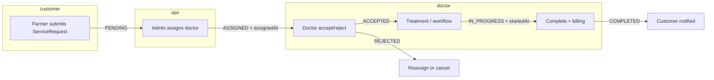
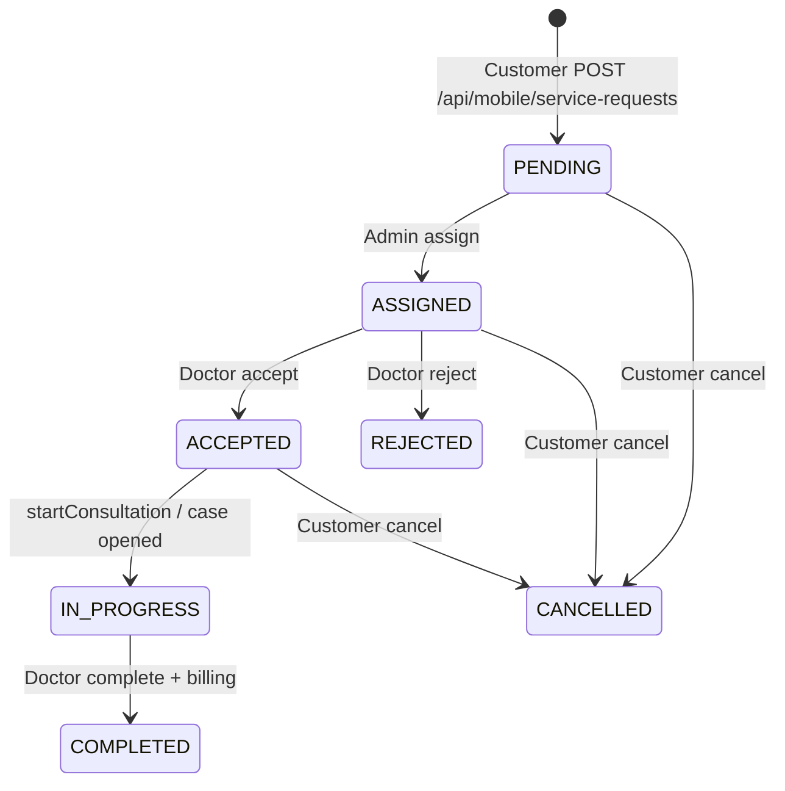
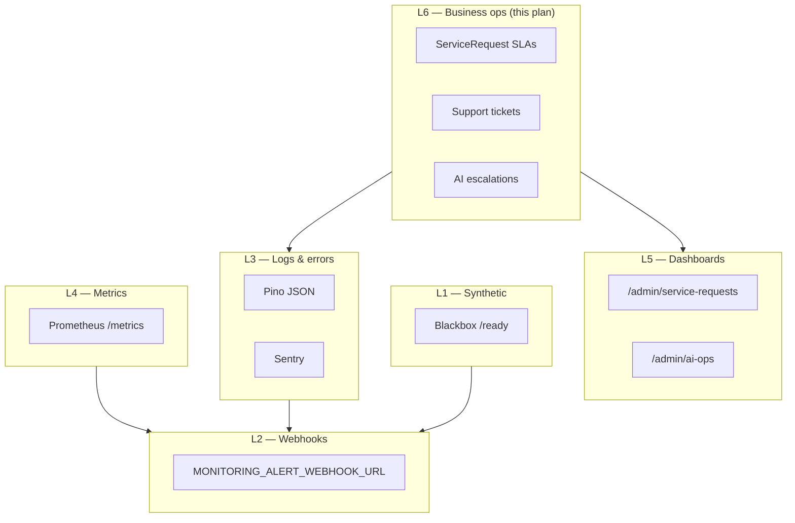
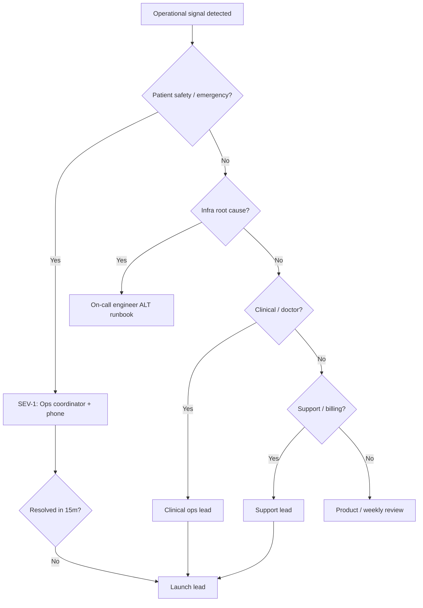

# Escalation & Operational Monitoring Plan — Prani Doctor

**Status:** Implemented (Phase 1 — scheduled DB checks + OPS-* alerts + Prometheus gauges)  
**Date:** 2026-05-30  
**Scope:** Doctor workflows, consultation lifecycle, support operations, incident escalation  
**Repos:** `pranidoctor-backend`, `pranidoctor-web`, `pranidoctor_user`  
**Related:** [backend-monitoring-plan.md](../monitoring/backend-monitoring-plan.md), [backend-monitoring-verification-report.md](../monitoring/backend-monitoring-verification-report.md), [escalation-readiness-report.md](./escalation-readiness-report.md), [alerting-plan.md](../../../pranidoctor_user/docs/production/monitoring/alerting-plan.md), [incident-response-guide.md](../../../pranidoctor_user/docs/incident-response-guide.md)

---

## 1. Executive summary

Prani Doctor separates **infrastructure monitoring** (API health, DB, queues — largely implemented) from **operational monitoring** (unanswered cases, doctor SLAs, failed consults, human escalations — **mostly manual today**).

This plan maps real product workflows to observable signals, defines monitoring and alert strategies for ops teams, and provides an **escalation matrix** linking severity to roles and channels. It is designed to work with existing admin panels and timeline data **without API contract changes**, while documenting Phase 2 automation (scheduled queries, business metrics, admin queues).

| Operational concern | Primary workflow | Current visibility | Automation maturity |
|---------------------|------------------|--------------------|---------------------|
| **Unanswered cases** | ServiceRequest `PENDING` / `ASSIGNED` | Admin panel + **automated OPS-REQ-* alerts** | Phase 1 shipped |
| **Delayed doctor responses** | `ASSIGNED` → `ACCEPTED` gap | Timeline + **OPS-REQ-02/03** | Phase 1 shipped |
| **Failed consultations** | `REJECTED`, `CANCELLED`, billing `FAILED` | Admin + **OPS-CON-* / OPS-BIL-01** | Phase 1 shipped |
| **Escalated incidents** | AI escalations, emergency SR, support tickets | AI ops + **OPS-ESC-* / OPS-SUP-*** | Phase 1 shipped |

**Recommendation:** Phase 0 manual cadence (§5.3) remains useful; **Phase 1 automation** runs via `startEscalationMonitoring()` on API boot. Phase 2 adds richer Grafana dashboards.

---

## 2. Workflow review — doctors

### 2.1 End-to-end doctor path



### 2.2 Key entities and statuses

| Entity | Status / fields | Ops meaning |
|--------|-----------------|-------------|
| `ServiceRequest` | `PENDING`, `ASSIGNED`, `ACCEPTED`, `IN_PROGRESS`, `COMPLETED`, `CANCELLED`, `REJECTED` | Customer case lifecycle |
| | `assignedDoctorId`, `assignedAt`, `startedAt`, `completedAt`, `submittedAt` | Timing for SLA measurement |
| | `priority`, `isEmergency`, `serviceType` | Triage (`EMERGENCY_DOCTOR`, `ONLINE_CONSULTATION_LATER`, etc.) |
| `ServiceRequestTimelineEvent` | `ASSIGNED`, `ACCEPTED`, `REJECTED`, `STARTED`, `COMPLETED`, … | **Authoritative audit trail** for accept delay |
| `DoctorProfile` | `providerStatus` (`ACTIVE`, `SUSPENDED`, …) | Assignment eligibility |
| `DoctorProfile` | `acceptsEmergency`, `acceptsOnlineConsultation` | Capability flags (not real-time schedule) |

**Schema:** `prisma/schema.prisma` — `ServiceRequest`, `ServiceRequestTimelineEvent`, `DoctorProfile`

### 2.3 Doctor queue (web panel)

Doctors work from the **web doctor dashboard**, not the mobile app.

| Tab | Statuses | Path |
|-----|----------|------|
| New | `ASSIGNED`, `ACCEPTED` | `GET /api/doctor/service-requests?tab=new` |
| Active | `IN_PROGRESS` | `tab=active` |
| Completed | `COMPLETED` | `tab=completed` |

**Services:** `src/modules/doctor-queue/doctor-queue.service.ts`, `src/modules/assignment/assignment.service.ts`

### 2.4 Critical operational gaps (doctor)

| Gap | Impact on monitoring |
|-----|----------------------|
| **No doctor notification on assignment** | Doctors must poll web panel; `ASSIGNED` cases appear “unanswered” even when doctor is unaware |
| **No `acceptedAt` column** | Doctor accept latency must be derived from timeline `ACCEPTED` event minus `assignedAt` |
| **Analytics `avgResponseMinutes`** | Measures **admin assignment delay** (`assignedAt - submittedAt`), **not** doctor accept time |
| **Manual assignment only** | `PENDING` backlog = ops workload, not auto-routed |
| **`DoctorSchedule` stub** | No real-time availability; discovery shows placeholder availability |
| **No SLA enforcement jobs** | No cron/worker escalates stale `ASSIGNED` requests |

### 2.5 Doctor workflow — monitoring touchpoints

| Stage | Signal | Source today | Target monitor |
|-------|--------|--------------|----------------|
| Submitted, no doctor | Count `PENDING` | Admin list filter | OPS-REQ-01 |
| Assigned, no accept | Count `ASSIGNED` + age | DB query / timeline | OPS-REQ-02 |
| Emergency unassigned | `PENDING` + `priority=EMERGENCY` | Admin filter | OPS-REQ-03 |
| Doctor rejected | `REJECTED` + timeline | Admin detail | OPS-CON-02 |
| Active case stale | `IN_PROGRESS` + old `startedAt` | DB query | OPS-CON-03 |
| Doctor suspended mid-case | `DoctorProfile.SUSPENDED` + open SR | Admin doctors + SR | Manual review |

---

## 3. Workflow review — consultations

### 3.1 What “consultation” means in this codebase

Consultation is **not** a single telemedicine session. It spans:

1. **ServiceRequest booking** — home visit, emergency, or `ONLINE_CONSULTATION_LATER` (scheduled intent, `preferredTime` required).
2. **TreatmentWorkflow** — doctor clinical steps (`CONSULTATION_STARTED` → diagnosis → prescription → close).
3. **Legacy clinical APIs** — parallel path via `/api/doctor/.../treatment-cases`.

There is **no** video/WebRTC session, **no** doctor↔customer chat room, and **no** `ConsultationSession` model in production schema.

### 3.2 Consultation lifecycle (service request)



**Completion gate:** ≥1 `TreatmentCase` with status `FINALIZED` + billing body on first complete.

**Files:** `src/legacy/web/lib/doctor-service-requests/doctor-service-request-service.ts`, `src/modules/treatment-workflow/treatment-workflow.service.ts`

### 3.3 What counts as a “failed consultation”

There is **no** `FAILED_CONSultation` status. Ops should treat these as failure modes:

| Failure mode | System representation | Customer impact |
|--------------|----------------------|-----------------|
| Doctor declined | `REJECTED` + timeline `REJECTED` | Needs reassignment or refund (manual) |
| Legacy no-show | Migrated to `REJECTED` | Same as declined |
| Customer cancelled | `CANCELLED` + `cancelledAt` | Expected exit |
| Stuck in progress | `IN_PROGRESS` without `COMPLETED` | Service undelivered |
| Cannot complete (clinical) | Doctor error `TREATMENT_REQUIRED` | Case open, not billable |
| Payment failed | `PaymentStatus.FAILED` on billing record | Revenue / dispute risk |
| Workflow invalid state | HTTP `WORKFLOW_INVALID_STATE` | Doctor blocked; ops may need support |

**Online consultation (`ONLINE_CONSULTATION_LATER`):** booking only — sets `preferredTime`; no automated no-show job or session timeout exists.

### 3.4 Consultation — monitoring touchpoints

| Signal | Query / view | Alert candidate |
|--------|--------------|-----------------|
| Rejection rate spike | `REJECTED` / total doctor types, 24h roll | OPS-CON-02 |
| Cancel after accept | `CANCELLED` where timeline had `ACCEPTED` | OPS-CON-04 |
| Stalled `IN_PROGRESS` | `startedAt` older than threshold | OPS-CON-03 |
| Online consult past `preferredTime` still `ASSIGNED`/`ACCEPTED` | SR type + timestamps | OPS-CON-05 |
| Billing `FAILED` | `BillingRecord` / payment status | OPS-BIL-01 |
| Treatment workflow closed without SR complete | `TreatmentWorkflowStatus.CLOSED` vs SR status | Manual audit |

---

## 4. Workflow review — support

### 4.1 Parallel support tracks

| Track | Model | Admin UI | Customer UI |
|-------|-------|----------|---------------|
| **Support tickets** | `SupportTicket`, `SupportTicketMessage` | **None** | Flutter `/support` |
| **AI technician complaints** | `AiTechnicianComplaint` | `/admin/ai-technician-complaints` | Mobile AI service flow |
| **AI medical escalations** | `AiEscalationRecord` | `/admin/ai-ops/governance` | AI symptom checker |
| **Service requests (vet ops)** | `ServiceRequest` | `/admin/service-requests` | Service request history |
| **Legacy Complaint** | `Complaint` | **Not wired** | — |
| **Infrastructure incidents** | No DB entity | Launch Ops + webhooks | — |

### 4.2 Support ticket lifecycle

| Status | Meaning |
|--------|---------|
| `OPEN` | New ticket, awaiting staff |
| `IN_PROGRESS` | Staff working |
| `WAITING_CUSTOMER` | Ball with customer |
| `RESOLVED` / `CLOSED` | Done |

**API:** `src/legacy/web/routes/mobile/support/tickets/**` — customer create/reply/close only.  
**Gap:** `SupportMessageAuthorType.SUPPORT` exists in schema but **no admin reply API or panel**.

### 4.3 AI escalation lifecycle

| Status | Meaning |
|--------|---------|
| `PENDING_REVIEW` | Needs clinical/ops review |
| `QUEUED` | Queued for handoff |
| `HANDED_OFF` | Escalated to human workflow |
| `DISMISSED` | Closed without action |

**Reasons:** `HIGH_RISK`, `EMERGENCY_SYMPTOM`, `LOW_CONFIDENCE`, `DOCTOR_REQUEST`, `POLICY_REFUSAL`

**Admin:** `/admin/ai-ops`, `/admin/ai-ops/governance`, `/admin/ai-ops/risk`

### 4.4 Support — monitoring touchpoints

| Signal | Source | Alert candidate |
|--------|--------|-----------------|
| Unanswered support ticket | `OPEN` + no `SUPPORT` message | OPS-SUP-01 |
| URGENT ticket aging | `priority=URGENT`, status `OPEN` | OPS-SUP-02 |
| AI escalation backlog | `PENDING_REVIEW` + `QUEUED` count | OPS-ESC-01 |
| Emergency SR backlog | See §2.5 OPS-REQ-03 | OPS-REQ-03 |
| Open technician complaint | `AiTechnicianComplaint.status=OPEN` | OPS-SUP-03 |

---

## 5. Monitoring strategy

Operational monitoring uses **four layers**. Layers L1–L5 are documented in [alerting-plan.md](../../../pranidoctor_user/docs/production/monitoring/alerting-plan.md). This plan adds **L6 — Business operations**.

### 5.1 Layer model



### 5.2 Signal sources by concern

#### Unanswered cases

| Signal | Definition | Data source | Phase 0 (now) | Phase 1 | Phase 2 |
|--------|------------|-------------|---------------|---------|---------|
| **Ops-unanswered** | `status=PENDING` | `ServiceRequest` | Admin filter + daily standup | Hourly SQL → Slack digest | Gauge `pranidoctor_sr_pending_total` |
| **Doctor-unanswered** | `status=ASSIGNED` | `ServiceRequest.assignedAt` | Admin “assigned” tab + timeline | SLA query by priority | Histogram `doctor_accept_delay_seconds` from timeline |
| **Emergency unanswered** | `PENDING` + emergency flags | `isEmergency` or `priority=EMERGENCY` | **Manual watch** — highest priority | 5-min cron + page | Alert OPS-REQ-03 |

**Recommended SLA thresholds (initial — tune after baseline week):**

| Priority / type | Assign within (ops) | Accept within (doctor) | Start treatment within |
|-----------------|---------------------|------------------------|------------------------|
| `EMERGENCY` / `EMERGENCY_DOCTOR` | **15 min** | **15 min** | **30 min** |
| `HIGH` | 2 h | 1 h | 4 h |
| `NORMAL` | 8 h (business hours) | 4 h | 24 h |
| `ONLINE_CONSULTATION_LATER` | Before `preferredTime` − 2h | 1 h before `preferredTime` | By `preferredTime` |

#### Delayed doctor responses

**Canonical metric (to implement in Phase 1):**

```sql
-- Doctor accept latency (minutes)
SELECT sr.id,
       sr.priority,
       sr."assignedAt",
       te."createdAt" AS accepted_at,
       EXTRACT(EPOCH FROM (te."createdAt" - sr."assignedAt")) / 60 AS accept_minutes
FROM "ServiceRequest" sr
JOIN "ServiceRequestTimelineEvent" te
  ON te."serviceRequestId" = sr.id AND te."eventType" = 'ACCEPTED'
WHERE sr."assignedAt" IS NOT NULL;
```

**Stalled assigned (no accept yet):**

```sql
SELECT count(*) FROM "ServiceRequest"
WHERE status = 'ASSIGNED'
  AND "assignedAt" < NOW() - INTERVAL '1 hour'
  AND priority IN ('EMERGENCY', 'HIGH');
```

**Do not use** admin analytics `avgResponseMinutes` for doctor SLA — it measures admin assignment delay only (`src/modules/admin-analytics/admin-analytics.repository.ts`).

#### Failed consultations

Monitor **rates and aging**, not a single status:

| Metric | Query concept |
|--------|---------------|
| Rejection rate | `REJECTED` count / terminal outcomes, 24h |
| Cancel-after-accept rate | `CANCELLED` with prior `ACCEPTED` timeline event |
| Stalled in progress | `IN_PROGRESS` AND `startedAt` < now − threshold |
| Billing failure count | Billing/payment records with `FAILED` status |

#### Escalated incidents

| Type | Monitor | Panel |
|------|---------|-------|
| AI safety escalation | Count by `AiEscalationStatus`, reason | `/admin/ai-ops/governance` |
| Emergency service request | `PENDING`/`ASSIGNED` emergency SR | `/admin/service-requests` |
| Support URGENT | `SupportTicket` priority + age | **No panel — SQL only** |
| Infra SEV-1/2 | Existing `ALT-*` alerts | Launch Ops, Sentry, webhooks |

### 5.3 Human monitoring cadence (Phase 0 — immediate)

| Cadence | Owner | Action |
|---------|-------|--------|
| **Continuous (launch window)** | Ops coordinator | Watch `/admin/service-requests` — emergency + pending tabs |
| **Every 2h (business hours)** | Ops coordinator | Review `ASSIGNED` aging; nudge doctors via phone/SMS (manual) |
| **Daily 09:00 BDT** | Clinical ops lead | Dashboard: pending, assigned stale, rejections, AI escalation backlog |
| **Daily** | Support lead | Run support ticket SQL (until admin UI exists) |
| **Weekly** | Product | Rejection/cancel trends; doctor leaderboard (fix response metric label) |

### 5.4 Admin panels as monitoring surfaces

| Route | Operational use |
|-------|-------------------|
| `/admin/service-requests` | Primary ops queue — filter by status, type, emergency |
| `/admin/service-requests/[id]` | Timeline audit, assign/reassign doctor |
| `/admin/ai-ops/governance` | AI escalations + LLM kill switch |
| `/admin/ai-ops/risk` | High-risk farm signals |
| `/admin/ai-technician-complaints` | Technician quality escalations |
| `/admin/launch-ops` | Infra health + runbook links |
| `/admin/analytics/*` | Retrospective volume/revenue — not real-time SLA |

---

## 6. Alert strategy

Business alerts use prefix **`OPS-*`** to distinguish from infrastructure **`ALT-*`** (see [alerting-plan.md](../../../pranidoctor_user/docs/production/monitoring/alerting-plan.md)).

### 6.1 Alert delivery paths

| Path | When to use | Config |
|------|-------------|--------|
| **Slack ops channel** | OPS-REQ/SUP/CON warnings | `MONITORING_ALERT_WEBHOOK_URL` via scheduled checks → `sendWarningAlert` |
| **PagerDuty / phone** | Emergency SR SLA breach, AI emergency escalation spike | Ops-owned routing |
| **Admin dashboard only** | SEV-4 informational counts | No webhook |
| **Existing ALT-* webhooks** | Infra failures affecting consult delivery | Already shipped |

### 6.2 Operational alert catalog

| ID | Name | Condition | Threshold (initial) | Severity | Status | Runbook section |
|----|------|-----------|---------------------|----------|--------|-----------------|
| **OPS-REQ-01** | UnassignedPendingBacklog | `PENDING` count | >10 for 2h (business hours) | SEV-3 | ✅ Shipped | §7.2 Ops coordinator |
| **OPS-REQ-02** | DoctorAcceptSlaBreach | `ASSIGNED` age | >1h (NORMAL), >15m (EMERGENCY) | SEV-2 / SEV-1 | ✅ Shipped | §7.3 Clinical ops |
| **OPS-REQ-03** | EmergencyUnassigned | `PENDING` + emergency | Any >15m | **SEV-1** | ✅ Shipped | §7.1 Emergency |
| **OPS-REQ-04** | DoctorRejectSpike | `REJECTED` rate | >20% of assignments / 4h | SEV-3 | ✅ Shipped | §7.3 |
| **OPS-CON-01** | ConsultationRejected | Single high-priority `REJECTED` | Emergency type | SEV-2 | ✅ Shipped | §7.3 |
| **OPS-CON-02** | ConsultationFailureSpike | Cancel after accept in window | ≥5 (default) / 4h window | SEV-2 | ✅ Shipped | §7.4 |
| **OPS-CON-03** | ConsultationStalled | `IN_PROGRESS` age | >24h (NORMAL), >4h (EMERGENCY) | SEV-3 / SEV-2 | ✅ Shipped | §7.3 |
| **OPS-CON-04** | OnlineConsultMissedWindow | `ONLINE_CONSULTATION_LATER` past `scheduledStart` not `IN_PROGRESS` | Any | SEV-2 | ✅ Shipped | §7.3 |
| **OPS-SUP-01** | SupportTicketUnanswered | `OPEN` + age | >4h | SEV-3 | ✅ Shipped | §7.5 |
| **OPS-SUP-02** | SupportUrgentAging | `priority=URGENT` + `OPEN` | >1h | **SEV-2** | ✅ Shipped | §7.5 |
| **OPS-SUP-03** | TechnicianComplaintOpen | `AiTechnicianComplaint.OPEN` | >24h | SEV-3 | ✅ Shipped | §7.5 |
| **OPS-ESC-01** | AiEscalationBacklog | `PENDING_REVIEW` + `QUEUED` | >10 | SEV-2 | ✅ Shipped | §7.6 — review `/admin/ai-ops` |
| **OPS-ESC-02** | AiEmergencyEscalation | `EMERGENCY_SYMPTOM` escalation | Any unreviewed >30m | **SEV-1** | ✅ Shipped | §7.6 |
| **OPS-BIL-01** | ConsultBillingFailed | Payment `FAILED` on consult billing | Any emergency case | SEV-3 | ✅ Shipped | §7.4 |

**Legend:** ✅ Shipped = `src/shared/monitoring/escalation/` scheduled checks + webhook alerts + Prometheus gauges.

### 6.3 Correlation with infrastructure alerts

When **`ALT-DOWN-*`**, **`ALT-DB-*`**, or **`ALT-ERR-*`** fire, pause business SLA clocks for affected window and prioritize infra runbooks. Consult workflows **depend on API + DB + Redis** (rate limits). Document incident merge in postmortem.

### 6.4 Alert fatigue controls (business)

| Control | Application |
|---------|-------------|
| Business-hours only | OPS-REQ-01, OPS-SUP-01 for NORMAL priority |
| Priority-aware thresholds | EMERGENCY bypasses dedup for OPS-REQ-03 |
| Dedup by SR id | Same request ID → one alert per 15m window |
| Suppress during known doctor outage | Manual maintenance flag in ops channel topic |
| Separate channels | `#pranidoctor-ops-clinical` vs `#pranidoctor-alerts` (infra) |

---

## 7. Escalation matrix

### 7.1 Roles

| Role | Responsibility | Typical contact |
|------|----------------|-----------------|
| **Ops coordinator** | First line — pending queue, assignment, doctor nudges | Shift rotation |
| **Clinical ops lead** | Doctor network, accept SLA, reassignment after reject | Named lead |
| **Support lead** | Support tickets, refunds, customer comms | Named lead |
| **AI safety reviewer** | AI escalations, kill switch decisions | Admin AI ops permission |
| **On-call engineer** | Infra (`ALT-*`), systemic API failures | PagerDuty |
| **Launch lead** | SEV-1 war room, refund policy exceptions | Executive escalation |

### 7.2 Escalation matrix — unanswered cases (ops)

| Condition | Severity | T+0 action | T+15m | T+1h | Escalate to |
|-----------|----------|------------|-------|------|-------------|
| Emergency `PENDING` | SEV-1 | Assign nearest **ACTIVE** emergency doctor; phone doctor | Launch lead if unassigned | Customer callback script | Launch lead |
| High priority `PENDING` | SEV-2 | Assign from admin panel | Clinical ops if unassigned | — | Clinical ops lead |
| Normal `PENDING` backlog >10 | SEV-3 | Prioritize by `submittedAt` | Ops standup | — | Product (capacity) |
| `ASSIGNED` no accept (emergency) | SEV-1 | Phone/SMS doctor; prepare reassign | Second doctor assign | Customer update | Clinical ops → Launch lead |
| `ASSIGNED` no accept (normal) | SEV-3 | In-app nudge (manual phone today) | Reassign | — | Clinical ops |

**Runbook actions:**
1. Open `/admin/service-requests` → filter status + priority.
2. Check doctor `providerStatus=ACTIVE` and emergency/online flags.
3. Assign or reassign via `ServiceRequestAssignmentActions`.
4. Log action in SR timeline (automatic on assign) + ops Slack thread.

### 7.3 Escalation matrix — delayed doctor responses & stalled consults

| Condition | Severity | T+0 | T+threshold | Escalate to |
|-----------|----------|-----|-------------|-------------|
| Accept SLA breach (emergency) | SEV-1 | Call doctor | Reassign + notify customer | Clinical ops lead |
| Accept SLA breach (normal) | SEV-3 | Notify doctor | Reassign | Clinical ops lead |
| `REJECTED` (emergency) | SEV-2 | Immediate reassign attempt | Customer callback | Clinical ops lead |
| `IN_PROGRESS` stalled | SEV-3 | Message doctor | Admin note; consider support outreach | Clinical ops |
| Online consult missed window | SEV-2 | Call doctor + customer | Reschedule manually | Support lead |

**Note:** Doctor assignment does **not** trigger push notification today — phone/SMS is required for time-sensitive escalations until Phase 2 notification work ships.

### 7.4 Escalation matrix — failed consultations

| Failure mode | Customer comms | Ops action | Escalate to |
|--------------|------------------|------------|-------------|
| `REJECTED` (doctor) | Apologize; offer reassign or refund | Reassign or close with reason | Support lead if refund |
| `CANCELLED` (customer) | Confirm cancellation | None unless dispute | — |
| Stalled `IN_PROGRESS` | Proactive status update | Doctor follow-up | Clinical ops |
| Billing / payment `FAILED` | Payment retry guidance | Admin billing review | Finance / support |
| Duplicate billing error | Explain | Fix billing record | On-call if systemic 409 |

**Refund policy:** [pranidoctor-web refund page](https://github.com/PraniDoctor/pranidoctor-web) — manual support process.

### 7.5 Escalation matrix — support

| Condition | Severity | Action | Escalate to |
|-----------|----------|--------|-------------|
| `OPEN` ticket >4h | SEV-3 | SQL pull; email customer from support mailbox | Support lead |
| `URGENT` ticket >1h | SEV-2 | Immediate human response | Support lead → Launch lead if vet safety |
| Technician complaint `OPEN` | SEV-3 | `/admin/ai-technician-complaints` | AI ops admin |
| Customer mentions animal emergency in ticket | SEV-1 | Create **`EMERGENCY_DOCTOR`** service request if not exists | Clinical ops |

**Gap:** Until admin support UI exists, support lead uses **DB read + direct email**, not in-app `SUPPORT` author replies.

### 7.6 Escalation matrix — AI & safety incidents

| Condition | Severity | Action | Escalate to |
|-----------|----------|--------|-------------|
| `EMERGENCY_SYMPTOM` escalation unreviewed | SEV-1 | Governance panel review; consider SR creation | AI safety reviewer + clinical ops |
| Escalation backlog >10 | SEV-2 | Triage queue | AI safety reviewer |
| LLM unsafe output reported | SEV-2 | Kill switch via governance panel | AI safety reviewer |
| Correlated with `ALT-AI-*` infra alert | SEV-2 | Fix provider first | On-call engineer |

### 7.7 Master escalation ladder



| Level | Trigger | Decision authority |
|-------|---------|------------------|
| **L0** | Automated `OPS-*` / `ALT-*` | Alert routing |
| **L1** | Ops coordinator | Assign, nudge, reassign |
| **L2** | Clinical ops / support lead | SLA exceptions, refunds |
| **L3** | Launch lead | SEV-1, policy exceptions, public comms |
| **L4** | On-call engineer | Infrastructure restoration |

---

## 8. Implementation (Phase 1 — shipped)

| Component | Path | Role |
|-----------|------|------|
| Config / thresholds | `src/shared/monitoring/escalation/escalation-config.ts` | Env-driven SLA minutes and toggles |
| DB queries | `src/shared/monitoring/escalation/escalation.repository.ts` | Read-only Prisma checks (no workflow mutation) |
| Alert dispatch | `src/shared/monitoring/escalation/escalation-alerts.ts` | `OPS-*` → existing webhook alert service |
| Scheduler | `src/shared/monitoring/escalation/escalation-monitor.service.ts` | Interval checks on API boot |
| Prometheus gauges | `src/shared/monitoring/escalation/escalation.metrics.ts` | Exported on `/metrics` scrape |
| Server wiring | `src/server.ts` | `startEscalationMonitoring()` after listen |

**Behavior:** Monitoring is **read-only** — no changes to assignment, accept/reject, or consultation state machines.

### 8.1 Environment variables

| Variable | Default | Purpose |
|----------|---------|---------|
| `ESCALATION_MONITORING_ENABLED` | `true` (when `MONITORING_ENABLED`) | Master toggle |
| `ESCALATION_CHECK_INTERVAL_MS` | `300000` (5 min) | Poll interval |
| `OPS_EMERGENCY_UNASSIGNED_MINUTES` | `15` | OPS-REQ-03 |
| `OPS_DOCTOR_ACCEPT_EMERGENCY_MINUTES` | `15` | OPS-REQ-02 emergency |
| `OPS_DOCTOR_ACCEPT_HIGH_MINUTES` | `60` | OPS-REQ-02 high |
| `OPS_DOCTOR_ACCEPT_NORMAL_MINUTES` | `240` | OPS-REQ-02 normal |
| `OPS_PENDING_BACKLOG_THRESHOLD` | `10` | OPS-REQ-01 count |
| `OPS_PENDING_BACKLOG_MINUTES` | `120` | OPS-REQ-01 oldest age |
| `OPS_IN_PROGRESS_STALLED_EMERGENCY_MINUTES` | `240` | OPS-CON-03 |
| `OPS_IN_PROGRESS_STALLED_NORMAL_MINUTES` | `1440` | OPS-CON-03 |
| `OPS_SUPPORT_UNANSWERED_MINUTES` | `240` | OPS-SUP-01 |
| `OPS_SUPPORT_URGENT_MINUTES` | `60` | OPS-SUP-02 |
| `OPS_TECHNICIAN_COMPLAINT_OPEN_MINUTES` | `1440` | OPS-SUP-03 |
| `OPS_AI_ESCALATION_BACKLOG_THRESHOLD` | `10` | OPS-ESC-01 |
| `OPS_AI_EMERGENCY_SYMPTOM_MINUTES` | `30` | OPS-ESC-02 |
| `OPS_REJECTION_SPIKE_WINDOW_HOURS` | `4` | OPS-REQ-04 window |
| `OPS_REJECTION_SPIKE_RATE` | `0.2` | OPS-REQ-04 rate |
| `OPS_CONSULT_FAILURE_SPIKE_THRESHOLD` | `5` | OPS-CON-02 cancel-after-accept count |

Requires `MONITORING_ALERT_WEBHOOK_URL` (or logs-only when unset) — same as infrastructure alerts.

### 8.2 Roadmap — remaining

| Phase | Deliverable | Status |
|-------|-------------|--------|
| **0** | Manual admin cadence + SQL runbook | Ongoing ops |
| **1** | Scheduled OPS-* checks + gauges | ✅ Shipped |
| **1** | Fix analytics doctor vs admin response label | Pending |
| **1** | Doctor notify on `ASSIGNED` | Pending |
| **2** | Grafana clinical dashboard | Pending ops |
| **2** | Admin support ticket queue | Pending |

### 8.3 Phase 1 SQL pack (ops — read-only replica)

Store as runbook queries in ops wiki; examples:

```sql
-- 1) Unassigned pending (OPS-REQ-01)
SELECT id, "serviceType", priority, "isEmergency", "submittedAt"
FROM "ServiceRequest"
WHERE status = 'PENDING'
ORDER BY CASE priority WHEN 'EMERGENCY' THEN 0 WHEN 'HIGH' THEN 1 ELSE 2 END, "submittedAt";

-- 2) Assigned awaiting doctor accept (OPS-REQ-02)
SELECT id, "assignedDoctorId", priority, "assignedAt",
       EXTRACT(EPOCH FROM (NOW() - "assignedAt")) / 60 AS minutes_waiting
FROM "ServiceRequest"
WHERE status = 'ASSIGNED'
ORDER BY minutes_waiting DESC;

-- 3) Support tickets unanswered (OPS-SUP-01)
SELECT id, subject, priority, status, "createdAt"
FROM "SupportTicket"
WHERE status = 'OPEN'
ORDER BY CASE priority WHEN 'URGENT' THEN 0 WHEN 'HIGH' THEN 1 ELSE 2 END, "createdAt";

-- 4) AI escalation backlog (OPS-ESC-01)
SELECT status, reason, count(*) FROM "AiEscalationRecord"
WHERE status IN ('PENDING_REVIEW', 'QUEUED')
GROUP BY status, reason;
```

---

## 9. Key file reference

| Area | Path |
|------|------|
| Service request schema | `prisma/schema.prisma` |
| Assignment / accept / reject | `src/modules/assignment/assignment.service.ts` |
| Customer submit | `src/modules/lead/customer-lead.service.ts` |
| Doctor complete | `src/legacy/web/lib/doctor-service-requests/doctor-service-request-service.ts` |
| Treatment workflow | `src/modules/treatment-workflow/` |
| Notifications | `src/legacy/web/lib/notifications/events.ts` |
| Support tickets | `src/legacy/web/lib/mobile-support/support-service.ts` |
| AI escalations | `src/modules/ai/audit/ai-audit.service.ts` |
| Admin SR UI | `pranidoctor-web/src/components/admin/service-requests/` |
| Doctor panel | `pranidoctor-web/src/app/doctor/(dashboard)/requests/` |
| Mobile booking | `pranidoctor_user/lib/features/doctors/presentation/book_consultation_page.dart` |
| Mobile support | `pranidoctor_user/lib/features/support/` |
| Infra alerting | `src/shared/monitoring/alerting/` |
| **Escalation monitoring** | `src/shared/monitoring/escalation/` |
| Infra monitoring plan | `docs/production/monitoring/backend-monitoring-plan.md` |

---

## 10. Document maintenance

- [ ] Phase 0: Ops team adopts daily cadence (§5.3)
- [x] Phase 1: Implement OPS-* scheduled checks + webhook delivery
- [x] Phase 1: Prometheus ops gauges on `/metrics`
- [ ] Phase 1: Correct admin analytics doctor response metric
- [ ] Phase 2: Grafana dashboard + admin support ticket panel
- [ ] After first production month: Tune SLA thresholds from baseline data

Update this document when admin support UI ships, doctor assignment notifications land, or automated SLA jobs are implemented.

---

**Report status:** Complete — Phase 1 escalation monitoring implemented; tune thresholds after baseline week.
